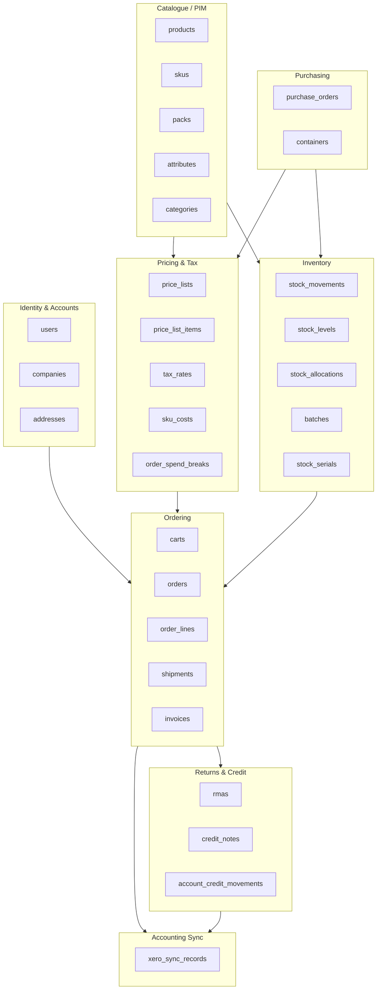
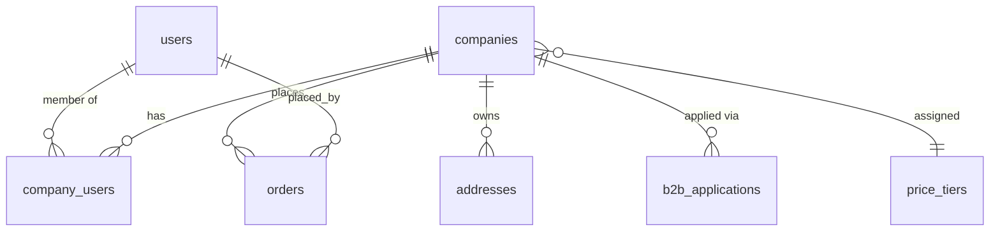
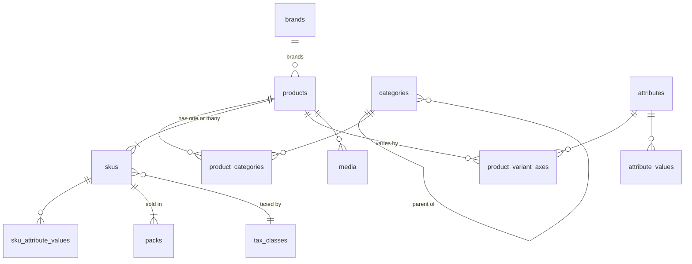
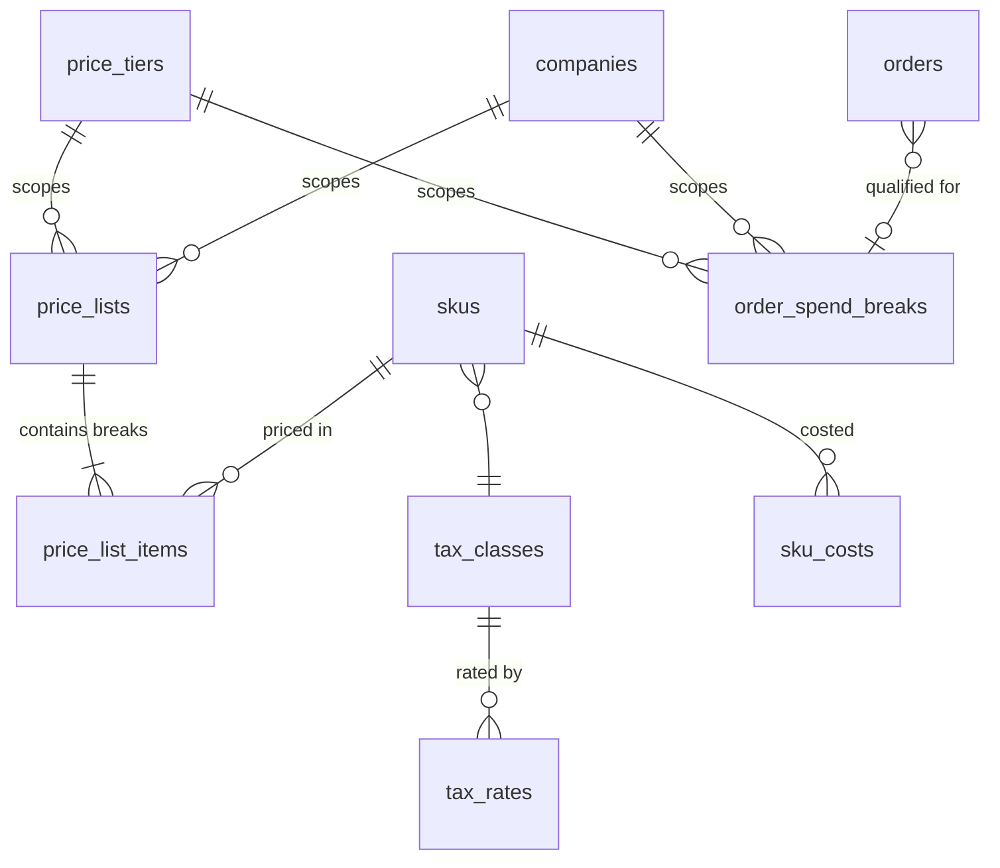
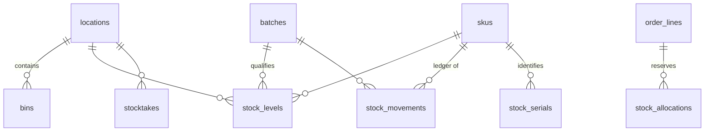
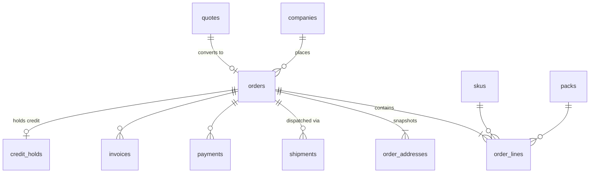

# Domain Model & ERD

**B2B Wholesale & Supermarket Management Platform**

| | |
|---|---|
| Document | 02 — Domain Model & ERD |
| Status | Draft for review — **rewritten for PostgreSQL 16** |
| Stack | Laravel (PHP 8.3+), Inertia.js + React (TS), **PostgreSQL 16**, Redis, Node.js (TS) real-time gateway |
| Reference system | londontopchoice.co.uk (WordPress/WooCommerce) |
| Supersedes | The MySQL 8 edition of this document. Section numbering is preserved so cross-references from 03–07 resolve unchanged |
| Feeds into | 03 — Pricing Engine, 04 — Inventory & Stock Ledger, 05.1–05.9 |

---

## 1. Purpose & Scope

This document defines the persistent data model: entities, relationships, constraints, and the indexing strategy that supports them. It is the authoritative reference for schema migrations. No table is created in implementation that is not described here or in a downstream module spec that explicitly extends this document.

**In scope:** Identity & accounts, catalogue/PIM, pack structure, pricing, tax, inventory ledger, ordering, quotes, returns, purchasing, accounting integration.

**Out of scope (deferred to module specs):** Marketing automation entities.

**Correction 2026-09-20.** Three items previously listed here as out of scope are removed from this line, because each was also declared out of scope by, or simply absent from, every other document — a hole between documents, not a decision either one made: **CMS page storage** → `docs/05.11-cms-seo.md` (pending, not yet written); **reporting aggregates and materialised views** → `docs/05.14-reporting.md` (pending, not yet written); **audit log storage backend** → this document's own **§15** (proposed, see `docs/ROADMAP.md` §18 — `07-nfr.md` §6.5 mandates an audit log this document had disclaimed, and signed-off constraints (`rmas_waiver_chk`, `roles.granted_by_user_id`) already assume one exists to write to). None of the three has a table yet; this line now points at where each is tracked instead of disclaiming ownership.

### 1.1 Design drivers

Four requirements shape almost every decision below:

1. **Pack structure is first-class.** Quantities are stored in base units, always; a pack is a unit of transaction, never of storage. Adding or changing a pack tier is a data change, not a migration.
2. **Pricing is resolved, never stored on the product.** A price is the output of a precedence chain, and the result is snapshotted immutably onto the transaction.
3. **Stock is authoritative here.** The ledger is the source of truth; levels are a rebuildable projection. The system must not oversell under concurrency.
4. **Traceability is structural.** Batch/expiry and serial tracking are present from the first migration, including in the identity of `stock_levels` and the uniqueness of `stock_allocations`.

### 1.2 Why PostgreSQL 16

The platform was initially specified against MySQL 8 and deliberately moved. Four capabilities drove it, each of which removes a workaround rather than adding a feature:

| Capability | What it replaces |
|---|---|
| **Partial unique indexes** | The `default_sell_token` stored-generated-column trick for "exactly one default pack per SKU" (§5.6), and the whole class of "unique where not deleted" workarounds |
| **`UNIQUE NULLS NOT DISTINCT`** (PG 15+) | The `batch_id = 0` sentinel row and its `NO_AUTO_VALUE_ON_ZERO` seed migration (§7.3, §7.5) |
| **`EXCLUDE USING gist`** with range types | Overlapping price-list and rate validity windows, previously *unpreventable* and resolved only by deterministic tie-breaking (§6.3) |
| **`jsonb` with GIN** | Opaque JSON columns that could be stored but not queried |

Plus: native `tstzrange` removes the sentinel-date convention entirely; `INCLUDE` columns give true covering indexes without polluting the key; BRIN suits the append-only ledger; `FOR UPDATE SKIP LOCKED` improves FEFO batch selection; `READ COMMITTED` is already the default and takes no gap locks.

**What is worse, stated plainly:** PostgreSQL uses **heap storage with no clustered index.** Every index is secondary. The MySQL edition justified `stock_levels`' composite primary key by InnoDB clustering — that argument does not transfer, and §7.3 carries a different, correct one.

---

## 2. Conventions

These apply to every table without exception.

### 2.1 Keys & identifiers

| Rule | Detail |
|---|---|
| Primary key | `bigint GENERATED ALWAYS AS IDENTITY` unless a natural composite key is the correct identity (see `stock_levels`, §7.3) |
| External identifier | `public_id text` holding a ULID, on any entity exposed in a URL or API payload. Auto-increment ids are never exposed |
| Human reference | Separate readable code where the business needs one: `order_number`, `account_code`, `sku_code`, `rma_number` |
| Foreign keys | Named `{singular_table}_id`, with real `FOREIGN KEY` constraints, `ON DELETE RESTRICT` by default |

`GENERATED ALWAYS AS IDENTITY` is preferred over `serial`: it is SQL-standard, the sequence is owned by the column, and a client cannot accidentally override it.

Heap storage means PK width no longer inflates every secondary index the way InnoDB clustering did. ULIDs still live in their own column rather than becoming the PK, because 16-byte random keys destroy insert locality in the index and defeat BRIN correlation on append-only tables.

### 2.2 Money

All monetary values are stored as **`bigint`** at one of exactly two scales.

| Scale | Suffix | Unit | Used for |
|---|---|---|---|
| Pence | `_minor` | 1/100 of £1 | Per line or per document — line totals, order totals, invoice amounts, fees, credit limits |
| Ten-thousandths | `_e4` | 1/10,000 of £1 | Per unit — unit prices, unit costs, break prices |

£0.9212 is `9212` at `e4`. £13.24 is `1324` at `minor`.

**Why two scales.** Per-unit prices genuinely need four decimal places. A £0.98 item with a 6% volume break is £0.9212; rounded to whole pence it becomes 92p, under-invoicing by £1.73 per 1,440 units — systematically, always in the same direction, on a catalogue whose median SKU is under £2. Document totals cannot carry fractional pence: an invoice is settled in real money.

**The conversion boundary.** `e4 → minor` happens **exactly once per order line**:

```
line_net_minor = round_half_up(unit_price_net_e4 × base_qty / 100)
```

No intermediate rounding before, none after. The three-phase sequence and worked examples are in 03 §7A.4.

`numeric` is rejected despite Postgres's exact arithmetic: break tables, percentage restocking fees (20% or £25, whichever is greater) and landed-cost apportionment all need an *explicit, auditable rounding boundary*, and `numeric` invites deferring that decision. Integer arithmetic makes the boundary a line of code rather than a column definition.

Rates are **basis points** as `smallint`: `tax_rate_bp = 2000` is 20.00%. FX rates are `_e4`, not bp — a rate is not a percentage (§6.6).

Mixing scales in one expression is the one arithmetic error this design can still produce. Guarded by the suffix convention, a `Money` value object that refuses cross-scale operations, and a static analysis rule.

### 2.3 Quantities

- Every quantity column is suffixed `_base_qty`, in the SKU's base unit.
- Pack-denominated quantities appear **only** alongside their base equivalent: `pack_qty`, `pack_base_units`, `base_qty`.
- Type is `integer` (±2.1bn), which is ample. Signed throughout, including where only positives are valid, because `CHECK` constraints express the constraint more clearly than an unsigned type and Postgres has no unsigned integers.

### 2.4 Timestamps & lifecycle

- `created_at`, `updated_at` as **`timestamptz`**, defaulting to `now()`. Postgres stores UTC and converts on read; the MySQL-era choice between `DATETIME` and `TIMESTAMP` does not arise, and there is no 2038 limit.
- Event times needing sub-second ordering are also `timestamptz` — microsecond precision is native.
- Date-only values are `date`.

> **The MySQL constraint that no longer applies.** In MySQL, `UNIQUE (sku_code, deleted_at)` does *not* prevent two live rows sharing a code, because NULLs are treated as distinct and there are no partial indexes. That forced catalogue entities onto a `status` enum instead of soft deletes, and forced the `packs.default_sell_token` workaround.
>
> Postgres expresses both directly:
>
> ```sql
> CREATE UNIQUE INDEX skus_sku_code_uq ON skus (sku_code) WHERE deleted_at IS NULL;
> CREATE UNIQUE INDEX packs_default_sell_uq ON packs (sku_id) WHERE is_default_sell;
> ```
>
> Catalogue entities nevertheless **keep** their `status` column. That was never only a workaround: `draft`, `active`, `coming_soon`, `discontinued` and `archived` are distinct business states a boolean deletion flag cannot express. `deleted_at` is now additionally available for genuine removal, and both are correctly enforceable.

### 2.5 Status values: `text` + `CHECK`, not native enums

Every status, type and kind column is `text` with a `CHECK (col IN (…))` constraint, not a `CREATE TYPE … AS ENUM`.

Native Postgres enums look tidier and are marginally more compact, but: values cannot be removed or reordered; `ALTER TYPE … ADD VALUE` cannot run inside a transaction block in older versions and still cannot be rolled back; and reordering requires recreating the type and rewriting every dependent column. Over the life of this system, `orders.status` will gain values.

A `CHECK` constraint is dropped and recreated in one transaction, with a validation-only pass available:

```sql
ALTER TABLE orders DROP CONSTRAINT orders_status_chk;
ALTER TABLE orders ADD CONSTRAINT orders_status_chk
  CHECK (status IN (…, 'new_value')) NOT VALID;
ALTER TABLE orders VALIDATE CONSTRAINT orders_status_chk;
```

`NOT VALID` then `VALIDATE` takes only a `SHARE UPDATE EXCLUSIVE` lock, so adding a status value to a large table does not block trading (07 §11.1).

The corresponding PHP backed enum is the single source of the value list; a test asserts the `CHECK` constraint and the enum agree.

### 2.6 Database, encoding and extensions

```sql
CREATE DATABASE wholesale
  ENCODING     'UTF8'
  LC_COLLATE   'en_GB.UTF-8'
  LC_CTYPE     'en_GB.UTF-8'
  TEMPLATE     template0;

CREATE EXTENSION IF NOT EXISTS btree_gist;   -- EXCLUDE with = on scalar columns
CREATE EXTENSION IF NOT EXISTS citext;       -- case-insensitive email
CREATE EXTENSION IF NOT EXISTS pg_trgm;      -- fuzzy name matching, search
CREATE EXTENSION IF NOT EXISTS unaccent;     -- accent-insensitive search
CREATE EXTENSION IF NOT EXISTS pg_stat_statements;
```

- **`text` everywhere, not `varchar(n)`.** In Postgres they are the same type with the same performance; a length limit is a business rule and belongs in a `CHECK` constraint, where changing it does not require an `ALTER TYPE`.
- **Case sensitivity is explicit, not collation-wide.** `sku_code`, `barcode_ean`, `public_id`, `order_number` are plain `text` and compare exactly. Emails are `citext`. Name search uses `unaccent` + `pg_trgm` at query time rather than a nondeterministic collation, because nondeterministic collations disable pattern-matching index use.
- `btree_gist` is required for the `EXCLUDE` constraints in §6.3 — GiST cannot index `=` on a `bigint` without it.

### 2.7 Configuration storage

Values business administrators must change without a deployment — restocking rates, minimum order values, hold windows, return windows — live in `system_configurations`.

```sql
CREATE TABLE system_configurations (
  id                 bigint GENERATED ALWAYS AS IDENTITY PRIMARY KEY,
  config_key         text        NOT NULL,
  scope              text        NOT NULL DEFAULT 'global',
  location_id        bigint      REFERENCES locations (id),
  company_id         bigint      REFERENCES companies (id),
  value_type         text        NOT NULL,
  value_int          bigint,
  value_text         text,
  value_json         jsonb,
  description        text,
  updated_by_user_id bigint      REFERENCES users (id),
  created_at         timestamptz NOT NULL DEFAULT now(),
  updated_at         timestamptz NOT NULL DEFAULT now(),

  CONSTRAINT system_configurations_scope_chk
    CHECK (scope IN ('global','location','company')),
  CONSTRAINT system_configurations_type_chk
    CHECK (value_type IN ('int','bp','money_minor','text','bool','json','date')),
  CONSTRAINT system_configurations_coherence_chk CHECK (
      (scope = 'global'   AND location_id IS NULL AND company_id IS NULL)
   OR (scope = 'location' AND location_id IS NOT NULL AND company_id IS NULL)
   OR (scope = 'company'  AND company_id IS NOT NULL)
  ),
  CONSTRAINT system_configurations_key_scope_uq
    UNIQUE NULLS NOT DISTINCT (config_key, scope, location_id, company_id)
);

CREATE INDEX system_configurations_resolve_idx
  ON system_configurations (config_key, scope)
  INCLUDE (value_int, value_text, company_id, location_id);
```

**`UNIQUE NULLS NOT DISTINCT` is the improvement here.** The MySQL edition used sentinel zeros for `location_id` and `company_id`, because MySQL treats NULLs as distinct and `(key, 'global', NULL, NULL)` could be inserted twice. Postgres 15+ treats them as equal on request, so NULL means "not applicable" honestly, real foreign keys apply, and no sentinel rows need seeding.

**Resolution: most specific wins.** `company` → `location` → `global` → the code-level default. One query, cached, invalidated on write.

**Money-affecting configuration is snapshotted onto the transaction that used it.** A restocking fee computed in March must be reproducible in October even if the rate changed, so the resolved rate and minimum are copied onto the RMA row (05.4 §5.1) rather than re-read at report time. Same rule as prices on order lines (§8.3).

Every write is audited with `updated_by_user_id`. Configuration that changes money is a commercial decision, not a setting.

---

## 3. Bounded Contexts



Contexts communicate through domain events, not cross-context joins in application code. `stock_movements` is written only by the inventory context; ordering requests allocation through a service.

---

## 4. Identity & Accounts

### 4.1 ERD



### 4.2 `users`

```sql
CREATE TABLE users (
  id                      bigint GENERATED ALWAYS AS IDENTITY PRIMARY KEY,
  public_id               text        NOT NULL,
  email                   citext      NOT NULL,
  password_hash           text,
  first_name              text        NOT NULL,
  last_name               text        NOT NULL,
  phone                   text,
  status                  text        NOT NULL DEFAULT 'pending',
  email_verified_at       timestamptz,
  two_factor_secret       bytea,
  two_factor_enabled      boolean     NOT NULL DEFAULT false,
  last_login_at           timestamptz,
  locale                  text        NOT NULL DEFAULT 'en_GB',
  default_max_discount_bp smallint,
  created_at              timestamptz NOT NULL DEFAULT now(),
  updated_at              timestamptz NOT NULL DEFAULT now(),
  deleted_at              timestamptz,

  CONSTRAINT users_status_chk
    CHECK (status IN ('pending','active','suspended','closed')),
  CONSTRAINT users_public_id_len_chk CHECK (length(public_id) = 26),
  CONSTRAINT users_discount_chk
    CHECK (default_max_discount_bp IS NULL OR default_max_discount_bp <= 10000)
);

CREATE UNIQUE INDEX users_public_id_uq ON users (public_id);
CREATE UNIQUE INDEX users_email_uq     ON users (email) WHERE deleted_at IS NULL;
CREATE INDEX users_status_created_idx  ON users (status, created_at);
CREATE INDEX users_last_login_idx      ON users (last_login_at)
  WHERE last_login_at IS NOT NULL;
```

**Index rationale**

- `users_email_uq` is a **partial unique index**. This is the pattern MySQL could not express: one live account per email, while anonymised rows (07 §7.3) retain a tombstoned value without colliding. The MySQL edition had to tombstone *into* the unique constraint; here the constraint simply does not apply to deleted rows.
- `users_status_created_idx` — admin lists filter by status then sort by signup date. Equality first, sort second, satisfying both clauses from one index.
- `users_last_login_idx` is **partial**: users who have never logged in are the majority in a system with invited accounts, and indexing their NULLs is pure write cost.
- `citext` for email removes every `LOWER()` call and the functional index it would otherwise need.

### 4.3 `companies`

The trade account: price tier, payment terms, credit.

```sql
CREATE TABLE companies (
  id                     bigint GENERATED ALWAYS AS IDENTITY PRIMARY KEY,
  public_id              text        NOT NULL,
  account_code           text        NOT NULL,
  name                   text        NOT NULL,
  trading_name           text,
  vat_number             text,
  registration_number    text,
  status                 text        NOT NULL DEFAULT 'applied',
  price_tier_id          bigint      REFERENCES price_tiers (id),
  payment_terms          text        NOT NULL DEFAULT 'prepay',
  credit_limit_minor     bigint      NOT NULL DEFAULT 0,
  credit_used_minor      bigint      NOT NULL DEFAULT 0,
  credit_held_minor      bigint      NOT NULL DEFAULT 0,
  account_balance_minor  bigint      NOT NULL DEFAULT 0,
  tax_exempt             boolean     NOT NULL DEFAULT false,
  price_display_mode     text        NOT NULL DEFAULT 'net',
  assigned_rep_user_id   bigint      REFERENCES users (id),
  xero_contact_id        uuid,
  approved_at            timestamptz,
  approved_by_user_id    bigint      REFERENCES users (id),
  created_at             timestamptz NOT NULL DEFAULT now(),
  updated_at             timestamptz NOT NULL DEFAULT now(),

  CONSTRAINT companies_status_chk
    CHECK (status IN ('applied','approved','rejected','suspended','closed')),
  CONSTRAINT companies_terms_chk
    CHECK (payment_terms IN ('prepay','net7','net14','net30','net60')),
  CONSTRAINT companies_display_chk CHECK (price_display_mode IN ('net','gross')),
  CONSTRAINT companies_credit_chk  CHECK (credit_limit_minor    >= 0),
  CONSTRAINT companies_held_chk    CHECK (credit_held_minor     >= 0),
  CONSTRAINT companies_balance_chk CHECK (account_balance_minor >= 0)
);

CREATE UNIQUE INDEX companies_account_code_uq ON companies (account_code);
CREATE UNIQUE INDEX companies_public_id_uq    ON companies (public_id);
CREATE UNIQUE INDEX companies_vat_uq          ON companies (vat_number)
  WHERE vat_number IS NOT NULL;
CREATE INDEX companies_status_name_idx ON companies (status, name);
CREATE INDEX companies_tier_idx        ON companies (price_tier_id, status)
  WHERE price_tier_id IS NOT NULL;
CREATE INDEX companies_rep_idx         ON companies (assigned_rep_user_id, status)
  WHERE assigned_rep_user_id IS NOT NULL;
CREATE INDEX companies_name_trgm_idx   ON companies USING gin (name gin_trgm_ops);
```

**Notes**

- `companies_vat_uq` is partial rather than relying on NULL-distinctness. The MySQL edition depended on MySQL's NULL behaviour happening to be correct here; the Postgres version states the intent — *unique among companies that have a VAT number* — so the constraint is self-documenting rather than incidentally right.
- `companies_name_trgm_idx` is a **trigram GIN index**, which powers the fuzzy duplicate detection in 05.2 §5.2. MySQL had no equivalent, and application-side fuzzy matching over every company was the fallback.
- `credit_used_minor`, `credit_held_minor` and `account_balance_minor` are all **projections**, maintained transactionally and rebuildable. `credit_used` derives from unpaid invoice balances; `credit_held` from `credit_holds` at `held`; `account_balance` from the `account_credit_movements` ledger. Available credit is `limit − used − held`.
  The split exists because an order placed on account creates real exposure **before** any invoice exists — counting only invoiced debt would let a customer place £40,000 of orders against a £10,000 limit. It mirrors inventory (§7.3): an order holds credit the way it allocates stock. Specified in 05.2 §6–8.
- `account_balance_minor` is a distinct concept: **unapplied credit the business owes the customer**, spendable at checkout or refundable. It does not increase available credit — a customer with a £10,000 limit and a £500 balance can order £10,500, because the £500 is already theirs (05.4 §7.5A).
- `xero_contact_id` is a `uuid`, matching Xero's identifier type natively (05.9).

### 4.4 `company_users`

```sql
CREATE TABLE company_users (
  company_id         bigint      NOT NULL REFERENCES companies (id) ON DELETE CASCADE,
  user_id            bigint      NOT NULL REFERENCES users (id)     ON DELETE CASCADE,
  role               text        NOT NULL DEFAULT 'buyer',
  order_limit_minor  bigint,
  requires_approval  boolean     NOT NULL DEFAULT false,
  is_default_contact boolean     NOT NULL DEFAULT false,
  created_at         timestamptz NOT NULL DEFAULT now(),

  PRIMARY KEY (company_id, user_id),
  CONSTRAINT company_users_role_chk
    CHECK (role IN ('owner','buyer','approver','viewer'))
);

CREATE INDEX company_users_user_idx ON company_users (user_id, company_id);
CREATE UNIQUE INDEX company_users_default_contact_uq
  ON company_users (company_id) WHERE is_default_contact;
```

**Index rationale.** The composite PK serves "list users on this company". The reverse index serves login — "which companies does this user belong to" — and a user in several companies (a buying group, an agent) needs no schema change.

`company_users_default_contact_uq` is another partial unique index: **exactly one default contact per company**, expressed directly. MySQL would have needed a generated-column token.

### 4.5 `addresses`

```sql
CREATE TABLE addresses (
  id               bigint GENERATED ALWAYS AS IDENTITY PRIMARY KEY,
  company_id       bigint      NOT NULL REFERENCES companies (id),
  label            text,
  contact_name     text,
  phone            text,
  line1            text        NOT NULL,
  line2            text,
  city             text        NOT NULL,
  county           text,
  postcode         text        NOT NULL,
  country_code     char(2)     NOT NULL DEFAULT 'GB',
  address_type     text        NOT NULL DEFAULT 'both',
  is_default       boolean     NOT NULL DEFAULT false,
  delivery_zone_id bigint      REFERENCES delivery_zones (id),
  created_at       timestamptz NOT NULL DEFAULT now(),
  updated_at       timestamptz NOT NULL DEFAULT now(),
  deleted_at       timestamptz,

  CONSTRAINT addresses_type_chk
    CHECK (address_type IN ('billing','delivery','both'))
);

CREATE INDEX addresses_company_type_idx ON addresses (company_id, address_type)
  WHERE deleted_at IS NULL;
CREATE INDEX addresses_postcode_idx     ON addresses (postcode);
CREATE INDEX addresses_zone_idx         ON addresses (delivery_zone_id)
  WHERE delivery_zone_id IS NOT NULL;
CREATE UNIQUE INDEX addresses_default_uq
  ON addresses (company_id, address_type)
  WHERE is_default AND deleted_at IS NULL;
```

> **Invariant:** an order **never** foreign-keys to `addresses`. Orders hold an immutable snapshot in `order_addresses` (§8.4). A customer editing their address must not retrospectively change where a historical order was delivered, and a deleted address must not orphan an invoice.

`addresses_default_uq` — one default per company per address type, among live rows. Three conditions in one partial unique index, none of which MySQL could express.

### 4.6 `b2b_applications`

```sql
CREATE TABLE b2b_applications (
  id                  bigint GENERATED ALWAYS AS IDENTITY PRIMARY KEY,
  public_id           text        NOT NULL,
  company_id          bigint      REFERENCES companies (id),
  applicant_user_id   bigint      REFERENCES users (id),
  company_name        text        NOT NULL,
  vat_number          text,
  registration_number text,
  contact_name        text        NOT NULL,
  contact_email       citext      NOT NULL,
  contact_phone       text,
  business_type       text,
  estimated_monthly_spend_minor bigint,
  address             jsonb       NOT NULL,
  status              text        NOT NULL DEFAULT 'submitted',
  requested_tier_id   bigint      REFERENCES price_tiers (id),
  granted_tier_id     bigint      REFERENCES price_tiers (id),
  reviewer_user_id    bigint      REFERENCES users (id),
  review_note         text,
  info_request        text,
  reviewed_at         timestamptz,
  submitted_at        timestamptz NOT NULL DEFAULT now(),

  CONSTRAINT b2b_applications_status_chk CHECK (status IN
    ('submitted','in_review','info_requested','approved','rejected','withdrawn'))
);

CREATE UNIQUE INDEX b2b_applications_public_id_uq ON b2b_applications (public_id);
CREATE INDEX b2b_applications_queue_idx ON b2b_applications (status, submitted_at)
  WHERE status IN ('submitted','in_review','info_requested');
CREATE INDEX b2b_applications_email_idx ON b2b_applications (contact_email);
CREATE INDEX b2b_applications_company_idx ON b2b_applications (company_id)
  WHERE company_id IS NOT NULL;
CREATE INDEX b2b_applications_address_gin ON b2b_applications USING gin (address);
```

`b2b_applications_queue_idx` is partial on the **open** statuses only. The review queue never looks at approved or rejected applications, and after a year the open set is a tiny fraction of the table — so the index stays small and hot regardless of history. This is the single most generally useful Postgres indexing pattern in the document and recurs throughout.

`address jsonb` with a GIN index replaces the MySQL edition's opaque `address_json`: postcode and city inside the application are now queryable for duplicate detection.

Supporting documents go in a generic `attachments` table keyed by `(attachable_type, attachable_id)`.

---

## 5. Catalogue / PIM

### 5.1 ERD



### 5.2 The dual variant model

Both flat SKUs and parent/variant products are supported by **a single hierarchy in which flat is the degenerate case**:

| Shape | `products.product_type` | SKU count | Variant axes |
|---|---|---|---|
| Flat (`LTC01372` is its own item) | `simple` | exactly 1 | none |
| Variant parent ("Steel Basin" in 4 sizes) | `variant` | 1..n | 1..n rows in `product_variant_axes` |

Consequences, all deliberate:

- **`skus` is the only stockable, priceable, sellable entity.** Nothing in pricing, inventory or ordering references `products.id`. This is what makes the two shapes interchangeable downstream.
- A flat product still gets a `products` row, so migrating flat → variant is a data operation, not a schema change.
- The product page renders a variant selector when `product_type = 'variant'` and a straight buy box otherwise. One template, one query shape.

### 5.3 `categories`

```sql
CREATE TABLE categories (
  id               bigint GENERATED ALWAYS AS IDENTITY PRIMARY KEY,
  parent_id        bigint      REFERENCES categories (id),
  name             text        NOT NULL,
  slug             text        NOT NULL,
  path             ltree,
  depth            smallint    NOT NULL DEFAULT 0,
  position         smallint    NOT NULL DEFAULT 0,
  status           text        NOT NULL DEFAULT 'active',
  icon_media_id    bigint,
  meta_title       text,
  meta_description text,
  created_at       timestamptz NOT NULL DEFAULT now(),
  updated_at       timestamptz NOT NULL DEFAULT now(),

  CONSTRAINT categories_status_chk CHECK (status IN ('active','hidden','archived'))
);

CREATE UNIQUE INDEX categories_slug_uq ON categories (slug);
CREATE INDEX categories_parent_pos_idx ON categories (parent_id, position);
CREATE INDEX categories_path_gist      ON categories USING gist (path);
CREATE INDEX categories_active_idx     ON categories (depth, position)
  WHERE status = 'active';

CREATE TABLE category_closure (
  ancestor_id   bigint   NOT NULL REFERENCES categories (id) ON DELETE CASCADE,
  descendant_id bigint   NOT NULL REFERENCES categories (id) ON DELETE CASCADE,
  depth         smallint NOT NULL,
  PRIMARY KEY (ancestor_id, descendant_id)
);

CREATE INDEX category_closure_descendant_idx
  ON category_closure (descendant_id, ancestor_id) INCLUDE (depth);
```

**`ltree` replaces the MySQL edition's `varchar(512)` path with a prefix index.** It is a purpose-built hierarchical type with GiST support for ancestor (`@>`), descendant (`<@`) and pattern (`~`) queries. Requires `CREATE EXTENSION ltree`.

**The closure table is retained even so.** `ltree` answers tree questions well, but the hot query is *"all active products in this category and every descendant, faceted and paginated"*, run on every category page view — and that needs a set of category ids to equality-join against the product filter. The closure table provides exactly that in one join. `ltree` serves breadcrumbs, admin tree manipulation and ad-hoc reporting.

`category_closure_descendant_idx` with `INCLUDE (depth)` is what makes the discount-authority and commission-rate resolution in 05.3 §6.3 and 05.8 §10.1 a single covering index scan: ancestors of a category, ordered by depth, most specific first.

### 5.4 `products`

```sql
CREATE TABLE products (
  id                  bigint GENERATED ALWAYS AS IDENTITY PRIMARY KEY,
  public_id           text        NOT NULL,
  product_type        text        NOT NULL DEFAULT 'simple',
  name                text        NOT NULL,
  slug                text        NOT NULL,
  brand_id            bigint      REFERENCES brands (id),
  primary_category_id bigint      REFERENCES categories (id),
  status              text        NOT NULL DEFAULT 'draft',
  short_description   text,
  description         text,
  rrp_minor           bigint,
  origin_country      char(2),
  hs_code             text,
  is_featured         boolean     NOT NULL DEFAULT false,
  meta_title          text,
  meta_description    text,
  specifications      jsonb,
  completeness_score  smallint    NOT NULL DEFAULT 0,
  search_vector       tsvector GENERATED ALWAYS AS (
                        setweight(to_tsvector('english', coalesce(name, '')), 'A') ||
                        setweight(to_tsvector('english',
                                  coalesce(short_description, '')), 'B') ||
                        setweight(to_tsvector('english', coalesce(description, '')), 'C')
                      ) STORED,
  published_at        timestamptz,
  created_at          timestamptz NOT NULL DEFAULT now(),
  updated_at          timestamptz NOT NULL DEFAULT now(),
  deleted_at          timestamptz,

  CONSTRAINT products_type_chk CHECK (product_type IN ('simple','variant')),
  CONSTRAINT products_status_chk CHECK (status IN
    ('draft','active','coming_soon','discontinued','archived')),
  CONSTRAINT products_completeness_chk
    CHECK (completeness_score BETWEEN 0 AND 100)
);

CREATE UNIQUE INDEX products_slug_uq      ON products (slug) WHERE deleted_at IS NULL;
CREATE UNIQUE INDEX products_public_id_uq ON products (public_id);

CREATE INDEX products_active_published_idx ON products (published_at DESC, id)
  WHERE status = 'active' AND deleted_at IS NULL;
CREATE INDEX products_cat_active_idx  ON products (primary_category_id, id)
  WHERE status = 'active' AND deleted_at IS NULL;
CREATE INDEX products_brand_active_idx ON products (brand_id, id)
  WHERE status = 'active' AND deleted_at IS NULL;
CREATE INDEX products_featured_idx ON products (published_at DESC)
  WHERE is_featured AND status = 'active';
CREATE INDEX products_incomplete_idx ON products (completeness_score)
  WHERE status = 'active' AND completeness_score < 60;
CREATE INDEX products_search_gin ON products USING gin (search_vector);
CREATE INDEX products_name_trgm  ON products USING gin (name gin_trgm_ops);
CREATE INDEX products_specs_gin  ON products USING gin (specifications)
  WHERE specifications IS NOT NULL;
```

**Index rationale — where Postgres changes the answer**

- Every catalogue index is now **partial on `status = 'active'`**. The MySQL edition had to carry `status` as a leading key column in each composite index, because MySQL has no partial indexes. Two consequences: the indexes are smaller (drafts, archived and discontinued rows are excluded entirely), and the key no longer wastes its leading position on a low-cardinality column. `products_cat_active_idx` is `(primary_category_id, id)` rather than `(primary_category_id, status, id)`.
- `products_active_published_idx` uses a real `DESC` ordering with trailing `id` as a keyset cursor. Postgres has supported descending index columns since well before 16.
- `products_incomplete_idx` is partial on the *predicate the report uses* — active products scoring under 60. The index contains only rows the data-quality dashboard cares about, which on a well-maintained catalogue is a handful. This is the direct answer to the reference system's placeholder-image problem, and MySQL's version indexed the whole table to find them.
- `search_vector` is a **stored generated `tsvector`** with weighting: name outranks short description, which outranks body. GIN-indexed.

### 5.4a Search: a dependency removed

The MySQL edition specified Meilisearch or Typesense via Laravel Scout, because InnoDB `FULLTEXT` offers no practical typo tolerance, synonyms or ranking control.

**Postgres does not need it at this scale.** `tsvector` with weighting and `ts_rank_cd` gives real relevance ranking, and `pg_trgm` gives typo tolerance via similarity:

```sql
-- combined exact-code, full-text and fuzzy search
SELECT p.id,
       ts_rank_cd(p.search_vector, q) AS rank,
       similarity(p.name, :term)      AS sim
FROM   products p, websearch_to_tsquery('english', :term) q
WHERE  p.status = 'active'
  AND  (p.search_vector @@ q OR p.name % :term)
ORDER  BY (s.sku_code = :term) DESC NULLS LAST, rank DESC, sim DESC
LIMIT  50;
```

`websearch_to_tsquery` handles quoted phrases and negation from user input without parsing. `%` uses the trigram index for fuzziness. Synonyms are handled by a custom `ts_dictionary` — which is version-controlled configuration rather than a service to operate.

**Decision: no external search engine at launch.** One fewer service on the VPS (07 §11.5), one fewer index to keep in sync, one fewer source of stale results. The trigger to revisit is the catalogue exceeding roughly 50,000 SKUs, or a requirement for faceted search with counts across many dimensions, where a dedicated engine earns its operational cost. Recorded in §13.

### 5.5 `skus` — the central entity

```sql
CREATE TABLE skus (
  id                       bigint GENERATED ALWAYS AS IDENTITY PRIMARY KEY,
  public_id                text        NOT NULL,
  product_id               bigint      NOT NULL REFERENCES products (id),
  sku_code                 text        NOT NULL,
  barcode_ean              text,
  supplier_ref             text,
  variant_label            text,
  status                   text        NOT NULL DEFAULT 'draft',
  tax_class_id             bigint      NOT NULL REFERENCES tax_classes (id),
  base_unit                text        NOT NULL DEFAULT 'each',
  unit_weight_g            integer,
  moq_base_qty             integer     NOT NULL DEFAULT 1,
  order_increment_base_qty integer     NOT NULL DEFAULT 1,
  max_order_base_qty       integer,
  default_pack_id          bigint,
  is_stock_tracked         boolean     NOT NULL DEFAULT true,
  tracking_mode            text        NOT NULL DEFAULT 'none',
  allocation_strategy      text        NOT NULL DEFAULT 'none',
  requires_expiry          boolean     NOT NULL DEFAULT false,
  shelf_life_days          smallint,
  min_remaining_shelf_life_days smallint,
  allow_backorder          boolean     NOT NULL DEFAULT false,
  is_refundable            boolean     NOT NULL DEFAULT true,
  non_refundable_reason    text,
  position                 smallint    NOT NULL DEFAULT 0,
  created_at               timestamptz NOT NULL DEFAULT now(),
  updated_at               timestamptz NOT NULL DEFAULT now(),
  deleted_at               timestamptz,

  CONSTRAINT skus_status_chk CHECK (status IN
    ('draft','active','coming_soon','discontinued','archived')),
  CONSTRAINT skus_base_unit_chk CHECK (base_unit IN
    ('each','kg','litre','metre','pair')),
  CONSTRAINT skus_tracking_mode_chk CHECK (tracking_mode IN
    ('none','batch','serial','batch_and_serial')),
  CONSTRAINT skus_strategy_chk CHECK (allocation_strategy IN
    ('none','fifo','fefo','lifo')),
  CONSTRAINT skus_nonref_reason_chk CHECK (non_refundable_reason IS NULL
    OR non_refundable_reason IN ('consumable','hygiene','electrical_sealed','bespoke')),
  CONSTRAINT skus_increment_chk CHECK (order_increment_base_qty >= 1),
  CONSTRAINT skus_moq_chk       CHECK (moq_base_qty >= 1),
  CONSTRAINT skus_max_chk       CHECK (max_order_base_qty IS NULL
                                       OR max_order_base_qty >= moq_base_qty),
  CONSTRAINT skus_nonref_chk    CHECK ((is_refundable AND non_refundable_reason IS NULL)
                                    OR (NOT is_refundable
                                        AND non_refundable_reason IS NOT NULL)),
  CONSTRAINT skus_tracking_chk  CHECK (tracking_mode = 'none' OR is_stock_tracked),
  CONSTRAINT skus_expiry_chk    CHECK (NOT requires_expiry
                                       OR tracking_mode IN ('batch','batch_and_serial')),
  CONSTRAINT skus_fefo_chk      CHECK (allocation_strategy <> 'fefo'
                                       OR tracking_mode IN ('batch','batch_and_serial'))
);

CREATE UNIQUE INDEX skus_sku_code_uq  ON skus (sku_code)    WHERE deleted_at IS NULL;
CREATE UNIQUE INDEX skus_public_id_uq ON skus (public_id);
CREATE UNIQUE INDEX skus_barcode_uq   ON skus (barcode_ean)
  WHERE barcode_ean IS NOT NULL AND deleted_at IS NULL;
CREATE INDEX skus_product_position_idx ON skus (product_id, position, id)
  WHERE deleted_at IS NULL;
CREATE INDEX skus_active_idx     ON skus (id) WHERE status = 'active';
CREATE INDEX skus_supplier_ref_idx ON skus (supplier_ref) WHERE supplier_ref IS NOT NULL;
CREATE INDEX skus_tracked_idx    ON skus (tracking_mode, id)
  WHERE tracking_mode <> 'none';
CREATE INDEX skus_code_trgm_idx  ON skus USING gin (sku_code gin_trgm_ops);
```

**Notes**

- `skus_sku_code_uq` as a partial unique index means soft deletion is now *actually available* on the central entity — the MySQL edition could not offer it without the code colliding. The lifecycle `status` remains for business states.
- `skus_tracked_idx` is partial on the minority of SKUs that carry batch or serial tracking, so the traceability jobs scan only relevant rows.
- `skus_code_trgm_idx` lets a warehouse operative find `LTC01372` from a partial or mis-scanned code — a genuinely common warehouse need that the MySQL edition could only serve with a leading wildcard scan.
- `default_pack_id` is a circular reference (`skus` → `packs` → `skus`). Postgres supports **deferred** foreign keys, which resolves cleanly where MySQL required abandoning the constraint:

```sql
ALTER TABLE skus ADD CONSTRAINT skus_default_pack_fk
  FOREIGN KEY (default_pack_id) REFERENCES packs (id)
  DEFERRABLE INITIALLY DEFERRED;
```

  Both rows are inserted in one transaction and the constraint is checked at commit. A real constraint replaces a documented exception and a nightly consistency check.

### 5.6 `packs` — pack structure as first-class data

```sql
CREATE TABLE packs (
  id                bigint GENERATED ALWAYS AS IDENTITY PRIMARY KEY,
  sku_id            bigint      NOT NULL REFERENCES skus (id) ON DELETE CASCADE,
  code              text        NOT NULL,
  label             text        NOT NULL,
  pack_level        text        NOT NULL DEFAULT 'each',
  base_units        integer     NOT NULL,
  barcode           text,
  gross_weight_g    integer,
  length_mm         integer,
  width_mm          integer,
  height_mm         integer,
  packs_per_layer   smallint,
  layers_per_pallet smallint,
  is_sellable       boolean     NOT NULL DEFAULT true,
  is_default_sell   boolean     NOT NULL DEFAULT false,
  position          smallint    NOT NULL DEFAULT 0,
  created_at        timestamptz NOT NULL DEFAULT now(),
  updated_at        timestamptz NOT NULL DEFAULT now(),

  CONSTRAINT packs_level_chk CHECK (pack_level IN ('each','inner','outer','pallet')),
  CONSTRAINT packs_units_chk CHECK (base_units >= 1),
  CONSTRAINT packs_sku_code_uq  UNIQUE (sku_id, code),
  CONSTRAINT packs_sku_units_uq UNIQUE (sku_id, base_units)
);

CREATE UNIQUE INDEX packs_default_sell_uq ON packs (sku_id) WHERE is_default_sell;
CREATE UNIQUE INDEX packs_barcode_uq      ON packs (barcode) WHERE barcode IS NOT NULL;
CREATE INDEX packs_sku_sellable_idx ON packs (sku_id, base_units)
  INCLUDE (label, gross_weight_g) WHERE is_sellable;
```

**`packs_default_sell_uq` is the clearest single argument for the migration.** The MySQL edition needed this:

```sql
default_sell_token bigint GENERATED ALWAYS AS
  (CASE WHEN is_default_sell THEN sku_id END) STORED,
UNIQUE (default_sell_token)
```

— a generated column existing solely to exploit MySQL's NULL-distinctness, requiring a paragraph of explanation and a comment in the migration so nobody "cleaned it up". Postgres states the rule in one line, and the line reads as the rule.

**This table remains the answer to the retrofit problem:**

| Requirement | How it is satisfied |
|---|---|
| Customer buys 3 outers of 144 | `pack_qty=3`, `pack_base_units=144`, `base_qty=432` on the order line |
| Stock deducted correctly | Inventory only ever sees `base_qty=432` |
| New "half-pallet of 720" tier next year | One `INSERT`. No migration, no backfill, no code change |
| One customer allowed to buy singles | A `base_units=1` sellable pack; visibility rules live in the pricing layer |
| Warehouse picks by case barcode | `packs.barcode`, distinct from `skus.barcode_ean` |
| Pallet build for freight | `packs_per_layer × layers_per_pallet`, plus dimensions |
| Reporting comparable across pack changes | All reports aggregate `base_qty`, never `pack_qty` |

- `packs_sku_units_uq` prevents two packs of the same size on one SKU, which would make break resolution ambiguous.
- `packs_sku_sellable_idx` is **partial on sellable, with `INCLUDE` columns**. The product page and order pad get label and weight from an index-only scan. `INCLUDE` is strictly better than the MySQL approach of appending columns to the key: the columns are stored in the leaf pages for covering purposes but take no part in ordering or uniqueness, so the key stays narrow.
- **Invariant:** every `active` SKU has at least one sellable pack, exactly one of which is `is_default_sell`. The second half is now a database constraint; the first ("at least one child row") remains application-enforced, as no relational database expresses it.

### 5.7 Attributes & variant axes

```sql
CREATE TABLE attributes (
  id              bigint GENERATED ALWAYS AS IDENTITY PRIMARY KEY,
  code            text     NOT NULL,
  name            text     NOT NULL,
  data_type       text     NOT NULL DEFAULT 'select',
  unit            text,
  is_variant_axis boolean  NOT NULL DEFAULT false,
  is_filterable   boolean  NOT NULL DEFAULT false,
  position        smallint NOT NULL DEFAULT 0,

  CONSTRAINT attributes_code_uq UNIQUE (code),
  CONSTRAINT attributes_type_chk
    CHECK (data_type IN ('select','text','integer','decimal','boolean'))
);

CREATE INDEX attributes_filterable_idx ON attributes (position) WHERE is_filterable;

CREATE TABLE attribute_values (
  id           bigint GENERATED ALWAYS AS IDENTITY PRIMARY KEY,
  attribute_id bigint   NOT NULL REFERENCES attributes (id) ON DELETE CASCADE,
  value        text     NOT NULL,
  slug         text     NOT NULL,
  swatch_hex   char(7),
  position     smallint NOT NULL DEFAULT 0,

  CONSTRAINT attribute_values_uq UNIQUE (attribute_id, slug)
);

CREATE INDEX attribute_values_position_idx
  ON attribute_values (attribute_id, position) INCLUDE (value, swatch_hex);

CREATE TABLE product_variant_axes (
  product_id   bigint   NOT NULL REFERENCES products (id) ON DELETE CASCADE,
  attribute_id bigint   NOT NULL REFERENCES attributes (id),
  position     smallint NOT NULL DEFAULT 0,
  PRIMARY KEY (product_id, attribute_id)
);

CREATE TABLE sku_attribute_values (
  sku_id             bigint NOT NULL REFERENCES skus (id) ON DELETE CASCADE,
  attribute_id       bigint NOT NULL REFERENCES attributes (id),
  attribute_value_id bigint REFERENCES attribute_values (id),
  value_text         text,
  value_numeric      numeric(14,4),
  PRIMARY KEY (sku_id, attribute_id)
);

CREATE INDEX sku_attribute_values_facet_idx
  ON sku_attribute_values (attribute_value_id, sku_id)
  WHERE attribute_value_id IS NOT NULL;
```

**Index rationale.** The composite PK serves "this SKU's attributes". `sku_attribute_values_facet_idx` is the inverse and makes faceted filtering work: "every SKU where colour = blue" is an index-only scan returning a sorted id list, intersectable with other facets. **Both directions of a many-to-many, always** — missing the second is the commonest cause of a slow facet query.

Postgres adds a real option here the MySQL edition lacked: for multi-facet queries, the planner can combine several partial index scans via a **bitmap AND**, so three simultaneous facets do not require a three-column composite index guessing at the order users will pick. That is why no such composite exists.

### 5.8 `media`

```sql
CREATE TABLE media (
  id            bigint GENERATED ALWAYS AS IDENTITY PRIMARY KEY,
  product_id    bigint      REFERENCES products (id) ON DELETE CASCADE,
  sku_id        bigint      REFERENCES skus (id)     ON DELETE CASCADE,
  disk          text        NOT NULL DEFAULT 's3',
  path          text        NOT NULL,
  original_name text,
  mime_type     text        NOT NULL,
  size_bytes    integer     NOT NULL,
  width_px      integer,
  height_px     integer,
  alt_text      text,
  media_type    text        NOT NULL DEFAULT 'image',
  variants      jsonb,
  position      smallint    NOT NULL DEFAULT 0,
  created_at    timestamptz NOT NULL DEFAULT now(),

  CONSTRAINT media_type_chk CHECK (media_type IN ('image','video','document')),
  CONSTRAINT media_owner_chk CHECK (product_id IS NOT NULL OR sku_id IS NOT NULL)
);

CREATE INDEX media_product_idx ON media (product_id, position)
  WHERE product_id IS NOT NULL;
CREATE INDEX media_sku_idx     ON media (sku_id, position) WHERE sku_id IS NOT NULL;
```

`variants jsonb` caches generated derivative paths (thumb/card/zoom, WebP/AVIF) so rendering needs no second query. **Bulk image ingest** matches uploaded filenames against `skus.sku_code` — the reference system's images are already named `LTC01372.png`, so its entire missing-image backlog is resolvable by one import job, now with trigram matching to catch near-misses.

### 5.9 `brands`, `product_categories` — Amendment 2026-09-16

**Status: signed off 2026-09-17.** Both tables are named in Appendix A's Phase 1 inventory and migration ordering (step 5: `brands, categories, category_closure`; step 6: `products, product_categories`) and cross-referenced elsewhere (`products.brand_id`, the §5.1 ERD), but no `CREATE TABLE` body was ever written for either. This closes that gap, following existing conventions exactly rather than introducing anything new: `brands` mirrors `categories` (§5.3) — a shallow catalogue lookup, not a full lifecycle entity like `products`/`skus` — and `product_categories` mirrors `company_users` (§4.4), a plain composite-PK join row.

```sql
CREATE TABLE brands (
  id               bigint GENERATED ALWAYS AS IDENTITY PRIMARY KEY,
  public_id        text        NOT NULL,
  name             text        NOT NULL,
  slug             text        NOT NULL,
  description      text,
  logo_media_id    bigint,
  meta_title       text,
  meta_description text,
  status           text        NOT NULL DEFAULT 'active',
  created_at       timestamptz NOT NULL DEFAULT now(),
  updated_at       timestamptz NOT NULL DEFAULT now(),

  CONSTRAINT brands_status_chk CHECK (status IN ('active','hidden','archived'))
);

CREATE UNIQUE INDEX brands_slug_uq      ON brands (slug);
CREATE UNIQUE INDEX brands_public_id_uq ON brands (public_id);
CREATE INDEX brands_active_idx   ON brands (name) WHERE status = 'active';
CREATE INDEX brands_name_trgm_idx ON brands USING gin (name gin_trgm_ops);

CREATE TABLE product_categories (
  product_id  bigint      NOT NULL REFERENCES products (id)   ON DELETE CASCADE,
  category_id bigint      NOT NULL REFERENCES categories (id) ON DELETE CASCADE,
  position    smallint    NOT NULL DEFAULT 0,
  created_at  timestamptz NOT NULL DEFAULT now(),

  PRIMARY KEY (product_id, category_id)
);

CREATE INDEX product_categories_category_idx
  ON product_categories (category_id, product_id);
```

**Notes**

- `brands.status` reuses the `categories` three-value set (`active`/`hidden`/`archived`) rather than the five-value catalogue-entity set on `products`/`skus` (§2.4) — a brand is a shallow, always-current lookup with no draft/coming-soon/discontinued lifecycle of its own.
- `logo_media_id` is left as a plain `bigint` with no `REFERENCES media (id)`, matching the doc's own precedent on `categories.icon_media_id` — `media` (§5.8) is defined after both tables in the document and the doc does not FK either forward reference.
- `product_categories_category_idx` is the reverse direction of the composite PK, required by the rule stated at §5.7: "Both directions of a many-to-many, always — missing the second is the commonest cause of a slow facet query." It serves "all products in category X" without a seq scan.
- This is additive to `products.primary_category_id`, not a replacement — a product's primary category stays a direct FK; `product_categories` covers secondary/cross-listing membership per the §5.1 ERD's `products ||--o{ product_categories` relation.
- `products.brand_id REFERENCES brands (id)` (§5.4, already written) is added as a real foreign key in the migration immediately after `brands` is created.

---

## 6. Pricing & Tax

The resolution algorithm, rounding rules and worked examples are in **03 — Pricing Engine Spec**. This section defines storage and indexes.

### 6.1 ERD



### 6.2 The resolution chain

A price is never a column on a product. It is the output of a precedence walk, first match wins:

```
1. contract          scope='company', has_contract     (negotiated, dated)
2. customer specific scope='company'
3. promotion         scope='promotion', within validity
4. tier              scope='tier'
5. base              scope='base'                      (the fallback, always exists)
```

Within the winning list, the **break table** applies: the row with the greatest `min_base_qty` that is `<=` the line's `base_qty`.

**A quantity break is just a row.** No separate break entity, no JSON blob of tiers, no fixed `price_1/price_12/price_48` columns. Adding a tier for one SKU is an `INSERT`.

### 6.3 `price_tiers`, `price_lists` — and overlap made impossible

```sql
CREATE TABLE price_tiers (
  id         bigint GENERATED ALWAYS AS IDENTITY PRIMARY KEY,
  code       text     NOT NULL,
  name       text     NOT NULL,
  position   smallint NOT NULL DEFAULT 0,
  is_default boolean  NOT NULL DEFAULT false,

  CONSTRAINT price_tiers_code_uq UNIQUE (code)
);

CREATE UNIQUE INDEX price_tiers_default_uq ON price_tiers ((true)) WHERE is_default;

CREATE TABLE price_lists (
  id            bigint GENERATED ALWAYS AS IDENTITY PRIMARY KEY,
  code          text        NOT NULL,
  name          text        NOT NULL,
  scope         text        NOT NULL,
  price_tier_id bigint      REFERENCES price_tiers (id),
  company_id    bigint      REFERENCES companies (id),
  promotion_id  bigint,
  currency      char(3)     NOT NULL DEFAULT 'GBP',
  has_contract  boolean     NOT NULL DEFAULT false,
  priority      smallint    NOT NULL DEFAULT 100,
  validity      tstzrange   NOT NULL DEFAULT tstzrange(now(), NULL, '[)'),
  status        text        NOT NULL DEFAULT 'draft',
  created_at    timestamptz NOT NULL DEFAULT now(),
  updated_at    timestamptz NOT NULL DEFAULT now(),

  CONSTRAINT price_lists_code_uq UNIQUE (code),
  CONSTRAINT price_lists_scope_chk
    CHECK (scope IN ('base','tier','company','promotion')),
  CONSTRAINT price_lists_status_chk CHECK (status IN ('draft','active','archived')),
  CONSTRAINT price_lists_validity_chk CHECK (NOT isempty(validity)),
  CONSTRAINT price_lists_coherence_chk CHECK (
      (scope = 'base'      AND price_tier_id IS NULL AND company_id IS NULL)
   OR (scope = 'tier'      AND price_tier_id IS NOT NULL)
   OR (scope = 'company'   AND company_id IS NOT NULL)
   OR (scope = 'promotion' AND promotion_id IS NOT NULL)
  ),

  -- overlapping active windows for the same audience are now IMPOSSIBLE
  CONSTRAINT price_lists_no_tier_overlap
    EXCLUDE USING gist (price_tier_id WITH =, currency WITH =, validity WITH &&)
    WHERE (scope = 'tier' AND status = 'active'),
  CONSTRAINT price_lists_no_company_overlap
    EXCLUDE USING gist (company_id WITH =, currency WITH =,
                        has_contract WITH =, validity WITH &&)
    WHERE (scope = 'company' AND status = 'active'),
  CONSTRAINT price_lists_no_base_overlap
    EXCLUDE USING gist (currency WITH =, validity WITH &&)
    WHERE (scope = 'base' AND status = 'active')
);

CREATE INDEX price_lists_company_idx ON price_lists (company_id)
  INCLUDE (priority, has_contract) WHERE scope = 'company' AND status = 'active';
CREATE INDEX price_lists_tier_idx    ON price_lists (price_tier_id)
  INCLUDE (priority)               WHERE scope = 'tier'    AND status = 'active';
CREATE INDEX price_lists_validity_gist ON price_lists USING gist (validity)
  WHERE status = 'active';
```

**This is the decision that most justifies PostgreSQL.**

The MySQL edition of this section read:

> MySQL has no exclusion constraint, so **overlapping windows for the same scope cannot be prevented by the database.** Overlap is resolved deterministically by `priority` then `id DESC`, and the admin UI warns on overlap creation. (Postgres would have allowed `EXCLUDE USING gist` here — noted as a known MySQL limitation, not an oversight.)

Two active tier price lists overlapping in time is a **mispricing waiting to happen**. The MySQL design mitigated it: deterministic tie-breaking meant the wrong price was at least the *same* wrong price every time, and a UI warning asked an administrator to notice. Neither prevents it.

`EXCLUDE USING gist` prevents it. An attempt to activate a second overlapping tier list fails at the database, whatever code path attempted it — admin UI, import job, console command, or a developer in `psql` at 2 a.m.

Three further gains:

1. **The sentinel-date convention is gone.** The MySQL edition used `valid_from DEFAULT '1970-01-01'` and `valid_to DEFAULT '9999-12-31'` so the resolution predicate stayed indexable without `OR valid_to IS NULL`. A `tstzrange` with a NULL upper bound means genuinely unbounded, and `validity @> now()` is both natural and GiST-indexable. One documented ugliness removed.
2. **Scope predicates move into the index.** `price_lists_company_idx` is partial on active company-scoped rows with `INCLUDE (priority, has_contract)`, so candidate-list resolution is an index-only scan over a fraction of the table.
3. `price_tiers_default_uq ON price_tiers ((true)) WHERE is_default` — exactly one default tier, system-wide, in one line. The expression index on a constant is the idiomatic Postgres way to express a singleton constraint.

**`scope = 'promotion'` deliberately has no `EXCLUDE` constraint, unlike `base`/`tier`/`company`.** Two or more promotion-scope price lists are permitted to be simultaneously active with overlapping validity windows for the same audience — a Black Friday campaign and a category-specific promotion can legitimately run at once. Where the base/tier/company scopes treat overlap as a data-entry error to prevent, promotion overlap is an intentional feature: campaigns compete, and the resolution algorithm (03 §4.2) already ranks all of a customer's eligible promotion lists together at rank 3, exactly as it ranks any other candidate. Determinism is provided the same way the MySQL edition provided it everywhere, quoted above: `priority DESC`, then `price_lists.id DESC`. This is implemented and tested — `app/Domain/Pricing/PriceResolver.php` (`ORDER BY ... pl.priority DESC, pl.id DESC`) and `app/Domain/Pricing/BulkPriceResolver.php` (`rankOf()` plus an identical priority/id sort over the in-memory candidate set) agree, cross-checked by `tests/Feature/Domain/PriceResolverTest.php`'s "breaks ties within a rank on priority DESC then id DESC" test, deliberately built against two overlapping promotion lists since that is the one scope where such a tie is reachable at all.

### 6.4 `price_list_items` — the break table

The single most performance-critical table in the application.

```sql
CREATE TABLE price_list_items (
  id             bigint GENERATED ALWAYS AS IDENTITY PRIMARY KEY,
  price_list_id  bigint      NOT NULL REFERENCES price_lists (id) ON DELETE CASCADE,
  sku_id         bigint      NOT NULL REFERENCES skus (id)        ON DELETE CASCADE,
  min_base_qty   integer     NOT NULL DEFAULT 1,
  unit_price_e4  bigint      NOT NULL,
  created_at     timestamptz NOT NULL DEFAULT now(),
  updated_at     timestamptz NOT NULL DEFAULT now(),

  CONSTRAINT price_list_items_uq UNIQUE (price_list_id, sku_id, min_base_qty),
  CONSTRAINT price_list_items_qty_chk   CHECK (min_base_qty >= 1),
  CONSTRAINT price_list_items_price_chk CHECK (unit_price_e4 >= 0)
);

-- the bulk order-pad path
CREATE INDEX price_list_items_resolve_idx
  ON price_list_items (price_list_id, sku_id, min_base_qty DESC)
  INCLUDE (unit_price_e4);

-- the admin price editor and audit path
CREATE INDEX price_list_items_by_sku_idx
  ON price_list_items (sku_id, price_list_id, min_base_qty DESC)
  INCLUDE (unit_price_e4);
```

**Index rationale — the most important in this document**

The order pad resolves prices for **50–100 SKUs against 2–5 candidate price lists in a single page load**:

```sql
SELECT price_list_id, sku_id, min_base_qty, unit_price_e4
FROM   price_list_items
WHERE  price_list_id = ANY(:list_ids)   -- 2-5 values
  AND  sku_id        = ANY(:sku_ids);   -- 50-100 values
```

`price_list_items_resolve_idx` is designed for exactly this:

1. **`price_list_id` leads** despite low cardinality (tens of lists). Textbook advice about selectivity concerns single-value predicates; here two array predicates produce a set of narrow range scans, and leading with the smaller set keeps that set compact. Leading with `sku_id` would produce 100 scans that each then filter on list.
2. **`min_base_qty DESC`** means the first row within each `(list, sku)` group is already the highest applicable break, so resolution terminates early with no sort.
3. **`INCLUDE (unit_price_e4)`** makes the index covering. This is where Postgres is cleaner than the MySQL edition, which appended the price to the *key* — inflating the key and implying an ordering on price that is meaningless. `INCLUDE` stores it in the leaf pages for covering only.
4. `price_list_items_by_sku_idx` serves the inverse question — every price this SKU has, across all lists — for the admin editor and price-change audit. A genuinely different access path, not redundant.
5. The `UNIQUE` constraint on `(price_list_id, sku_id, min_base_qty)` both enforces break uniqueness and provides a usable prefix, so no third index is needed.

> An index-only scan in Postgres requires the visibility map to be current, which requires `VACUUM` to have run. On a table with this write pattern — bulk price updates, then long read-heavy periods — autovacuum settings are tuned per table (07 §11.6), and the covering claim is verified by `EXPLAIN (ANALYZE, BUFFERS)` asserting `Heap Fetches: 0`. This is a real operational difference from InnoDB, where a covering index is unconditionally covering.

Resolved prices are additionally cached in Redis keyed on `(sku_id, company_id, qty_band)`. The index design is what makes a **cold cache** acceptable rather than a cliff: at 5,000 SKUs × 5 lists × 3 breaks the whole index is a few megabytes and stays resident in `shared_buffers`.

### 6.5 `tax_classes`, `tax_rates`

```sql
CREATE TABLE tax_classes (
  id   bigint GENERATED ALWAYS AS IDENTITY PRIMARY KEY,
  code text NOT NULL,
  name text NOT NULL,
  xero_tax_type text,

  CONSTRAINT tax_classes_code_uq UNIQUE (code)
);

CREATE TABLE tax_rates (
  id           bigint GENERATED ALWAYS AS IDENTITY PRIMARY KEY,
  tax_class_id bigint    NOT NULL REFERENCES tax_classes (id),
  country_code char(2)   NOT NULL DEFAULT 'GB',
  region       text,
  rate_bp      smallint  NOT NULL,
  validity     tstzrange NOT NULL DEFAULT tstzrange(now(), NULL, '[)'),

  CONSTRAINT tax_rates_rate_chk CHECK (rate_bp BETWEEN 0 AND 10000),
  CONSTRAINT tax_rates_validity_chk CHECK (NOT isempty(validity)),
  CONSTRAINT tax_rates_no_overlap
    EXCLUDE USING gist (tax_class_id WITH =, country_code WITH =,
                        COALESCE(region, '') WITH =, validity WITH &&)
);

CREATE INDEX tax_rates_resolve_idx
  ON tax_rates (tax_class_id, country_code) INCLUDE (rate_bp, region, validity);
```

Seed: `standard` 2000 bp, `zero` 0, `reduced` 500. Rates are dated, so a VAT change is a new row and historical invoices re-derive correctly.

`tax_rates_no_overlap` matters more than the price-list constraint: **two overlapping VAT rates for one class is an HMRC problem, not merely a commercial one.** Postgres makes it unrepresentable. `xero_tax_type` maps our class to Xero's tax type string (05.9).

**Correction 2026-09-16 — `COALESCE(region, '')` in the exclusion list.** The originally specified `region WITH =` does not fire when `region IS NULL` on both rows: standard SQL treats `NULL = NULL` as unknown, so two overlapping *national* rates — `region` unset, which is every seed value (`standard`/`zero`/`reduced`) and the common case in general — were not rejected. Verified live against Postgres 16: two overlapping `('GB', NULL, 2000bp)` rows inserted without error under the original constraint. This is the same NULL-uniqueness pitfall `system_configurations` solves with `UNIQUE NULLS NOT DISTINCT` (§2.7) — but that syntax is not valid on `EXCLUDE` constraints in Postgres 16 (confirmed: syntax error). `COALESCE(region, '') WITH =` is the equivalent fix for `EXCLUDE`: it makes two NULL-region rows collide as intended while leaving distinct non-null regions independent, and was verified to correctly reject the overlapping-NULL-region case live. `tax_rates_resolve_idx` is unaffected — it still indexes the raw `region` column, which is correct for lookups.

### 6.6 `sku_costs` — landed cost for real margin

```sql
CREATE TABLE sku_costs (
  id                bigint GENERATED ALWAYS AS IDENTITY PRIMARY KEY,
  sku_id            bigint      NOT NULL REFERENCES skus (id) ON DELETE CASCADE,
  source            text        NOT NULL DEFAULT 'manual',
  purchase_order_id bigint,
  container_id      bigint,
  currency          char(3)     NOT NULL DEFAULT 'GBP',
  fx_rate_e4        bigint,
  fob_e4            bigint      NOT NULL DEFAULT 0,
  freight_e4        bigint      NOT NULL DEFAULT 0,
  duty_e4           bigint      NOT NULL DEFAULT 0,
  other_e4          bigint      NOT NULL DEFAULT 0,
  landed_cost_e4    bigint GENERATED ALWAYS AS
                      (fob_e4 + freight_e4 + duty_e4 + other_e4) STORED,
  is_provisional    boolean     NOT NULL DEFAULT false,
  valid_from        timestamptz NOT NULL,
  created_at        timestamptz NOT NULL DEFAULT now(),

  CONSTRAINT sku_costs_source_chk CHECK (source IN
    ('manual','purchase_order','container_allocation')),
  CONSTRAINT sku_costs_fx_chk CHECK (currency = 'GBP' OR fx_rate_e4 IS NOT NULL)
);

CREATE INDEX sku_costs_current_idx ON sku_costs (sku_id, valid_from DESC)
  INCLUDE (landed_cost_e4, is_provisional);
CREATE INDEX sku_costs_po_idx ON sku_costs (purchase_order_id)
  WHERE purchase_order_id IS NOT NULL;
```

`landed_cost_e4` is a **stored generated column**, indexable and unable to drift from its components. `sku_costs_current_idx` with `INCLUDE` makes "current cost for this SKU" a covering single-row read — called once per order line at placement to snapshot `order_lines.unit_cost_e4`, which is what makes margin reporting possible without recomputing history.

Cost components are at `e4` scale for the same reason as prices, and more acutely: a container's freight and duty are apportioned across tens of thousands of units, so per-unit cost is frequently a fraction of a penny. **FX rates are `_e4`, not `bp`** — a rate is not a percentage, and 0.7853 GBP/USD stores as `7853`.

### 6.7 `order_spend_breaks`

Order-wide spend thresholds — *"£1,000 net spend, 3% off everything"* — applied as a **second pass** after item-level pricing resolves.

```sql
CREATE TABLE order_spend_breaks (
  id                        bigint GENERATED ALWAYS AS IDENTITY PRIMARY KEY,
  code                      text        NOT NULL,
  name                      text        NOT NULL,
  scope                     text        NOT NULL DEFAULT 'global',
  price_tier_id             bigint      REFERENCES price_tiers (id),
  company_id                bigint      REFERENCES companies (id),
  min_subtotal_minor        bigint      NOT NULL,
  discount_type             text        NOT NULL DEFAULT 'percentage',
  discount_rate_bp          integer,
  discount_amount_minor     bigint,
  max_discount_minor        bigint,
  currency                  char(3)     NOT NULL DEFAULT 'GBP',
  applies_to_contract_lines boolean     NOT NULL DEFAULT false,
  priority                  smallint    NOT NULL DEFAULT 100,
  validity                  tstzrange   NOT NULL DEFAULT tstzrange(now(), NULL, '[)'),
  status                    text        NOT NULL DEFAULT 'draft',
  created_at                timestamptz NOT NULL DEFAULT now(),
  updated_at                timestamptz NOT NULL DEFAULT now(),

  CONSTRAINT order_spend_breaks_code_uq UNIQUE (code),
  CONSTRAINT order_spend_breaks_scope_chk
    CHECK (scope IN ('global','tier','company')),
  CONSTRAINT order_spend_breaks_status_chk
    CHECK (status IN ('draft','active','archived')),
  CONSTRAINT order_spend_breaks_subtotal_chk CHECK (min_subtotal_minor > 0),
  CONSTRAINT order_spend_breaks_validity_chk CHECK (NOT isempty(validity)),
  CONSTRAINT order_spend_breaks_coherence_chk CHECK (
      (scope = 'global'  AND price_tier_id IS NULL AND company_id IS NULL)
   OR (scope = 'tier'    AND price_tier_id IS NOT NULL AND company_id IS NULL)
   OR (scope = 'company' AND company_id IS NOT NULL)
  ),
  CONSTRAINT order_spend_breaks_discount_chk CHECK (
      (discount_type = 'percentage' AND discount_rate_bp IS NOT NULL
                                    AND discount_rate_bp BETWEEN 1 AND 10000
                                    AND discount_amount_minor IS NULL)
   OR (discount_type = 'fixed'      AND discount_amount_minor IS NOT NULL
                                    AND discount_amount_minor > 0
                                    AND discount_rate_bp IS NULL)
  ),

  -- one break per audience per threshold per window
  CONSTRAINT order_spend_breaks_no_overlap
    EXCLUDE USING gist (scope WITH =, COALESCE(price_tier_id, 0) WITH =,
                        COALESCE(company_id, 0) WITH =,
                        min_subtotal_minor WITH =, validity WITH &&)
    WHERE (status = 'active')
);

CREATE INDEX order_spend_breaks_resolve_idx
  ON order_spend_breaks (scope, min_subtotal_minor DESC)
  INCLUDE (discount_type, discount_rate_bp, discount_amount_minor,
           max_discount_minor, price_tier_id, company_id, priority)
  WHERE status = 'active';
```

**Why a separate table rather than a fifth `price_lists` scope.** Three reasons, each sufficient:

1. **Different threshold unit.** `price_list_items.min_base_qty` is a quantity of one SKU; `min_subtotal_minor` is money across an order. One column would store a unit it does not mean.
2. **Different application point.** Item breaks resolve per line *before* a subtotal exists. Spend breaks need the subtotal. A hard dependency, not a preference.
3. **Different index shape.** Item breaks are looked up by `(price_list_id, sku_id)`; spend breaks once per order by scope and subtotal, with no SKU involved.

`order_spend_breaks_no_overlap` blocks two active breaks at the same threshold for the same audience in overlapping windows — the data-entry error that would make the discount non-deterministic. `order_spend_breaks_resolve_idx` is partial on active with a wide `INCLUDE`, making the once-per-order lookup a single index-only scan.

**Correction 2026-09-18 — `COALESCE(price_tier_id, 0)` / `COALESCE(company_id, 0)` in the exclusion list.** The same NULL-equality gap as §6.5's `tax_rates_no_overlap` correction, more severe here: `order_spend_breaks_coherence_chk` guarantees at least one of `price_tier_id`/`company_id` is NULL on *every* row (both NULL for `global`, `company_id` NULL for `tier`, `price_tier_id` NULL for `company`), so the originally specified `price_tier_id WITH =`/`company_id WITH =` never matched on any scope and the constraint was fully non-enforcing. Verified live against Postgres 16: two overlapping breaks at the same threshold inserted without error for all three scopes (`global`/`tier`/`company`) under the original constraint. `COALESCE(..., 0)` is safe — `bigint GENERATED ALWAYS AS IDENTITY` never produces `0` — and was verified live to reject all three overlap cases while leaving distinct tiers/companies independent (no false positives).

**Semantics** are unchanged from the MySQL edition: threshold evaluated on the net subtotal after item pricing, excluding shipping and VAT; `max_discount_minor` caps a percentage; `applies_to_contract_lines = false` excludes contract-priced lines from both the qualifying subtotal and the apportionment; precedence `company` > `tier` > `global`, then `priority DESC`, then `id DESC`; **exactly one break applies, never stacked.** Resolution and apportionment in 03 §7A.

---

## 7. Inventory

Stock is authoritative in this system, so the ledger design carries the weight.

### 7.1 ERD



### 7.2 Principles

1. **`stock_movements` is append-only and is the source of truth.** No `UPDATE`, no `DELETE`, ever — including administrative correction. A mistake is corrected by a compensating movement with a reason code. This is the only way to answer *"why does this number look wrong?"*, which is the question you will be asked.
2. **`stock_levels` is a projection.** Maintained in the same transaction as the movement, and fully rebuildable from the ledger. A nightly job asserts projection equals ledger and alerts on drift.
3. **Allocation reserves, dispatch consumes.** Placing an order increases `allocated_base_qty`; it does not reduce `on_hand_base_qty`. Stock leaves on hand only at dispatch. This is what makes a warehouse count match the system.
4. **Traceability is per-batch, per-serial**, structurally, from the first migration.

### 7.3 `stock_levels`

```sql
CREATE TABLE locations (
  id           bigint GENERATED ALWAYS AS IDENTITY PRIMARY KEY,
  code         text    NOT NULL,
  name         text    NOT NULL,
  location_type text   NOT NULL DEFAULT 'warehouse',
  is_sellable  boolean NOT NULL DEFAULT true,
  is_default   boolean NOT NULL DEFAULT false,

  CONSTRAINT locations_code_uq UNIQUE (code),
  CONSTRAINT locations_type_chk
    CHECK (location_type IN ('warehouse','collection','virtual','quarantine'))
);

CREATE UNIQUE INDEX locations_default_uq ON locations ((true)) WHERE is_default;

CREATE TABLE bins (
  id            bigint GENERATED ALWAYS AS IDENTITY PRIMARY KEY,
  location_id   bigint   NOT NULL REFERENCES locations (id),
  code          text     NOT NULL,
  walk_sequence integer,

  CONSTRAINT bins_location_code_uq UNIQUE (location_id, code)
);

CREATE INDEX bins_walk_idx ON bins (location_id, walk_sequence)
  WHERE walk_sequence IS NOT NULL;

CREATE TABLE stock_levels (
  sku_id                 bigint      NOT NULL REFERENCES skus (id) ON DELETE CASCADE,
  location_id            bigint      NOT NULL REFERENCES locations (id),
  batch_id               bigint      REFERENCES batches (id),
  on_hand_base_qty       integer     NOT NULL DEFAULT 0,
  allocated_base_qty     integer     NOT NULL DEFAULT 0,
  available_base_qty     integer GENERATED ALWAYS AS
                           (on_hand_base_qty - allocated_base_qty) STORED,
  incoming_base_qty      integer     NOT NULL DEFAULT 0,
  reorder_point_base_qty integer     NOT NULL DEFAULT 0,
  reorder_qty_base_qty   integer     NOT NULL DEFAULT 0,
  version                bigint      NOT NULL DEFAULT 0,
  last_movement_id       bigint,
  updated_at             timestamptz NOT NULL DEFAULT now(),

  CONSTRAINT stock_levels_identity_uq
    UNIQUE NULLS NOT DISTINCT (sku_id, location_id, batch_id),
  CONSTRAINT stock_levels_on_hand_chk   CHECK (on_hand_base_qty   >= 0),
  CONSTRAINT stock_levels_allocated_chk CHECK (allocated_base_qty >= 0)
);

CREATE INDEX stock_levels_loc_available_idx
  ON stock_levels (location_id, available_base_qty)
  WHERE available_base_qty > 0;
CREATE INDEX stock_levels_reorder_idx
  ON stock_levels (location_id, reorder_point_base_qty, available_base_qty)
  WHERE reorder_point_base_qty > 0;
CREATE INDEX stock_levels_sku_idx
  ON stock_levels (sku_id) INCLUDE (location_id, batch_id, available_base_qty);
CREATE INDEX stock_levels_batch_idx ON stock_levels (batch_id)
  WHERE batch_id IS NOT NULL;
```

**`batch_id` is nullable, and the sentinel row is gone.**

The MySQL edition required `batch_id bigint NOT NULL DEFAULT 0` with a seeded `batches` row at `id = 0`, inserted under `SET sql_mode = 'NO_AUTO_VALUE_ON_ZERO'` because MySQL otherwise turns an inserted `0` into `1` on an `AUTO_INCREMENT` column. The reason was that a primary key cannot contain NULLs, and MySQL's `UNIQUE` treats NULLs as distinct, so `(sku, loc, NULL)` could be inserted twice.

**`UNIQUE NULLS NOT DISTINCT` (PG 15+) removes the whole apparatus.** `batch_id IS NULL` means "not batch-tracked" honestly, exactly one such row can exist per `(sku, location)`, and the foreign key applies normally to non-NULL values. No sentinel row, no seed migration, no `sql_mode` trick, no comment warning future maintainers not to delete row zero.

**Why a natural key rather than a surrogate `id` — the Postgres argument.**

The MySQL edition justified `PRIMARY KEY (sku_id, location_id, batch_id)` on InnoDB clustering: the hot path — *lock and read the level row for this SKU at this location and batch*, inside every allocation transaction — was a single clustered-index point lookup with no secondary-index indirection.

**That argument does not transfer.** PostgreSQL uses heap storage; every index is secondary, and a natural key gives no locality advantage. The correct justification here is different and narrower:

1. **It is the row's actual identity.** A surrogate id plus a unique constraint would permit application code to reference a level row by an id that has no meaning outside this table, and would invite two rows for the same triple through a code path that bypasses the constraint's intent.
2. **The unique index *is* the lookup path,** and it is as fast as any surrogate-keyed equivalent would be: one index scan, one heap fetch, then `FOR UPDATE` on the located tuple.
3. **No `id` is needed anywhere.** Nothing foreign-keys to `stock_levels`; the ledger references `(sku, location, batch)` by value.

So: same schema shape, honest reasoning. The MySQL version's stated benefit was real *there* and is absent *here* — it would have been easy to carry the sentence across unexamined, and wrong.

`available_base_qty` is a **stored generated column**, indexable, and `stock_levels_loc_available_idx` is partial on `available_base_qty > 0` — the "in stock" facet and the order pad only ever query positive availability, so out-of-stock rows are excluded from the index entirely.

**`location_id` is present from day one** even though launch is single-warehouse. Adding a location dimension later means rewriting every stock query, every allocation path and every report, plus a migration that has to invent history. The cost of carrying it now is one always-`1` column.

### 7.4 `stock_movements` and `stock_allocations`

```sql
CREATE TABLE stock_movements (
  id              bigint GENERATED ALWAYS AS IDENTITY,
  occurred_at     timestamptz NOT NULL DEFAULT now(),
  sku_id          bigint      NOT NULL,
  location_id     bigint      NOT NULL,
  batch_id        bigint,
  serial_id       bigint,
  bin_id          bigint,
  movement_type   text        NOT NULL,
  base_qty        integer     NOT NULL,
  balance_after   integer,
  reference_type  text,
  reference_id    bigint,
  unit_cost_e4    bigint,
  reason_code     text,
  note            text,
  actor_user_id   bigint,
  created_at      timestamptz NOT NULL DEFAULT now(),

  PRIMARY KEY (id, occurred_at),
  CONSTRAINT stock_movements_type_chk CHECK (movement_type IN
    ('goods_in','allocation','deallocation','dispatch','return_in',
     'adjustment','stocktake','transfer_in','transfer_out','write_off')),
  CONSTRAINT stock_movements_reason_chk CHECK (
    movement_type NOT IN ('adjustment','stocktake','write_off')
    OR reason_code IS NOT NULL)
) PARTITION BY RANGE (occurred_at);

CREATE TABLE stock_movements_2026 PARTITION OF stock_movements
  FOR VALUES FROM ('2026-01-01') TO ('2027-01-01');
CREATE TABLE stock_movements_2027 PARTITION OF stock_movements
  FOR VALUES FROM ('2027-01-01') TO ('2028-01-01');
CREATE TABLE stock_movements_default PARTITION OF stock_movements DEFAULT;

CREATE INDEX stock_movements_sku_loc_batch_idx
  ON stock_movements (sku_id, location_id, batch_id, occurred_at);
CREATE INDEX stock_movements_batch_idx ON stock_movements (batch_id, occurred_at)
  WHERE batch_id IS NOT NULL;
CREATE INDEX stock_movements_serial_idx ON stock_movements (serial_id)
  WHERE serial_id IS NOT NULL;
CREATE INDEX stock_movements_reference_idx
  ON stock_movements (reference_type, reference_id)
  WHERE reference_type IS NOT NULL;
CREATE INDEX stock_movements_occurred_brin
  ON stock_movements USING brin (occurred_at) WITH (pages_per_range = 32);
```

**Three Postgres-specific decisions.**

**1. Partitioning is declared from day one, not deferred.** The MySQL edition set `PRIMARY KEY (id, occurred_at)` specifically so that range partitioning could later be a pure `ALTER` rather than a full table rebuild — a retrofit deliberately designed out, but still a future task.

Postgres declarative partitioning makes it cheap enough to do now. `PARTITION BY RANGE (occurred_at)` with a partition per year and a `DEFAULT` catch-all costs nothing at 1.3M rows/year and means:

- Partition pruning on every period-scoped query (`stock_movements_occurred_brin` plus pruning, rather than scanning history)
- Old partitions detachable to cold storage in one statement, satisfying the retention policy (07 §7.2) without a delete storm
- `VACUUM` and index maintenance scoped per partition

The composite `PRIMARY KEY (id, occurred_at)` remains required: Postgres, like MySQL, demands the partition key in every unique constraint on a partitioned table.

**2. A BRIN index on `occurred_at`.** This table is append-only and its timestamps are therefore strongly physically correlated. BRIN stores a min/max summary per block range rather than an entry per row, so it is roughly three orders of magnitude smaller than the equivalent B-tree while answering *"movements in this date range"* efficiently. A B-tree on `occurred_at` on an append-only ledger is almost pure write amplification. There is no MySQL equivalent.

**3. Foreign keys: narrowed by choice, not forced by limitation.** The MySQL edition had *no* foreign keys here, partly by choice (per-insert cost on the highest-write table) and partly because MySQL forbids foreign keys on partitioned InnoDB tables.

Postgres supports foreign keys on partitioned tables. The constraint is lifted, so the decision must stand on its own merits — and on balance we still omit them on this table: the inventory service is the sole writer, the columns reference slowly-changing dimensions, and referential integrity is asserted by the nightly reconciliation that already exists (§11.4). What changes is that this is now recorded as a **write-cost trade-off that can be revisited**, not a workaround. If insert volume proves unproblematic, adding `sku_id` and `location_id` foreign keys is a non-breaking change.

`stock_movements_reason_chk` is new and enforces at the database what the MySQL edition enforced only in the application: adjustments, stocktakes and write-offs cannot exist without a reason code.

```sql
CREATE TABLE stock_allocations (
  id               bigint GENERATED ALWAYS AS IDENTITY PRIMARY KEY,
  order_line_id    bigint      NOT NULL REFERENCES order_lines (id),
  sku_id           bigint      NOT NULL REFERENCES skus (id),
  location_id      bigint      NOT NULL REFERENCES locations (id),
  batch_id         bigint      REFERENCES batches (id),
  suggested_bin_id bigint      REFERENCES bins (id),
  base_qty         integer     NOT NULL,
  status           text        NOT NULL DEFAULT 'allocated',
  allocated_at     timestamptz NOT NULL DEFAULT now(),
  released_at      timestamptz,

  CONSTRAINT stock_allocations_identity_uq
    UNIQUE NULLS NOT DISTINCT (order_line_id, location_id, batch_id),
  CONSTRAINT stock_allocations_status_chk
    CHECK (status IN ('allocated','picked','dispatched','released')),
  CONSTRAINT stock_allocations_qty_chk CHECK (base_qty > 0)
);

CREATE INDEX stock_allocations_sku_active_idx
  ON stock_allocations (sku_id, location_id, batch_id)
  WHERE status IN ('allocated','picked');
CREATE INDEX stock_allocations_reaper_idx ON stock_allocations (allocated_at)
  WHERE status = 'allocated';
CREATE INDEX stock_allocations_bin_idx ON stock_allocations (suggested_bin_id)
  WHERE suggested_bin_id IS NOT NULL AND status IN ('allocated','picked');
```

**`stock_allocations_identity_uq` prevents double-allocating the same line from the same location and batch** — the defence against a retried request reserving stock twice. Batch is part of the key because **one order line is routinely satisfied from several batches**: 432 units as 300 from batch A and 132 from batch B is two allocation rows for one line, which a narrower `(order_line_id, location_id)` key would reject.

`NULLS NOT DISTINCT` again does real work: for untracked SKUs `batch_id IS NULL`, and without it two NULL-batch allocation rows for one line would be permitted — reintroducing exactly the double-reservation bug the constraint exists to prevent. The MySQL edition avoided it only via the sentinel.

`stock_allocations_reaper_idx` is partial on `allocated` and drives the stale-allocation reaper. As dispatched allocations accumulate over years, this index stays the size of the *open* set.

**`suggested_bin_id` is advisory and is never locked.** Allocation happens at `(sku_id, location_id, batch_id)` granularity only. The bin is a hint on the picking slip; a picker taking goods from a different bin is not an error. Locking bin rows during allocation would add a second lock tier inside the transaction that bounds peak checkout throughput, bought for operational tidiness. Rationale in 04 §4.7.

### 7.5 `batches` — batch & expiry tracking

```sql
CREATE TABLE batches (
  id                 bigint GENERATED ALWAYS AS IDENTITY PRIMARY KEY,
  sku_id             bigint      NOT NULL REFERENCES skus (id),
  batch_code         text        NOT NULL,
  supplier_batch_ref text,
  purchase_order_id  bigint,
  container_id       bigint,
  sku_cost_id        bigint      REFERENCES sku_costs (id),
  unit_cost_e4       bigint,
  manufactured_on    date,
  expires_on         date,
  best_before_on     date,
  received_at        timestamptz,
  status             text        NOT NULL DEFAULT 'active',
  recall_reference   text,
  note               text,
  created_at         timestamptz NOT NULL DEFAULT now(),
  updated_at         timestamptz NOT NULL DEFAULT now(),

  CONSTRAINT batches_sku_code_uq UNIQUE (sku_id, batch_code),
  CONSTRAINT batches_status_chk CHECK (status IN
    ('active','quarantined','expired','recalled','depleted')),
  CONSTRAINT batches_dates_chk CHECK (expires_on IS NULL
                                      OR manufactured_on IS NULL
                                      OR expires_on >= manufactured_on)
);

-- FEFO: active batches of a SKU, earliest expiry first. Partial and covering.
CREATE INDEX batches_fefo_idx ON batches (sku_id, expires_on NULLS LAST, id)
  INCLUDE (batch_code, unit_cost_e4) WHERE status = 'active';
CREATE INDEX batches_expiry_sweep_idx ON batches (expires_on)
  WHERE status = 'active' AND expires_on IS NOT NULL;
CREATE INDEX batches_recall_idx ON batches (recall_reference)
  WHERE recall_reference IS NOT NULL;
CREATE INDEX batches_po_idx ON batches (purchase_order_id)
  WHERE purchase_order_id IS NOT NULL;
CREATE INDEX batches_code_trgm_idx ON batches USING gin (batch_code gin_trgm_ops);
```

**What changed from the MySQL edition**

- **No sentinel row.** `sku_id` is now `NOT NULL` — the MySQL version had to make it nullable solely so the `id = 0` sentinel could exist without belonging to a SKU. Removing the sentinel tightened a real constraint.
- **`batches_fefo_idx` is partial and covering.** MySQL needed `(sku_id, status, expires_on, id)` with `status` occupying a key position. Here `status = 'active'` is the index predicate, so the key is purely the FEFO ordering, and `INCLUDE` supplies batch code and cost for the pick list without a heap fetch.
- **`NULLS LAST` is explicit.** Postgres sorts NULLs last in ascending order by default, but stating it makes the FEFO semantics — batches with no expiry are selected after those that expire — visible in the schema rather than implied by a default.
- `batches_code_trgm_idx` supports locating a batch from a partially-legible code on a damaged carton.

**Invariants** (application-enforced, asserted by scheduled checks)

1. A `stock_levels` row may have a non-NULL `batch_id` only if its SKU's `tracking_mode` is `batch` or `batch_and_serial`.
2. A batch-tracked SKU may never hold stock against a NULL `batch_id`. Goods-in without a batch code is rejected at the receipt screen, not corrected later — corrected batch data is untrustworthy for a recall, which defeats the purpose.
3. `requires_expiry` makes `expires_on` mandatory at receipt.
4. A `quarantined`, `expired` or `recalled` batch is excluded from allocation, but its `stock_levels` rows are **not** zeroed. The stock physically exists and must stay visible and auditable. Exclusion happens in the query — which is now literally the index predicate — never by destroying data.
5. `min_remaining_shelf_life_days` on the SKU filters candidate batches at allocation.

**The payoff query — recall trace.** Given a batch, every customer who received it:

```sql
SELECT DISTINCT o.id, o.order_number, o.company_id
FROM   stock_movements m
JOIN   stock_allocations a ON a.id = m.reference_id
                          AND m.reference_type = 'allocation'
JOIN   order_lines ol ON ol.id = a.order_line_id
JOIN   orders o       ON o.id  = ol.order_id
WHERE  m.batch_id = :batch_id
  AND  m.movement_type = 'dispatch';
```

`stock_movements_batch_idx` makes the driving scan a narrow range, and partition pruning limits it to the periods the batch was in circulation. Without `batch_id` on the ledger this query is unanswerable, which is the regulatory argument for structural traceability.

### 7.6 `stock_serials` — serial-number tracking

Serials are per-unit, so unlike batches they are not a dimension on a quantity — they are rows with their own lifecycle.

```sql
CREATE TABLE stock_serials (
  id                     bigint GENERATED ALWAYS AS IDENTITY PRIMARY KEY,
  sku_id                 bigint      NOT NULL REFERENCES skus (id),
  serial_number          text        NOT NULL,
  batch_id               bigint      REFERENCES batches (id),
  location_id            bigint      REFERENCES locations (id),
  bin_id                 bigint      REFERENCES bins (id),
  status                 text        NOT NULL DEFAULT 'in_stock',
  order_line_id          bigint      REFERENCES order_lines (id),
  rma_line_id            bigint,
  received_movement_id   bigint,
  dispatched_movement_id bigint,
  warranty_expires_on    date,
  received_at            timestamptz,
  dispatched_at          timestamptz,
  created_at             timestamptz NOT NULL DEFAULT now(),
  updated_at             timestamptz NOT NULL DEFAULT now(),

  CONSTRAINT stock_serials_sku_number_uq UNIQUE (sku_id, serial_number),
  CONSTRAINT stock_serials_status_chk CHECK (status IN
    ('expected','in_stock','allocated','picked','dispatched',
     'returned','quarantined','written_off')),
  CONSTRAINT stock_serials_assigned_chk CHECK (
    status NOT IN ('allocated','picked','dispatched')
    OR order_line_id IS NOT NULL)
);

-- picking: in-stock serials for a SKU at a location and batch, oldest first
CREATE INDEX stock_serials_pick_idx
  ON stock_serials (sku_id, location_id, batch_id, id)
  INCLUDE (serial_number) WHERE status = 'in_stock';
CREATE INDEX stock_serials_number_trgm ON stock_serials USING gin
  (serial_number gin_trgm_ops);
CREATE INDEX stock_serials_number_idx   ON stock_serials (serial_number);
CREATE INDEX stock_serials_order_line_idx ON stock_serials (order_line_id)
  WHERE order_line_id IS NOT NULL;
CREATE INDEX stock_serials_rma_line_idx ON stock_serials (rma_line_id)
  WHERE rma_line_id IS NOT NULL;
```

**Notes**

- **Uniqueness is scoped `(sku_id, serial_number)`, not global.** Two manufacturers legitimately issue the same serial string. `stock_serials_number_idx` still supports scanning a serial without knowing the SKU, returning candidates for disambiguation; the trigram index handles a mis-scanned or partially-legible one.
- `stock_serials_pick_idx` is partial on `in_stock` with `INCLUDE (serial_number)` — the pick list gets its serials from an index-only scan. As dispatched serials accumulate into the millions, this index stays the size of current inventory.
- `stock_serials_assigned_chk` makes a dispatched serial with no order line structurally impossible — the constraint that keeps warranty and recall traces intact.
- Status `expected` supports pre-registering serials from a supplier manifest before physical receipt.

**Invariant, and how it is verified.** For any serial-tracked `(sku_id, location_id, batch_id)`:

```
stock_levels.on_hand_base_qty
  = count(stock_serials WHERE status IN ('in_stock','allocated','picked'))
```

Checked by the same nightly reconciliation that verifies the level projection against the ledger; drift is a P1 (§11.4). Serial counts and quantity levels are two representations of one physical reality; the system must never believe both independently.

### 7.7 Cost of carrying traceability from day one

| Cost | Size |
|---|---|
| Nullable `batch_id` on levels, movements and allocations | 8 bytes, NULL for untracked SKUs |
| `serial_id` on movements | NULL for nearly every row |
| Two additional tables | `batches`, `stock_serials` — inert for `tracking_mode = 'none'` |
| Allocation gains a batch-selection step | Short-circuited by `tracking_mode = 'none'`; the untracked path is unchanged |
| Receipt and picking UI gain conditional fields | Rendered only when the SKU requires them |

**Cheaper than under MySQL.** That edition also carried a widened primary key (16 → 24 bytes, propagated to three secondary indexes), a sentinel `batches` row with a `sql_mode` seed migration, and a permanent explanatory comment. Postgres removes all four, and nullable columns in NULL-heavy tables cost close to nothing given the row-header null bitmap.

What it buys, unchanged: batch and serial tracking become **a configuration change per SKU** rather than a migration. The alternative — adding `batch_id` to the identity of `stock_levels` and to the uniqueness of `stock_allocations` on a live system — means rebuilding, under lock, the two structures the allocation transaction depends on for correctness, while orders are being placed.

---

## 8. Ordering

### 8.1 ERD



### 8.2 `orders`

```sql
CREATE TABLE orders (
  id                  bigint GENERATED ALWAYS AS IDENTITY PRIMARY KEY,
  public_id           text        NOT NULL,
  order_number        text        NOT NULL,
  company_id          bigint      REFERENCES companies (id),
  user_id             bigint      REFERENCES users (id),
  placed_by_user_id   bigint      REFERENCES users (id),
  sales_rep_user_id   bigint      REFERENCES users (id),
  quote_id            bigint,
  channel             text        NOT NULL DEFAULT 'web',
  status              text        NOT NULL DEFAULT 'draft',
  payment_status      text        NOT NULL DEFAULT 'unpaid',
  fulfilment_type     text        NOT NULL DEFAULT 'delivery',
  currency            char(3)     NOT NULL DEFAULT 'GBP',
  subtotal_net_minor  bigint      NOT NULL DEFAULT 0,
  discount_net_minor  bigint      NOT NULL DEFAULT 0,
  shipping_net_minor  bigint      NOT NULL DEFAULT 0,
  tax_minor           bigint      NOT NULL DEFAULT 0,
  total_gross_minor   bigint      NOT NULL DEFAULT 0,
  total_cost_minor    bigint      NOT NULL DEFAULT 0,
  spend_break_id      bigint      REFERENCES order_spend_breaks (id),
  spend_break_discount_minor bigint NOT NULL DEFAULT 0,
  account_credit_applied_minor bigint NOT NULL DEFAULT 0,
  price_tier_snapshot text,
  customer_reference  text,
  delivery_zone_id    bigint      REFERENCES delivery_zones (id),
  required_by_date    date,
  placed_at           timestamptz,
  confirmed_at        timestamptz,
  dispatched_at       timestamptz,
  cancelled_at        timestamptz,
  cancellation_fee_minor bigint   NOT NULL DEFAULT 0,
  xero_invoice_id     uuid,
  created_at          timestamptz NOT NULL DEFAULT now(),
  updated_at          timestamptz NOT NULL DEFAULT now(),

  CONSTRAINT orders_number_uq    UNIQUE (order_number),
  CONSTRAINT orders_public_id_uq UNIQUE (public_id),
  CONSTRAINT orders_channel_chk CHECK (channel IN
    ('web','order_pad','phone','rep','api','dropship')),
  CONSTRAINT orders_status_chk CHECK (status IN
    ('draft','awaiting_approval','pending_payment','confirmed','picking',
     'part_dispatched','dispatched','completed','cancelled')),
  CONSTRAINT orders_payment_status_chk CHECK (payment_status IN
    ('unpaid','deposit_paid','paid','part_refunded','refunded','on_account')),
  CONSTRAINT orders_fulfilment_chk CHECK (fulfilment_type IN
    ('delivery','collection','dropship')),
  CONSTRAINT orders_totals_chk CHECK (total_gross_minor >= 0)
);

CREATE INDEX orders_company_placed_idx ON orders (company_id, placed_at DESC, id)
  WHERE placed_at IS NOT NULL;
CREATE INDEX orders_open_status_idx    ON orders (status, placed_at)
  WHERE status IN ('awaiting_approval','pending_payment','confirmed',
                   'picking','part_dispatched');
CREATE INDEX orders_rep_placed_idx     ON orders (sales_rep_user_id, placed_at DESC)
  WHERE sales_rep_user_id IS NOT NULL;
CREATE INDEX orders_unpaid_idx         ON orders (payment_status, placed_at)
  WHERE payment_status IN ('unpaid','on_account','deposit_paid');
CREATE INDEX orders_customer_ref_idx   ON orders (company_id, customer_reference)
  WHERE customer_reference IS NOT NULL;
CREATE INDEX orders_placed_at_brin     ON orders USING brin (placed_at);
```

**Index rationale — the partial-index dividend**

- `orders_company_placed_idx (company_id, placed_at DESC, id)` — "my orders", the most-hit authenticated page. Descending sort served by the index, trailing `id` for stable keyset pagination. No sort node, no temp file.
- `orders_open_status_idx` is the significant change. MySQL needed `(status, placed_at)` across **every** order ever placed, with the low-cardinality status column occupying the leading key position. Here the index is **partial on the open statuses only** — the warehouse and approval queues never look at completed or cancelled orders. After three years, that index holds the few hundred open orders rather than a quarter of a million rows. The queue query gets faster over time instead of slower.
- `orders_unpaid_idx`, likewise, indexes only orders with money outstanding, which is what the credit and dunning jobs scan.
- `orders_placed_at_brin` supports period reporting across the full history at a fraction of a B-tree's size, since `placed_at` correlates with physical order.
- `total_cost_minor` aggregates line-level cost snapshots, making order-level margin a stored value rather than a runtime join across `sku_costs` history.

### 8.3 `order_lines` — where pack and price snapshots live

```sql
CREATE TABLE order_lines (
  id                    bigint GENERATED ALWAYS AS IDENTITY PRIMARY KEY,
  order_id              bigint      NOT NULL REFERENCES orders (id) ON DELETE CASCADE,
  line_no               smallint    NOT NULL,
  sku_id                bigint      NOT NULL REFERENCES skus (id),
  pack_id               bigint      NOT NULL REFERENCES packs (id),

  -- immutable snapshots: the order must render identically in ten years
  sku_code_snapshot     text        NOT NULL,
  name_snapshot         text        NOT NULL,
  pack_label_snapshot   text        NOT NULL,

  -- pack arithmetic, all three persisted
  pack_qty              integer     NOT NULL,
  pack_base_units       integer     NOT NULL,
  base_qty              integer     NOT NULL,

  -- price snapshot, per base unit (e4 scale, §2.2)
  unit_price_net_e4     bigint      NOT NULL,
  line_discount_minor   bigint      NOT NULL DEFAULT 0,
  line_spend_discount_minor bigint  NOT NULL DEFAULT 0,
  line_net_minor        bigint      NOT NULL,
  tax_rate_bp           smallint    NOT NULL,
  line_tax_minor        bigint      NOT NULL,
  line_gross_minor      bigint      NOT NULL,

  -- provenance: which rule produced this price
  price_source          text        NOT NULL DEFAULT 'base',
  price_list_id         bigint      REFERENCES price_lists (id),
  price_list_item_id    bigint,
  applied_break_qty     integer,

  -- cost snapshot for margin (e4 scale)
  unit_cost_e4          bigint,
  sku_cost_id           bigint      REFERENCES sku_costs (id),

  -- fulfilment progress
  allocated_base_qty    integer     NOT NULL DEFAULT 0,
  dispatched_base_qty   integer     NOT NULL DEFAULT 0,
  returned_base_qty     integer     NOT NULL DEFAULT 0,

  created_at            timestamptz NOT NULL DEFAULT now(),
  updated_at            timestamptz NOT NULL DEFAULT now(),

  CONSTRAINT order_lines_order_line_uq     UNIQUE (order_id, line_no),
  CONSTRAINT order_lines_order_sku_pack_uq UNIQUE (order_id, sku_id, pack_id),
  CONSTRAINT order_lines_price_source_chk CHECK (price_source IN
    ('contract','customer','promotion','tier','base','manual')),

  -- pack integrity: base_qty can never disagree with the pack arithmetic
  CONSTRAINT order_lines_base_qty_chk CHECK (base_qty = pack_qty * pack_base_units),
  CONSTRAINT order_lines_dispatch_chk CHECK (dispatched_base_qty <= base_qty),
  CONSTRAINT order_lines_return_chk   CHECK (returned_base_qty <= dispatched_base_qty),
  CONSTRAINT order_lines_qty_pos_chk  CHECK (pack_qty > 0 AND pack_base_units > 0),
  CONSTRAINT order_lines_tax_chk      CHECK (tax_rate_bp BETWEEN 0 AND 10000)
);

CREATE INDEX order_lines_sku_idx   ON order_lines (sku_id, order_id)
  INCLUDE (base_qty, line_net_minor);
CREATE INDEX order_lines_order_idx ON order_lines (order_id, sku_id);
CREATE INDEX order_lines_outstanding_idx ON order_lines (order_id)
  INCLUDE (sku_id, base_qty, dispatched_base_qty)
  WHERE dispatched_base_qty < base_qty;
```

**`order_lines_base_qty_chk` is the keystone constraint of the whole pack design.** It makes it structurally impossible to persist a line where base quantity disagrees with pack arithmetic — the bug class that turns a wholesale system's stock and margin figures into fiction. The database refuses it, so no code path can produce it.

**Scale discipline on this table.** `unit_price_net_e4` and `unit_cost_e4` are per-unit and therefore `e4`. Every other money column — `line_discount_minor`, `line_spend_discount_minor`, `line_net_minor`, `line_tax_minor`, `line_gross_minor` — is per-line and therefore pence. This is the one place both scales appear side by side, and the one place to review carefully. The suffix on every column says which scale it is in; no column is ambiguous.

**Index rationale**

- `order_lines_order_sku_pack_uq` prevents duplicate lines for the same SKU in the same pack size — the order pad merges quantities instead — and makes idempotent line upserts safe under retry.
- `order_lines_sku_idx` with `INCLUDE` is the best-sellers and product-history path, index-only. `order_lines_order_idx` is the reverse for order rendering. **Both directions of a many-to-many**, per §5.7.
- `order_lines_outstanding_idx` is **partial on the predicate itself** — lines not yet fully dispatched. MySQL approximated this with `(order_id, dispatched_base_qty, base_qty)` and a filter; here the index contains only the rows the picking screen wants, and a fully dispatched order's lines leave the index entirely.

### 8.4 Supporting order tables

```sql
CREATE TABLE order_addresses (
  id           bigint GENERATED ALWAYS AS IDENTITY PRIMARY KEY,
  order_id     bigint  NOT NULL REFERENCES orders (id) ON DELETE CASCADE,
  address_type text    NOT NULL,
  contact_name text,
  phone        text,
  company_name text,
  line1        text    NOT NULL,
  line2        text,
  city         text    NOT NULL,
  county       text,
  postcode     text    NOT NULL,
  country_code char(2) NOT NULL DEFAULT 'GB',

  CONSTRAINT order_addresses_order_type_uq UNIQUE (order_id, address_type),
  CONSTRAINT order_addresses_type_chk CHECK (address_type IN ('billing','delivery'))
);
```

Immutable by convention; no `updated_at`, because it is never updated. `UNIQUE (order_id, address_type)` enforces exactly one of each. For a dropship order the delivery address is the **end customer's**, snapshotted here and deliberately **never** written to `addresses` — see 05.8 §5.3 for why the absence of a reusable store is the privacy control.

Remaining tables in this and adjacent contexts, with **keys fixed now** so foreign keys and indexes are stable. Full DDL in the referenced module spec.

| Table | Key constraints and indexes | Spec |
|---|---|---|
| `carts` | `UNIQUE (session_token)`, `(company_id, updated_at)` | 05.1 |
| `cart_lines` | `UNIQUE (cart_id, sku_id, pack_id)` | 05.1 |
| `saved_lists`, `saved_list_lines` | `(company_id, name)`, `UNIQUE (list_id, sku_id, pack_id)` | 05.1 |
| `credit_holds` | `UNIQUE (order_id)`, partial `(company_id) WHERE status='held'` | 05.2 §7.1 |
| `rep_category_discount_limits` | `UNIQUE (user_id, category_id)` | 05.3 §6.3 |
| `quotes` | `UNIQUE (quote_number)`, `UNIQUE (converted_order_id)`, partial `(status, expires_at)` | 05.3 §5.1 |
| `quote_lines` | `UNIQUE (quote_id, line_no)`, `CHECK (base_qty = pack_qty * pack_base_units)` | 05.3 §5.2 |
| `shipments` | `(order_id)`, `(tracking_number)`, `(dispatched_at)` | 05.5 |
| `shipment_lines` | `UNIQUE (shipment_id, order_line_id)` | 05.5 |
| `shipment_line_batches` | `UNIQUE (shipment_line_id, batch_id)` | 05.5 |
| `shipment_line_serials` | `UNIQUE (shipment_line_id, serial_id)` | 05.5 |
| `payments` | `UNIQUE (gateway, gateway_reference)`, `(order_id, created_at)` | 05.2 |
| `invoices` | `UNIQUE (invoice_number)`, `(company_id, issued_at DESC)`, `(order_id)` | 05.2 |
| `rmas`, `rma_lines` | `UNIQUE (rma_number)`, partial `(status, return_by_date)` | 05.4 §5 |
| `credit_notes` | `UNIQUE (credit_note_number)`, `(company_id, issued_at DESC)` | 05.4 |
| `account_credit_movements` | `(company_id, occurred_at, id)`, BRIN on `occurred_at` | 05.4 §7.5A |
| `stocktakes`, `stocktake_lines` | `(location_id, status)`, `UNIQUE NULLS NOT DISTINCT (stocktake_id, sku_id, batch_id)` | 05.5 §8 |
| `delivery_zones`, `delivery_zone_postcodes`, `delivery_rates` | `UNIQUE (area, district_from, district_to)`, `EXCLUDE` on rate windows | 05.6 §4–5 |
| `collection_slots`, `collection_bookings` | `UNIQUE (location_id, slot_date, start_time)`, `UNIQUE (order_id)`, `CHECK (booked_count <= capacity)` | 05.6 §7 |
| `suppliers`, `purchase_orders`, `purchase_order_lines` | `UNIQUE (po_number)`, `CHECK (base_qty = pack_qty * pack_base_units)` | 05.7 §5 |
| `containers`, `container_costs`, `container_cost_allocations` | `UNIQUE (container_ref)`, `UNIQUE (container_id, purchase_order_line_id)` | 05.7 §6–7 |
| `commodity_duty_rates` | `EXCLUDE` on `(hs_code, origin_country, validity)` | 05.7 §9.2 |
| `dropship_profiles` | `UNIQUE (company_id)` | 05.8 §4 |
| `customer_activities` | `(company_id, occurred_at DESC)`, partial `(follow_up_on, user_id)` | 05.8 §9 |
| `rep_commission_rules`, `rep_commissions` | `EXCLUDE` on `(user_id, category_id, validity)`, `UNIQUE (order_line_id, invoice_id, clawback_of_id)` | 05.8 §10 |
| `xero_sync_records` | `UNIQUE (entity_type, entity_id)`, `UNIQUE (xero_id)`, partial `(status, next_attempt_at)` | 05.9 |

`UNIQUE (gateway, gateway_reference)` on `payments` is the webhook idempotency guard — the same Stripe event delivered twice cannot create two payment rows.

**Dated rate tables gain `EXCLUDE` constraints.** `delivery_rates`, `commodity_duty_rates` and `rep_commission_rules` all carry validity windows and all had the same unpreventable-overlap problem under MySQL. Each now uses `EXCLUDE USING gist (… WITH =, validity WITH &&) WHERE (status = 'active')`, so a second overlapping carriage rate, duty rate or commission rate cannot be activated. Details in the respective specs.

**Correction 2026-09-22 (T-0.11) — `COALESCE` on the two nullable-audience exclusions.** `commodity_duty_rates` (05.7 §9.2) and `rep_commission_rules` (05.8 §10.1) each carry a nullable column inside their `EXCLUDE` list — `origin_country` ("NULL origin = the general rate") and `category_id` ("NULL category = the rep default") respectively — which is exactly the `NULL = NULL` gap already corrected twice in this document (`tax_rates_no_overlap`, §6.5; `order_spend_breaks_no_overlap`, §6.7). Both are fixed the same way, in their own module specs where the full DDL lives: `commodity_duty_rates_no_overlap` now reads `EXCLUDE USING gist (hs_code WITH =, COALESCE(origin_country, '') WITH =, validity WITH &&)`, and `rep_commission_rules_no_overlap` now reads `EXCLUDE USING gist (user_id WITH =, COALESCE(category_id, 0) WITH =, validity WITH &&)`. `delivery_rates` was checked in the same pass and needs no such fix — see its own note above. This doc's own summary row for each (§8.4, above) already just points at "`EXCLUDE` on `(hs_code, origin_country, validity)`"/"`(user_id, category_id, validity)`" without repeating the `COALESCE`, consistent with every other row in that table being a key-shape pointer rather than full DDL.

### 8.5 `delivery_zones`, `delivery_zone_postcodes`, `delivery_rates` — Amendment 2026-09-21

**Status: signed off 2026-09-21** for `delivery_zones` and `delivery_zone_postcodes`. **`delivery_rates` is superseded 2026-09-22 — see the correction below; the table shown here is the current, corrected shape, not the originally signed-off one.** Named in Appendix A's Phase 1 inventory and migration ordering (step 11), and referenced by `addresses.delivery_zone_id` (§4.5) and `orders.delivery_zone_id` (§8.2), but the table above (§8.4) only fixes keys pending module spec **05.6 §4–5**, which did not yet exist at the time of the original 2026-09-21 amendment. That amendment guessed at `delivery_rates`' shape (spend-threshold banded) to close the gap the §8.4 row left open; `05.6-delivery-collection.md` has since arrived and specifies a **weight**-banded design instead, which wins outright as the authoritative module spec rather than being reconciled with the guess — the same relationship every other row in §8.4 has to its module spec. `delivery_zones`/`delivery_zone_postcodes` are unaffected and remain as originally signed off, following the row's own hints (`UNIQUE (area, district_from, district_to)`) and existing conventions.

**Correction 2026-09-22.** The original `delivery_rates` (spend-threshold: `min_subtotal_minor`, `code`, `name`, `currency`, `priority`) is replaced below by 05.6 §5.2's design (weight-banded: `method`, `weight_range int4range`, `price_net_minor`, `per_extra_kg_minor`, `tax_class_id`). No data existed to migrate — the table was never used outside this session's own tests, and the live migration (`2026_09_21_090300_create_delivery_rates_table.php`) was already rebuilt to this shape on 2026-09-22; this doc section was the one place still showing the superseded design. `delivery_rates_no_overlap`'s `EXCLUDE` follows the same shape prescribed two paragraphs above (`EXCLUDE USING gist (… WITH =, … WITH &&) WHERE (status = 'active')`), and `status`/`validity` mirror `price_lists` and `order_spend_breaks` (§6.3, §6.7) exactly as the original amendment intended — only the banding dimension and the carrier/tax columns changed.

```sql
CREATE TABLE delivery_zones (
  id         bigint GENERATED ALWAYS AS IDENTITY PRIMARY KEY,
  code       text     NOT NULL,
  name       text     NOT NULL,
  status     text     NOT NULL DEFAULT 'active',
  position   smallint NOT NULL DEFAULT 0,
  created_at timestamptz NOT NULL DEFAULT now(),
  updated_at timestamptz NOT NULL DEFAULT now(),

  CONSTRAINT delivery_zones_code_uq UNIQUE (code),
  CONSTRAINT delivery_zones_status_chk CHECK (status IN ('active','archived'))
);

CREATE TABLE delivery_zone_postcodes (
  id               bigint GENERATED ALWAYS AS IDENTITY PRIMARY KEY,
  delivery_zone_id bigint   NOT NULL REFERENCES delivery_zones (id) ON DELETE CASCADE,
  area             text     NOT NULL,   -- UK postcode area, e.g. 'SW', 'M', 'EH'
  district_from    smallint NOT NULL,
  district_to      smallint NOT NULL,
  created_at       timestamptz NOT NULL DEFAULT now(),

  CONSTRAINT delivery_zone_postcodes_uq UNIQUE (area, district_from, district_to),
  CONSTRAINT delivery_zone_postcodes_range_chk CHECK (district_to >= district_from)
);
CREATE INDEX delivery_zone_postcodes_zone_idx ON delivery_zone_postcodes (delivery_zone_id);

CREATE TABLE delivery_rates (
  id                 bigint GENERATED ALWAYS AS IDENTITY PRIMARY KEY,
  zone_id            bigint      NOT NULL REFERENCES delivery_zones (id),
  method             text        NOT NULL DEFAULT 'parcel',
  weight_range       int4range   NOT NULL,
  price_net_minor    bigint      NOT NULL,
  per_extra_kg_minor bigint,
  tax_class_id       bigint      NOT NULL REFERENCES tax_classes (id),
  validity           tstzrange   NOT NULL DEFAULT tstzrange(now(), NULL, '[)'),
  status             text        NOT NULL DEFAULT 'draft',
  created_at         timestamptz NOT NULL DEFAULT now(),
  updated_at         timestamptz NOT NULL DEFAULT now(),

  CONSTRAINT delivery_rates_method_chk CHECK (method IN
    ('parcel','pallet','courier_next_day','collection')),
  CONSTRAINT delivery_rates_status_chk CHECK (status IN ('draft','active','archived')),
  CONSTRAINT delivery_rates_price_chk  CHECK (price_net_minor >= 0),
  CONSTRAINT delivery_rates_bands_chk  CHECK (NOT isempty(weight_range)),
  CONSTRAINT delivery_rates_validity_chk CHECK (NOT isempty(validity)),

  -- neither overlapping weight bands nor overlapping validity windows
  CONSTRAINT delivery_rates_no_overlap
    EXCLUDE USING gist (zone_id WITH =, method WITH =,
                        weight_range WITH &&, validity WITH &&)
    WHERE (status = 'active')
);

CREATE INDEX delivery_rates_resolve_idx
  ON delivery_rates USING gist (zone_id, method, weight_range, validity)
  WHERE status = 'active';
```

**Notes**

- `delivery_zones` carries no `public_id` — like `price_tiers` and `tax_classes`, it is internal operational configuration, never exposed in a customer-facing URL or payload, so the ULID convention (§2.1) does not apply.
- `delivery_zones.status` is the two-value `active`/`archived` set, not the three-value catalogue set on `categories` — a zone is either routable or retired, with no "hidden but browsable" state.
- `delivery_zone_postcodes_uq` is exactly the key the §8.4 row specifies. It does not by itself prevent two *overlapping* (not identical) ranges in the same area from being assigned to different zones — the doc's key row only commits to the `UNIQUE`, not an `EXCLUDE`, for this table, so none is added here; that is a data-quality concern for the admin tool, not a structural invariant like a VAT-rate or carriage-rate overlap.
- `delivery_rates_no_overlap` deliberately has **no nullable column** in its exclusion list (`zone_id`, `method` and `weight_range` are all `NOT NULL`) — unlike the `tax_rates`/`order_spend_breaks`/`commodity_duty_rates`/`rep_commission_rules` `EXCLUDE` constraints corrected elsewhere in this document set (§6.5, §6.7, 05.7 §9.2, 05.8 §10.1 — see §8.4's note on the last two), there is no `NULL = NULL` gap to guard against here, and no `COALESCE` is needed. Confirmed during the same 2026-09-22 audit that found the two that did.
- `weight_range` is an `int4range` in grams — bands are rows, exactly as base-unit price breaks are rows (03 §3.1): adding a new weight tier is an `INSERT`, not a migration. `delivery_rates_bands_chk` rules out an empty range the same way `delivery_rates_validity_chk` rules out an empty validity window.
- `tax_class_id` is `NOT NULL`: carriage is its own taxable supply and is never assumed to match the goods' rate (05.6 §5.2).
- `delivery_rates_resolve_idx` is a **GiST** index, not a B-tree — `weight_range` needs range containment (`@>`), which only GiST serves. It mirrors `order_spend_breaks_resolve_idx` (§6.7) and `price_list_items_resolve_idx` (§6.4) in spirit (partial on active, leading with the low-cardinality zone), but the range-typed key means it cannot be a plain covering B-tree the way those two are.
- Once this section exists, `orders.delivery_zone_id REFERENCES delivery_zones (id)` (§8.2, already written) and `addresses.delivery_zone_id REFERENCES delivery_zones (id)` (§4.5, already written) become enforceable as real foreign keys.

---

## 9. Indexing Strategy — principles

Every index in this document follows these rules. Any index proposed later must justify itself against them.

1. **Prefer a partial index over a leading low-cardinality key column.** This is the single biggest change from the MySQL edition. `WHERE status = 'active'` as an index *predicate* beats `(status, …)` as an index *key*: the index is smaller, the key is free for columns that discriminate, and rows leave the index when they leave the predicate. Applied to products, SKUs, orders, batches, serials, allocations, price lists and spend breaks.

2. **Use `INCLUDE` for covering, never the key.** Payload columns go in `INCLUDE` so they are available for index-only scans without widening the key or implying a meaningless ordering. MySQL's only option was to append them to the key.

3. **Column order: equality → range → sort.** An index uses one range predicate and then serves ordering only on columns after it. `(company_id, placed_at DESC, id)` serves `WHERE company_id = ? ORDER BY placed_at DESC`; the reverse does not.

4. **Access pattern beats raw selectivity.** See `price_list_items_resolve_idx` (§6.4), where a low-cardinality column leads deliberately because the query supplies two array predicates and the smaller set should drive the scans.

5. **Index both directions of a many-to-many.** `(a_id, b_id)` and `(b_id, a_id)`. Missing the second is the commonest cause of a mysteriously slow facet or history query. The exception is where bitmap AND over separate partial indexes is preferable (§5.7) — which is a Postgres-only option.

6. **BRIN for append-only, time-correlated columns.** `stock_movements.occurred_at`, `orders.placed_at`, `account_credit_movements.occurred_at`. A B-tree there is mostly write amplification.

7. **GIN for `jsonb` and full text**, `gin_trgm_ops` for fuzzy text, GiST for ranges and `ltree`. Each is the purpose-built structure; a B-tree emulation of any of them is slower and larger.

8. **Trail `id` on any index backing pagination.** Guarantees total ordering, which makes keyset pagination correct. `OFFSET` is banned on the order pad and catalogue — at 92 pages it degrades linearly, which is part of why the reference system's pad is slow.

9. **Never index a low-cardinality column alone.** A boolean or four-value status on its own is not worth the write cost. It earns its place as an index *predicate* (rule 1) or as a leading equality column ahead of a range or sort.

10. **Avoid redundant prefixes.** If `(a, b, c)` exists, do not also create `(a)` or `(a, b)`. Audited before each migration. Note that a partial index is *not* redundant against a full one covering the same columns — it answers a narrower question far more cheaply.

11. **Verify, don't assume.** Every index in §10 has a recorded `EXPLAIN (ANALYZE, BUFFERS)` in the test suite. Index-only claims assert `Heap Fetches: 0`, which additionally proves autovacuum is keeping the visibility map current — something MySQL's covering indexes never required and which is a genuine new operational responsibility.

12. **Consider row-level security for tenancy as defence in depth, not as the primary control.** Postgres RLS could enforce `company_id` scoping in the database, beneath the application's policy layer. It is *not* adopted at launch: the application connects as one role, so RLS would require per-request `SET LOCAL` of a session variable, and a mistake there fails open in a way that is harder to test than a policy gate. Recorded in §13 as a considered option with a clear trigger — a future multi-tenant deployment — rather than an omission.

---

## 10. Critical query paths

Each has an assertion in the test suite that the named index is used, with no sequential scan on a large table, no sort node where the index should provide ordering, and `Heap Fetches: 0` where an index-only scan is claimed.

| # | Query | Index | Expected plan |
|---|---|---|---|
| Q1 | Order pad: resolve prices, 100 SKUs × 5 lists | `price_list_items_resolve_idx` | Index Only Scan, Heap Fetches 0 |
| Q2 | Order pad: stock availability, 100 SKUs | `stock_levels_sku_idx` | Index Only Scan |
| Q3 | Category page: active products in subtree, faceted | `category_closure` PK + `products_cat_active_idx` | Nested Loop / Bitmap AND, no sort |
| Q4 | Facet: SKUs with attribute value | `sku_attribute_values_facet_idx` | Index Only Scan |
| Q5 | Product page: sellable packs for SKU | `packs_sku_sellable_idx` | Index Only Scan |
| Q6 | "My orders", page N | `orders_company_placed_idx` | Index Scan, no sort, keyset |
| Q7 | Allocation: lock level row | `stock_levels_identity_uq` | Index Scan + `FOR UPDATE` |
| Q8 | Ledger: movements for SKU in period | `stock_movements_sku_loc_batch_idx` + pruning | Index Scan on pruned partitions |
| Q9 | Picking / approval queues | `orders_open_status_idx` | Index Scan, no sort |
| Q10 | Best sellers by period | `order_lines_sku_idx` + `orders_placed_at_brin` | Bitmap Heap Scan |
| Q11 | Low stock / reorder report | `stock_levels_reorder_idx` | Index Scan |
| Q12 | Data quality: incomplete products | `products_incomplete_idx` | Index Scan on tiny partial index |
| Q13 | Current landed cost for SKU | `sku_costs_current_idx` | Index Only Scan, LIMIT 1 |
| Q14 | Stale allocation reaper | `stock_allocations_reaper_idx` | Index Scan |
| Q15 | FEFO batch selection for allocation | `batches_fefo_idx` | Index Only Scan, no sort, early LIMIT |
| Q16 | Serial selection at pick | `stock_serials_pick_idx` | Index Only Scan |
| Q17 | Expiring-within-30-days report | `batches_expiry_sweep_idx` | Index Scan |
| Q18 | Recall trace: batch → customers | `stock_movements_batch_idx` + pruning | Index Scan driving join |
| Q19 | Serial lookup by scanned number | `stock_serials_number_idx` | Index Scan |
| Q20 | Product search, term + fuzzy | `products_search_gin` + `products_name_trgm` | Bitmap Or of two GIN scans |
| Q21 | Discount authority / commission rate resolution | `category_closure_descendant_idx` + rule index | Index Only Scan, LIMIT 1 |
| Q22 | Company fuzzy duplicate check | `companies_name_trgm_idx` | Bitmap Index Scan |

> **PROPOSED AMENDMENT — awaiting sign-off (drafted 2026-09-23). Not migrated.**
>
> 05.1 §9 pages the order pad by keyset on `(name, id)`, but no B-tree on `products.name` exists — only `products_name_trgm` (GIN), which cannot provide ordering. Proposed:
>
> ```sql
> CREATE INDEX products_active_name_idx ON products (name, id)
>   WHERE status = 'active' AND deleted_at IS NULL;
> ```
>
> | # | Query | Index | Expected plan |
> |---|---|---|---|
> | Q23 | Order pad: next page of active SKUs, keyset on `(p.name, p.id, s.position, s.id)` | `products_active_name_idx` → `skus_product_position_idx` | Nested Loop, Index Scan on both, no Sort node, early LIMIT |
>
> The pad's rows are SKUs, so the keyset tuple extends past `(name, id)` with `skus_product_position_idx`'s own `(position, id)`; the product index supplies the leading order and the SKU index the order within each product. Partial on the same predicate as `products_cat_active_idx`, so it stays proportional to the sellable catalogue. Until signed off, `App\Domain\Catalogue\OrderPadCatalogue` already sorts this way without the index (acceptable at the ~920-SKU reference catalogue; not at scale), and Q23 has no EXPLAIN assertion yet.

**Performance budgets** are consolidated and authoritative in **07 §2**. The figures assumed here: Q1 under 15 ms, Q2 under 10 ms, Q3 under 40 ms, Q6 under 20 ms, Q7 under 5 ms lock hold.

---

## 11. Concurrency & locking

### 11.1 Allocation — the only path that can oversell

```sql
BEGIN;  -- READ COMMITTED (the default, §11.2)

-- 1. lock the credit row first (05.2 §8.2 global lock order)
SELECT credit_limit_minor, credit_used_minor, credit_held_minor, account_balance_minor
FROM   companies WHERE id = :company_id FOR UPDATE;

-- 2. collection slot, if applicable (05.6 §7.2)
SELECT capacity, booked_count FROM collection_slots WHERE id = :slot_id FOR UPDATE;

-- 3. stock levels, ordered, to prevent deadlock
SELECT sku_id, location_id, batch_id, on_hand_base_qty, allocated_base_qty
FROM   stock_levels
WHERE  (sku_id, location_id, batch_id) IN (...)
ORDER  BY sku_id, location_id, batch_id NULLS FIRST
FOR    UPDATE;

-- 4. verify availability for every line; abort the whole order if any line fails
-- 5. UPDATE stock_levels, INSERT stock_movements, INSERT stock_allocations
-- 6. INSERT credit_holds, UPDATE companies projections
COMMIT;
```

**The single global lock order**, established incrementally across the module specs and stated here once:

```
1. companies         (credit, one row)
2. collection_slots  (one row, if collection)
3. stock_levels      (ascending sku_id, location_id, batch_id NULLS FIRST)
4. inserts
```

Credit locks first: one row, cheapest check, and failing it means taking no stock locks at all, so a rejected order holds nothing.

Rules:

- **Lock acquisition is always ordered.** Two concurrent orders containing the same two SKUs in opposite sequence is the textbook deadlock; consistent ordering removes the possibility rather than mitigating it. `NULLS FIRST` is specified because Postgres orders NULLs last by default and untracked SKUs have `batch_id IS NULL` — an unspecified NULL position is an unspecified lock order.
- **No external calls inside the transaction.** No payment gateway, no email, no HTTP, no queue dispatch that waits. Payment authorisation happens before, fulfilment side-effects after, via jobs dispatched with `DB::afterCommit()`.
- `CHECK (allocated_base_qty >= 0)` and the application's availability check are belt and braces: the application check gives a clean error, the constraint guarantees no path can corrupt the invariant.
- `statement_timeout` and `lock_timeout` are set for this transaction class, so a pathological wait fails fast rather than holding the credit row.

**`FOR UPDATE SKIP LOCKED` for FEFO candidate selection.** Where several concurrent orders compete for the same SKU's batches, `SKIP LOCKED` lets each transaction take the next unlocked eligible batch rather than queueing behind the first:

```sql
SELECT b.id FROM batches b
JOIN   stock_levels sl ON sl.batch_id = b.id AND sl.sku_id = b.sku_id
WHERE  b.sku_id = :sku AND b.status = 'active'
  AND  sl.location_id = :loc AND sl.available_base_qty > 0
  AND  (b.expires_on IS NULL
        OR b.expires_on >= current_date + :min_shelf_life)
ORDER  BY b.expires_on NULLS LAST, b.id
FOR    UPDATE OF sl SKIP LOCKED
LIMIT  :needed_batches;
```

This has no MySQL equivalent and materially improves throughput on fast-moving batch-tracked lines. It is safe because batch choice is a business-policy preference, not a correctness requirement: taking the second-oldest batch when the oldest is locked by another in-flight order is acceptable FEFO behaviour, and the *quantity* correctness still comes from the `FOR UPDATE` on the level row.

### 11.2 Isolation level

**`READ COMMITTED` — which is already the PostgreSQL default.**

The MySQL edition had to set this deliberately, overriding InnoDB's `REPEATABLE READ`, because gap locks on range scans produced contention and deadlocks between transactions touching no common row. That entire consideration disappears: **PostgreSQL takes no gap locks and no next-key locks.** Only rows actually matched are locked.

`SERIALIZABLE` is available and was considered. It is not adopted: it would let us drop the explicit lock ordering in favour of serialisation-failure retries, but it moves correctness from a deterministic, testable ordering rule into a probabilistic retry loop whose failure rate rises with load — precisely when a wholesale system must be predictable. Explicit `FOR UPDATE` in a documented order, verified by inspecting generated SQL, is the more auditable design. Recorded in §13 as a considered alternative.

Consistency comes from explicit `FOR UPDATE` on specific rows, not from the isolation level.

**Advisory locks** (`pg_advisory_xact_lock`) were considered for company-level credit serialisation as an alternative to locking the `companies` row. Rejected: the row lock is free (we read the row anyway), it is visible in `pg_locks` with a comprehensible object, and an advisory lock keyed on an integer is invisible to anyone diagnosing a stall at 3 a.m.

### 11.3 Number sequences

`order_number`, `invoice_number`, `receipt_number` (§21.2), `rma_number`, `credit_note_number`, `quote_number`, `po_number` must be **gapless** for accounting.

Postgres sequences — like MySQL's `AUTO_INCREMENT` — are explicitly non-transactional and gap on rollback. That is correct behaviour for surrogate keys and unacceptable for a document series HMRC may inspect.

```sql
CREATE TABLE number_sequences (
  key_name   text     PRIMARY KEY,
  prefix     text     NOT NULL DEFAULT '',
  next_value bigint   NOT NULL DEFAULT 1,
  padding    smallint NOT NULL DEFAULT 6
);
```

Incremented with `SELECT … FOR UPDATE` inside the same transaction that creates the document, so a rolled-back order consumes no number. This serialises document creation on one row per series — acceptable at expected volume, revisited only if measured as a bottleneck. The lock is taken **last** in the transaction, after all business validation, to minimise hold time.

### 11.4 Projection rebuilds

`stock_levels`, `companies.credit_used_minor`, `companies.credit_held_minor`, `companies.account_balance_minor`, `stock_levels.incoming_base_qty`, `order_lines.allocated_base_qty` and `invoices.paid_minor` (DRAFT — `invoices` and `payment_allocations` are §14.5.2/§14.5.4, not yet signed off) are projections. Each has:

- a rebuild command replaying the authoritative source,
- a scheduled reconciliation asserting projection equals source,
- an alert on any drift, treated as a P1.

**Drift is never auto-corrected.** An automatic fix hides the bug that caused it and destroys the evidence. The rebuild command exists and is run deliberately, by a human, after the cause is understood.

**`invoices.paid_minor`** rebuilds as:

```sql
SELECT COALESCE(SUM(pa.amount_minor), 0)
FROM   payment_allocations pa
JOIN   payments p ON p.id = pa.payment_id
WHERE  pa.invoice_id = :invoice_id
  AND  p.status = 'captured';
```

The sign lives entirely in `pa.amount_minor` (§14.5.4) — a straight `SUM`, no `CASE` on `payments.type`, because a refund's allocation is its own negative row rather than a positive `payments` row needing sign-flipping at read time.

**Two cross-row invariants apply this projection's writes, and neither is a `CHECK` constraint** (Postgres cannot express a cross-table sum that way — same limitation noted at §14.5.4):

1. `SUM(payment_allocations.amount_minor) WHERE payment_id = :id <= payments.amount_minor` for that payment. A payment can never be allocated for more than it is worth.
2. `SUM(payment_allocations.amount_minor) WHERE invoice_id = :id <= invoices.total_gross_minor` for that invoice. An invoice can never show as over-paid. A payment that would otherwise overpay one invoice allocates only up to that invoice's remaining balance; the excess is **not** forced into `payment_allocations` against that invoice — it is recorded as an `account_credit_movements` row instead (05.4 §7.5A), the same mechanism that already handles unapplied customer credit everywhere else in this document. `invoices.paid_minor` therefore never exceeds `total_gross_minor` by construction, not by a constraint guessing at the boundary.

Both are enforced by the application transaction that writes an allocation (locking the payment and invoice rows first, per §11.1's ordering discipline) and verified by the same scheduled reconciliation as every other projection in this section.

---

## 12. Migration from the reference system

The 920 LTC SKUs give a realistic import test before launch. Full plan in **08 — Migration & Seed Plan**.

| Source | Target | Notes |
|---|---|---|
| WooCommerce product | `products` + one `skus` row | All import as `product_type = 'simple'`; variant consolidation is later curation |
| SKU from title suffix (`LTC01372`) | `skus.sku_code` | Extract and validate; report collisions |
| `_regular_price` | `price_list_items` on the `base` list, `min_base_qty = 1` | Single break per SKU initially |
| `_stock` | `stock_movements` type `goods_in` at the default location | Opening balance as a ledger entry, never a direct level write |
| Product category | `product_categories` + `primary_category_id` | Map `Uncategorized` to a review queue, not a public category |
| Image filename | `media` matched on `sku_code`, trigram fallback | Resolves the placeholder-image backlog |
| Missing description | `completeness_score` | Flagged, not blocking |

**Pack data does not exist in the source.** Every imported SKU gets a single `packs` row (`pack_level = 'each'`, `base_units = 1`, `is_default_sell = true`) so it is immediately sellable, and appears in a "pack structure missing" work queue. The model is complete from day one; the data catches up.

Import runs through **staging tables loaded with `COPY`**, then validated by set-based SQL rather than row-by-row application logic. `COPY` is an order of magnitude faster than parameterised inserts and the validation queries are the same queries the data-quality dashboard runs. A rejection report is produced per row; no partial imports reach live tables.

---

## 13. Open questions for sign-off

| # | Question | Impact if deferred |
|---|---|---|
| 1 | Multi-currency at launch, or GBP only with `currency` columns unused? | `price_lists.currency` exists either way; FX tables and rounding rules are additive |
| 2 | Retention period for `stock_movements` before partition detachment | Partitions already declared, so detachment is one statement |
| 3 | External search engine trigger: catalogue above ~50,000 SKUs, or faceted counts across many dimensions (§5.4a) | Additive — Scout can be introduced without schema change |
| 4 | Row-level security for tenancy as defence in depth (§9 rule 12) | Additive; the trigger is a multi-tenant deployment |
| 5 | `SERIALIZABLE` isolation instead of explicit lock ordering (§11.2) | Recorded as considered and rejected; revisit only with evidence |
| 6 | Per-tier pack visibility (tier A eaches, tier C outers only) | Additive `pack_tier_visibility` table |
| 7 | Do we adopt foreign keys on `stock_movements` now that Postgres permits them on partitioned tables (§7.4)? | Non-breaking either way; measure insert cost first |

**Closed by decision:** dual variant model · base-unit breaks · `e4`/`minor` money scales · batch and serial tracking from migration one · both pricing mechanisms with two-pass application · collection allocation at placement · location-level allocation with advisory bins · commission on net margin, goods only · PostgreSQL 16.

With pack structure, location, batch and serial all present from the first migration, **there is no remaining addition to this model that cannot be made additively.**

---

## Appendix A — Table inventory

**Reclassified 2026-09-20** on §14's sign-off: fourteen tables move from "keys fixed, DDL in module specs" / Phase 3 into "full DDL here", because their full DDL now lives in §14, part of this document, not in a module spec. This reclassification tracks **where the DDL lives**, not **when a table is built** — build sequencing for the thirteen of these not yet migrated is ordinary backlog, tracked in `docs/ROADMAP.md`, same as everything else in this bucket that isn't migrated yet either.

**Phase 1 (full DDL here):** `users`, `roles`, `role_user`, `companies`, `company_users`, `addresses`, `b2b_applications`, `attachments`, `brands`, `categories`, `category_closure`, `products`, `product_categories`, `skus`, `packs`, `attributes`, `attribute_values`, `product_variant_axes`, `sku_attribute_values`, `media`, `price_tiers`, `price_lists`, `price_list_items`, `order_spend_breaks`, `tax_classes`, `tax_rates`, `sku_costs`, `locations`, `bins`, `batches`, `stock_serials`, `stock_levels`, `stock_movements`, `stock_allocations`, `carts`, `cart_lines`, `orders`, `order_lines`, `order_addresses`, `payments`, `invoices`, `payment_allocations`, `number_sequences`, `system_configurations`, `delivery_zones`, `delivery_zone_postcodes`, `delivery_rates`, `credit_notes`, `shipments`, `shipment_lines`, `shipment_line_batches`, `shipment_line_serials`, `stocktakes`, `stocktake_lines`, `saved_lists`, `saved_list_lines`, `promotions`, `promotion_rules`, `coupons`, `back_in_stock_subscriptions`, `xero_sync_records`

**Migrated as of 2026-09-20:** `roles`, `role_user`, `attachments`, `carts`, `cart_lines`, `payments`, `invoices`, `payment_allocations` (§14.1/§14.2/§14.3/§14.5.1/§14.5.2/§14.5.4). Every other table in the list above that isn't in this sentence and isn't part of Steps 1–7's original scope has DDL here but no migration yet — see `docs/ROADMAP.md` for when.

**Phase 2 (keys fixed here, DDL in module specs):** `quotes`, `quote_lines`, `credit_holds`, `account_credit_movements`, `rep_category_discount_limits`, `rmas`, `rma_lines`, `collection_slots`, `collection_bookings`

**Phase 3 (DDL in module specs):** `suppliers`, `purchase_orders`, `purchase_order_lines`, `containers`, `container_costs`, `container_cost_allocations`, `commodity_duty_rates`, `rep_commission_rules`, `rep_commissions`, `dropship_profiles`, `customer_activities`

**Migration ordering.** Sections are grouped by domain, not dependency, so several tables foreign-key forward. Migrations run in dependency order:

```
 1. extensions (btree_gist, citext, pg_trgm, unaccent, ltree, pg_stat_statements)
 2. price_tiers, tax_classes, tax_rates, locations, bins, number_sequences,
    system_configurations
 3. users, roles, role_user
 4. companies, company_users, addresses, b2b_applications, attachments
 5. brands, categories, category_closure
 6. products, product_categories
 7. skus, packs   (packs after skus; skus.default_pack_id added afterwards as a
                   DEFERRABLE INITIALLY DEFERRED foreign key — §5.5)
 8. attributes, attribute_values, product_variant_axes, sku_attribute_values, media
 9. price_lists, price_list_items, order_spend_breaks, sku_costs
10. batches, stock_serials, stock_levels, stock_movements (+ partitions)
11. delivery_zones, delivery_zone_postcodes, delivery_rates
12. carts, cart_lines
13. orders, order_lines, order_addresses, stock_allocations, payments, invoices
14. payment_allocations (added 2026-09-20 — follows both payments and invoices)
```

`stock_levels` and `stock_allocations` follow `batches`; `stock_allocations` follows `order_lines`. Note that `system_configurations` references `locations` and `companies`, so its foreign keys are added in step 4 rather than at creation — or the table is created in step 2 without them and altered later. Either is acceptable; the migration set records which.

---

## Appendix B — Rejected alternatives

Decisions carried from the MySQL edition, plus those the migration changed.

| Decision | Rejected alternative | Why |
|---|---|---|
| **PostgreSQL 16** | MySQL 8 | Partial unique indexes, `UNIQUE NULLS NOT DISTINCT`, `EXCLUDE USING gist` and `jsonb` each remove a documented workaround rather than adding a feature. §1.2 |
| Money as `bigint` integers | `numeric` | Postgres `numeric` is exact, but break tables, percentage fees and cost apportionment still need an explicit, auditable rounding boundary. `numeric` invites deferring that decision indefinitely |
| Two scales: `e4` per unit, `minor` per document | Whole pence everywhere | A £0.98 item with a 6% break is £0.9212; pence-only rounding under-invoices by £1.73 per 1,440 units, always in the same direction |
| Two scales | `e4` everywhere, including totals | An invoice cannot show fractional pence; totals must be settleable in real money |
| FX rates at `e4` | `bp` | An FX rate is not a percentage. 0.7853 GBP/USD is `7853` |
| `text` + `CHECK` for statuses | Native `CREATE TYPE … AS ENUM` | Enum values cannot be removed or reordered; a `CHECK` swap with `NOT VALID`/`VALIDATE` adds a status to a large table without blocking trading. §2.5 |
| `text` everywhere | `varchar(n)` | Identical in Postgres; a length limit is a business rule and belongs in a `CHECK` |
| Partial unique indexes | Generated-column uniqueness tokens | The MySQL `packs.default_sell_token` trick existed only because MySQL lacks partial indexes. One line now states the rule directly. §5.6 |
| Nullable `batch_id` with `UNIQUE NULLS NOT DISTINCT` | `NOT NULL DEFAULT 0` with a seeded sentinel row | Removes the sentinel, its `NO_AUTO_VALUE_ON_ZERO` seed migration, a nullable `batches.sku_id`, and a permanent explanatory comment. §7.3 |
| `EXCLUDE USING gist` on validity windows | Deterministic tie-breaking plus a UI warning | Overlapping active price lists and tax rates were *unpreventable* under MySQL. Two overlapping VAT rates is an HMRC problem, not a commercial one. §6.3, §6.5 |
| `tstzrange` validity | `valid_from` / `valid_to` with sentinel dates | Sentinels existed to keep the predicate indexable without `OR valid_to IS NULL`. A NULL upper bound means unbounded, and `@>` is GiST-indexable |
| Partitioning declared from day one | Deferred `ALTER` | Postgres declarative partitioning is cheap enough now, and enables pruning plus one-statement retention detachment. §7.4 |
| BRIN on append-only timestamps | B-tree | Three orders of magnitude smaller on a physically-correlated column; a B-tree there is mostly write amplification |
| `INCLUDE` columns for covering | Appending payload columns to the key | Keeps the key narrow and avoids implying an ordering on a payload column |
| No foreign keys on `stock_movements` | Full referential constraints | Now a **write-cost trade-off**, not a platform limitation — Postgres permits FKs on partitioned tables. Revisitable; §13 Q7 |
| Natural key on `stock_levels` | Surrogate `id` + unique constraint | It is the row's identity, nothing references it by id, and the InnoDB clustering argument that justified it under MySQL **does not apply to heap storage** — §7.3 states the honest reason |
| Closure table for categories | `ltree` alone, or read-time recursive CTEs | `ltree` is retained for tree operations, but the hot faceted query needs an equality-joinable id set. §5.3 |
| Postgres FTS + `pg_trgm` | External search engine at launch | Real ranking, typo tolerance and synonyms without a second service to operate and keep in sync. Trigger to revisit recorded. §5.4a |
| `READ COMMITTED` | `SERIALIZABLE` | Moves correctness from a deterministic, testable lock ordering into a probabilistic retry loop whose failure rate rises with load. §11.2 |
| Row locks for credit | `pg_advisory_xact_lock` | The row is read anyway, and a row lock is visible in `pg_locks` with a comprehensible object |
| Gapless `number_sequences` table | Postgres sequences | Sequences are non-transactional by design and gap on rollback. Unacceptable for a document series. §11.3 |
| Keyset pagination | `OFFSET` | Degrades linearly; part of why the reference system's 92-page order pad is slow |
| Application policies for tenancy | Row-level security as the primary control | RLS with a single application role needs per-request `SET LOCAL`, and a mistake fails open. Retained as a defence-in-depth option. §9 rule 12 |
| `order_spend_breaks` as its own table | A fifth `price_lists` scope | Different threshold unit, different application point, different index shape. §6.7 |
| One spend break per order, no stacking | Allow stacking | Compounding order-level discounts cannot be predicted from the configuration screen |
| Bins advisory, allocation at location level | Bin-level allocation | A second lock tier inside the transaction that bounds peak checkout throughput, bought for operational tidiness |
| Excluded batches stay in `stock_levels` | Zero out quarantined/recalled stock | The stock physically exists; destroying the record to express unavailability loses the audit trail exactly when it is needed |
| Configuration in `system_configurations`, snapshotted onto transactions | Config files or constants | Administrators must change fees and windows without a deployment; and a fee computed in March must stay reproducible in October |
| Account balance as an append-only ledger | A mutable counter | Same reasoning as stock: no audit trail, unrecoverable drift, no answer to "why is this figure wrong" |


---

## 14. Schema amendment 2026-09-17 — the Appendix A "full DDL here" gap

**Status: signed off 2026-09-20.** Reclassified into Appendix A below. Eight of the twenty-one tables (`roles`, `role_user`, `attachments`, `carts`, `cart_lines`, `payments`, `invoices`, `payment_allocations`) are migrated, modelled and factoried as of this sign-off; the remaining thirteen (`credit_notes`, `shipments`, `shipment_lines`, `shipment_line_batches`, `shipment_line_serials`, `stocktakes`, `stocktake_lines`, `saved_lists`, `saved_list_lines`, `promotions`, `promotion_rules`, `coupons`, `back_in_stock_subscriptions`, `xero_sync_records` — fourteen, see the correction below) have signed-off DDL here but no migration yet; each is ordinary backlog work in its own `docs/ROADMAP.md` section, not a doc gap.

`ROADMAP.md` §0.2–0.3 and the migration-blocking notes throughout that document identified roughly twenty tables that Appendix A listed under "full DDL here" (or named as a Phase 2/3 table with only a key-shape row in §8.4), but for which no `CREATE TABLE` existed anywhere in the active doc set: `roles`, `role_user`, `attachments`, `carts`, `cart_lines`, `payments`, `invoices`, `credit_notes`, `shipments`, `shipment_lines`, `shipment_line_batches`, `shipment_line_serials`, `stocktakes`, `stocktake_lines`, `saved_lists`, `saved_list_lines`, `promotions`, `promotion_rules`, `coupons`, `back_in_stock_subscriptions`, `xero_sync_records`.

This section supplies full DDL for all twenty (plus `payment_allocations`, a 21st found during review — see below), following exactly the conventions established elsewhere in this document (§2, and the two prior amendments at §5.9 and §8.5): `bigint GENERATED ALWAYS AS IDENTITY` primary keys, `_e4`/`_minor` money, `_base_qty` quantities, `text` + `CHECK` for status/lifecycle columns, partial indexes on the active predicate, `UNIQUE NULLS NOT DISTINCT` where a nullable column is part of an identity key, and `COALESCE(...)` guards on every `EXCLUDE` constraint touching a nullable column.

**Sign-off note, 2026-09-20.** Per the process CLAUDE.md fixes for this repository, this amendment was drafted (2026-09-17), reviewed (2026-09-18/19), and is now signed off as a distinct third step. All twenty-one tables' DDL below is accepted as written; none was altered as part of sign-off. `docs/ROADMAP.md` §0.2 and §0.3, which blocked on this gap, are updated accordingly (see those sections).

A "proposed migration ordering" was given per group below for reviewer convenience during drafting; it remains informative but is not a change to Appendix A's own ordering list, which is updated separately below to include the eight tables now actually migrated.

**Correction 2026-09-18 — a 21st table.** Review of this section surfaced a gap the original twenty-table audit did not: `payments`/`invoices` as drafted below had no way to record which specific invoice(s) a payment settles once an order can carry several invoices (per-shipment invoicing, 05.5 §7.3), so a multi-invoice BACS remittance or a deposit-plus-balance payment was unrepresentable, and `invoices.paid_minor` had no correct source to rebuild from. `payment_allocations` (§14.5.4) closes that gap and is scoped here as squarely as the other twenty — it exists to make cash application correct **before** any of it needs to reach Xero (05.9, not yet an active doc — see §14.11's own note on that).

---

### 14.1 `roles`, `role_user` — internal staff RBAC

Distinct from `company_users.role` (§4.4), which is the B2B customer-side role within a trade account (`owner`/`buyer`/`approver`/`viewer`). `roles`/`role_user` govern **internal staff** authorisation — FilamentPHP admin gating and Policy checks — for the six roles named in `07-nfr.md` §6.1 (Correction 2026-09-17, see that section): `admin`, `accounts`, `purchasing`, `rep`, `warehouse`, `sales_manager`. The two are never conflated: a `company_users` row can never reference a `roles` row, and vice versa.

```sql
CREATE TABLE roles (
  id                      bigint GENERATED ALWAYS AS IDENTITY PRIMARY KEY,
  code                    text     NOT NULL,
  name                    text     NOT NULL,
  default_max_discount_bp smallint,
  created_at              timestamptz NOT NULL DEFAULT now(),
  updated_at              timestamptz NOT NULL DEFAULT now(),

  CONSTRAINT roles_code_uq UNIQUE (code),
  CONSTRAINT roles_code_chk CHECK (code IN
    ('admin','accounts','purchasing','rep','warehouse','sales_manager')),
  CONSTRAINT roles_discount_chk
    CHECK (default_max_discount_bp IS NULL OR default_max_discount_bp <= 10000)
);

CREATE TABLE role_user (
  role_id            bigint      NOT NULL REFERENCES roles (id) ON DELETE CASCADE,
  user_id            bigint      NOT NULL REFERENCES users (id) ON DELETE CASCADE,
  granted_by_user_id bigint      REFERENCES users (id),
  created_at         timestamptz NOT NULL DEFAULT now(),

  PRIMARY KEY (user_id, role_id)
);

CREATE INDEX role_user_role_idx ON role_user (role_id, user_id);
```

**Notes**

- `roles` carries no `public_id`. Like `price_tiers` and `tax_classes` (CLAUDE.md, "things that will look wrong and are not"), it is internal operational configuration, never addressed by its own URL.
- `roles_code_chk` is a closed six-value list matching `07-nfr.md` §6.1 exactly (Correction 2026-09-17 added `sales_manager` — see that section), mirrored by a PHP backed enum per the project convention (§2.5). `sales_manager` is the role `05.3-quotes-rfq.md` §6.3/§8 addresses informally as "a manager" — the quote margin-approval gate ("Margin at or below zero — Blocked unless a manager approves") and the `sales manager` persona (U9: "approve discounts beyond a rep's authority") both needed a real role to bind a Policy check to, and neither `admin` (system administration) nor `rep` (the role being escalated past) is the correct fit. Adding a further staff role later is the `DROP CONSTRAINT` / `ADD CONSTRAINT ... NOT VALID` / `VALIDATE` sequence from §2.5, not a new migration shape.
- `default_max_discount_bp` exists here because `05.3-quotes-rfq.md` §6.3 already forward-references it: *"`users.default_max_discount_bp` (nullable) is the per-rep fallback; `roles.default_max_discount_bp` is the role-level floor beneath that."* Discount-authority resolution falls through rep → role → zero once no `rep_category_discount_limits` row applies.
- The composite `PRIMARY KEY (user_id, role_id)` serves "roles held by this user" (the common check, on every gated request); `role_user_role_idx` is the reverse direction — "who holds this role" — for the admin user-management screen. Both directions of a many-to-many, per §5.7/§9 rule 5, mirroring `company_users`' own PK-plus-reverse-index shape exactly (§4.4).
- `granted_by_user_id` records who assigned the role, matching the actor-attribution pattern used throughout (`b2b_applications.reviewer_user_id`, `rmas.fee_waived_by_user_id`) — a role grant is a privileged action and should be traceable.

**Open question, not resolved here.** A user can hold more than one role (e.g. `rep` and `accounts`). Which role's `default_max_discount_bp` applies when more than one is held, and more than one has a non-null value, is not specified anywhere in 03 or 05.3 and is not decided by this schema — it is an application-layer resolution choice (most permissive? most restrictive? the role used to start the session?). Flagged for the reviewer rather than guessed; see the open-questions table at the end of this section.

---

### 14.2 `attachments` — generic polymorphic file attachment

Referenced in passing by `b2b_applications` (§4.6: "Supporting documents go in a generic `attachments` table keyed by `(attachable_type, attachable_id)`"), by `05.4-rma-returns.md` §7.1 ("photographs encouraged for damage (`attachments`)"), and by `05.7-purchasing-containers.md` §16 Q7 ("Customs entry document storage... `attachments`").

```sql
CREATE TABLE attachments (
  id                  bigint GENERATED ALWAYS AS IDENTITY PRIMARY KEY,
  public_id           text        NOT NULL,
  attachable_type     text        NOT NULL,
  attachable_id       bigint      NOT NULL,
  disk                text        NOT NULL DEFAULT 's3',
  path                text        NOT NULL,
  original_name       text,
  mime_type           text        NOT NULL,
  size_bytes          integer     NOT NULL,
  is_customer_visible boolean     NOT NULL DEFAULT false,
  uploaded_by_user_id bigint      REFERENCES users (id),
  created_at          timestamptz NOT NULL DEFAULT now(),
  deleted_at          timestamptz,

  CONSTRAINT attachments_public_id_uq UNIQUE (public_id),
  CONSTRAINT attachments_attachable_type_chk CHECK (attachable_type IN
    ('b2b_application','rma','purchase_order','container','product','sku'))
);
-- §21.1 (2026-09-25) adds 'invoice'; §22.4 (2026-09-25) adds 'quote' and 'credit_note'.

CREATE INDEX attachments_attachable_idx ON attachments (attachable_type, attachable_id)
  WHERE deleted_at IS NULL;
CREATE INDEX attachments_uploader_idx ON attachments (uploaded_by_user_id)
  WHERE uploaded_by_user_id IS NOT NULL;
```

**Notes**

- Shape follows `media` (§5.8) deliberately — `disk`/`path`/`original_name`/`mime_type`/`size_bytes` are the same columns for the same reason — but `attachments` is polymorphic (`attachable_type`/`attachable_id`) where `media` is two direct nullable FKs, because `media` attaches only to `products`/`skus` while `attachments` genuinely spans unrelated tables (an application, an RMA, a purchase order).
- **No raw public path.** `07-nfr.md` §6.3 requires uploads "stored outside the web root, served through a signed URL" — `path` is a storage-driver key, never a public URL, and the signed URL is minted per request by the application, not stored. `mime_type` is captured from server-side sniffing at upload, per the same section ("MIME sniffing not extension trust"), never trusted from the client's `Content-Type` header or file extension — an application-layer rule this column cannot itself enforce, noted here so the migration author doesn't assume the column does the validating.
- `attachments_attachable_type_chk` is a closed list rather than an open `text` column, consistent with §2.5's status-column convention extended to this polymorphic-type column — the alternative (an unconstrained string) lets a typo silently create an orphaned attachment class no query ever looks for. Extending the list later is the same `NOT VALID`/`VALIDATE` sequence as any other status enum.
- `is_customer_visible` matters specifically for RMA photographs: a customer-submitted damage photo is visible to them; an internal inspection note attachment is not. Defaults to `false` (internal) so a new attachment type is never accidentally customer-facing.
- No `EXCLUDE`/overlap constraint is needed — attachments are additive, not scheduled or versioned resources.
- Soft-deletable (`deleted_at`), following the `products`/`skus` pattern (§2.4) rather than the `stock_movements`/`account_credit_movements` append-only pattern, because removing a mistakenly-uploaded attachment is a legitimate action here and carries no audit-trail obligation the way a stock or money movement does.

---

### 14.3 `carts`, `cart_lines` — pre-order state

Keys fixed at §8.4: `carts` — `UNIQUE (session_token)`, `(company_id, updated_at)`; `cart_lines` — `UNIQUE (cart_id, sku_id, pack_id)`. Full behaviour in `05.1-order-pad.md` §8.3.

```sql
CREATE TABLE carts (
  id           bigint GENERATED ALWAYS AS IDENTITY PRIMARY KEY,
  public_id    text        NOT NULL,
  session_token text       NOT NULL,
  company_id   bigint      REFERENCES companies (id),
  user_id      bigint      REFERENCES users (id),
  created_at   timestamptz NOT NULL DEFAULT now(),
  updated_at   timestamptz NOT NULL DEFAULT now(),

  CONSTRAINT carts_public_id_uq    UNIQUE (public_id),
  CONSTRAINT carts_session_token_uq UNIQUE (session_token)
);

CREATE INDEX carts_company_updated_idx ON carts (company_id, updated_at)
  WHERE company_id IS NOT NULL;
CREATE INDEX carts_user_idx ON carts (user_id) WHERE user_id IS NOT NULL;

CREATE TABLE cart_lines (
  id               bigint GENERATED ALWAYS AS IDENTITY PRIMARY KEY,
  public_id        text        NOT NULL,
  cart_id          bigint      NOT NULL REFERENCES carts (id) ON DELETE CASCADE,
  sku_id           bigint      NOT NULL REFERENCES skus (id),
  pack_id          bigint      NOT NULL REFERENCES packs (id),
  pack_qty         integer     NOT NULL,
  pack_base_units  integer     NOT NULL,
  base_qty         integer     NOT NULL,
  created_at       timestamptz NOT NULL DEFAULT now(),
  updated_at       timestamptz NOT NULL DEFAULT now(),

  CONSTRAINT cart_lines_public_id_uq UNIQUE (public_id),
  CONSTRAINT cart_lines_cart_sku_pack_uq UNIQUE (cart_id, sku_id, pack_id),
  CONSTRAINT cart_lines_qty_pos_chk CHECK (pack_qty > 0 AND pack_base_units > 0),
  CONSTRAINT cart_lines_base_qty_chk CHECK (base_qty = pack_qty * pack_base_units)
);
```

**Notes**

- `company_id` and `user_id` are both **nullable**: a guest browsing at `base` scope (05.2 §5.3) has neither yet. `session_token` is the only identity a fresh cart has, and is how a guest cart is merged onto a company/user at login.
- `cart_lines_base_qty_chk` is the same keystone pack-arithmetic constraint as `order_lines_base_qty_chk` (§8.3), `purchase_order_lines_base_qty_chk` (05.7 §5) and `quote_lines` (05.3 §5.2). Unlike those, `pack_base_units` here is **not** an immutable audit snapshot — it is refreshed by the application (`CartService`, per 05.1 §8.3: "a pack change is a line update") whenever the line's `pack_id` changes, since a cart is mutable by definition. This is why `cart_lines` is deliberately **not** shaped like `order_lines`: no price, no tax rate, no cost, no `price_source` — nothing here is a resolved-price snapshot, because nothing is final yet. Prices are recomputed live via `/pricing/bulk-resolve` (03 §8) every time the pad renders; storing a price on a cart line would violate CLAUDE.md invariant 3 in spirit even though a cart line isn't a SKU, by creating a second, likely-stale source for "what does this cost right now."
- **`public_id` on `carts` and `cart_lines`, unlike `order_lines`/`rma_lines`/`purchase_order_lines`.** Those three are immutable children addressed only inside their parent's payload (an order is never patched line-by-line via its own URL once placed). `cart_lines`, by contrast, is directly and individually addressable — `06-api-contract.md` §8 lists `PATCH /cart/lines/{id}` and `DELETE /cart/lines/{id}` as real endpoints — and per §2.1/06 §2, any id a client holds and passes back must be a ULID, not the internal identity column. `carts` gets one for the same reason its `CartResource` payload carries an `id` field at all.
- No `EXCLUDE` or validity window: a cart has no scheduled lifecycle, just present-tense mutable state.

---

### 14.4 `saved_lists`, `saved_list_lines`

Keys fixed at §8.4: `saved_lists` — `(company_id, name)`; `saved_list_lines` — `UNIQUE (list_id, sku_id, pack_id)`. Behaviour in `05.1-order-pad.md` §7.3: "named, company-scoped, shared across users on the account. Created from the current pad state or from a past order."

```sql
CREATE TABLE saved_lists (
  id                bigint GENERATED ALWAYS AS IDENTITY PRIMARY KEY,
  public_id         text        NOT NULL,
  company_id        bigint      NOT NULL REFERENCES companies (id) ON DELETE CASCADE,
  name              text        NOT NULL,
  created_by_user_id bigint     REFERENCES users (id),
  source            text        NOT NULL DEFAULT 'manual',
  source_order_id   bigint      REFERENCES orders (id),
  created_at        timestamptz NOT NULL DEFAULT now(),
  updated_at        timestamptz NOT NULL DEFAULT now(),

  CONSTRAINT saved_lists_public_id_uq UNIQUE (public_id),
  CONSTRAINT saved_lists_source_chk CHECK (source IN ('manual','cart','order'))
);

CREATE INDEX saved_lists_company_name_idx ON saved_lists (company_id, name);

CREATE TABLE saved_list_lines (
  id               bigint GENERATED ALWAYS AS IDENTITY PRIMARY KEY,
  saved_list_id    bigint      NOT NULL REFERENCES saved_lists (id) ON DELETE CASCADE,
  sku_id           bigint      NOT NULL REFERENCES skus (id),
  pack_id          bigint      NOT NULL REFERENCES packs (id),
  pack_qty         integer     NOT NULL,
  pack_base_units  integer     NOT NULL,
  base_qty         integer     NOT NULL,
  position         smallint    NOT NULL DEFAULT 0,
  created_at       timestamptz NOT NULL DEFAULT now(),
  updated_at       timestamptz NOT NULL DEFAULT now(),

  CONSTRAINT saved_list_lines_list_sku_pack_uq UNIQUE (saved_list_id, sku_id, pack_id),
  CONSTRAINT saved_list_lines_qty_pos_chk CHECK (pack_qty > 0 AND pack_base_units > 0),
  CONSTRAINT saved_list_lines_base_qty_chk CHECK (base_qty = pack_qty * pack_base_units)
);

CREATE INDEX saved_list_lines_sku_idx ON saved_list_lines (sku_id);
```

**Notes**

- `company_id`, **not `user_id`**, owns the list — 05.1 §7.3 is explicit that saved lists are "shared across users on the account," matching the multi-user account model in `05.2-b2b-accounts-credit.md` §10. `created_by_user_id` is attribution only, not an access-control column.
- No `public_id` on `saved_list_lines`: 06 §8 names `/saved-lists/{id}` as the addressable resource (`C R U, DELETE`) but no dedicated per-line endpoint, so lines are managed as part of the parent list's payload — the same reasoning that keeps `order_lines`/`rma_lines`/`purchase_order_lines` without one, and the opposite of the reasoning that gave `cart_lines` one in §14.3.
- `saved_lists_company_name_idx` is a plain (non-unique) index, matching the §8.4 hint row literally — it names an index shape, not a `UNIQUE` constraint, unlike the `UNIQUE (list_id, sku_id, pack_id)` hint for lines. Two saved lists with the same name on one account are therefore permitted; the reviewer may want a uniqueness rule here instead, but nothing in 05.1 states one, so none is added.
- `saved_list_lines_base_qty_chk` mirrors `cart_lines_base_qty_chk` for the identical reason: a saved list is edited over time (SKUs discontinued, packs changed), so `pack_base_units` is refreshed by the application on write, not an immutable snapshot.

---

### 14.5 `payments`, `invoices`, `credit_notes`

Appendix A's own migration-ordering list already anticipates `payments` and `invoices` landing at step 13, alongside `orders`/`order_lines`/`order_addresses`/`stock_allocations` — this section supplies the DDL that step was always going to need. `credit_notes` follows once `rmas` exists (Phase 2, per Appendix A), since a credit note is most commonly RMA-originated, though not exclusively (§14.5.3).

#### 14.5.1 `payments`

Keys fixed at §8.4: `UNIQUE (gateway, gateway_reference)`, `(order_id, created_at)`.

```sql
CREATE TABLE payments (
  id                    bigint GENERATED ALWAYS AS IDENTITY PRIMARY KEY,
  public_id             text        NOT NULL,
  order_id              bigint      REFERENCES orders (id),
  company_id            bigint      NOT NULL REFERENCES companies (id),
  type                  text        NOT NULL DEFAULT 'payment',
  gateway               text        NOT NULL,
  gateway_reference     text,
  status                text        NOT NULL DEFAULT 'pending',
  amount_minor          bigint      NOT NULL,
  currency              char(3)     NOT NULL DEFAULT 'GBP',
  card_brand            text,
  card_last4            text,
  refunded_payment_id   bigint      REFERENCES payments (id),
  failure_reason        text,
  authorized_at         timestamptz,
  captured_at           timestamptz,
  created_at            timestamptz NOT NULL DEFAULT now(),
  updated_at            timestamptz NOT NULL DEFAULT now(),

  CONSTRAINT payments_public_id_uq UNIQUE (public_id),
  CONSTRAINT payments_type_chk CHECK (type IN ('payment','refund')),
  CONSTRAINT payments_gateway_chk CHECK (gateway IN ('stripe','bacs','cash','internal')),
  CONSTRAINT payments_status_chk CHECK (status IN
    ('pending','authorized','captured','failed','refunded','part_refunded','voided')),
  CONSTRAINT payments_amount_chk CHECK (amount_minor >= 0),
  CONSTRAINT payments_last4_chk CHECK (card_last4 IS NULL OR length(card_last4) = 4),
  CONSTRAINT payments_refund_ref_chk CHECK (
      (type = 'payment' AND refunded_payment_id IS NULL)
   OR (type = 'refund'  AND refunded_payment_id IS NOT NULL)
  )
);

CREATE UNIQUE INDEX payments_gateway_reference_uq
  ON payments (gateway, gateway_reference) WHERE gateway_reference IS NOT NULL;
CREATE INDEX payments_order_idx ON payments (order_id, created_at)
  WHERE order_id IS NOT NULL;
CREATE INDEX payments_company_idx ON payments (company_id, created_at DESC);
CREATE INDEX payments_pending_idx ON payments (status, created_at)
  WHERE status IN ('pending','authorized');
```

**Notes**

- `payments_gateway_reference_uq` is the webhook idempotency guard the §8.4 prose already promises: "the same Stripe event delivered twice cannot create two payment rows." It is **partial**, not a plain table `UNIQUE`, because `gateway_reference` is `NULL` for cash and internal (account-credit) payments that have no external reference to deduplicate on — a plain `UNIQUE` would treat every such `NULL` pair as a collision risk under the pre-15 semantics this document otherwise avoids; the partial form states the actual rule ("unique among rows that have one").
- `order_id` is **nullable**. Every checkout-triggered payment has one, but `05.4-rma-returns.md` §7.5A's account-balance payout ("An administrator can pay a balance out by bank transfer or to the original card... Card payout is attempted through the gateway") is a real gateway transaction against a company's accumulated balance, not against any single order.
- `amount_minor >= 0`, **not** `> 0`, because §7.5A also describes "a zero-value payment record referencing the movement, so the audit trail is continuous" when an order is fully covered by applied account balance — a real payments row with nothing charged.
- Card data is never stored beyond `card_brand`/`card_last4`, per `07-nfr.md` §6.4 (PCI DSS SAQ-A scope) — `gateway_reference` is Stripe's token/charge id, never a PAN.
- Refunds are modelled as **separate rows** (`type = 'refund'`, `refunded_payment_id` pointing at the original), not as a mutated amount or a negative value on the original row — consistent with this document's preference for append-only money history over mutable counters (`stock_movements`, `account_credit_movements`) wherever a real audit question ("was this refunded, when, how much, by what mechanism") can arise.
- No `account_credit_movement_id` column: `account_credit_movements` (05.4 §7.5A) has a composite `(id, occurred_at)` primary key from its own partitioning, the same shape as `stock_movements`, and this document's own precedent for that shape is **no foreign key** — informal correlation via `order_id`/`company_id` and application logic, not a formal constraint, exactly as `stock_levels.last_movement_id` is a plain `bigint` with no `REFERENCES` (§7.3).

#### 14.5.2 `invoices`

Keys fixed at §8.4: `UNIQUE (invoice_number)`, `(company_id, issued_at DESC)`, `(order_id)`. Gapless numbering via `number_sequences` per CLAUDE.md invariant 8 — no new column needed on `number_sequences` itself, only a new seeded `key_name` row (`'invoice_number'`).

```sql
CREATE TABLE invoices (
  id                  bigint GENERATED ALWAYS AS IDENTITY PRIMARY KEY,
  public_id           text        NOT NULL,
  invoice_number      text        NOT NULL,
  company_id          bigint      NOT NULL REFERENCES companies (id),
  order_id            bigint      NOT NULL REFERENCES orders (id),
  shipment_id         bigint,
  status              text        NOT NULL DEFAULT 'issued',
  currency            char(3)     NOT NULL DEFAULT 'GBP',
  subtotal_net_minor  bigint      NOT NULL DEFAULT 0,
  discount_net_minor  bigint      NOT NULL DEFAULT 0,
  shipping_net_minor  bigint      NOT NULL DEFAULT 0,
  tax_minor           bigint      NOT NULL DEFAULT 0,
  total_gross_minor   bigint      NOT NULL DEFAULT 0,
  paid_minor          bigint      NOT NULL DEFAULT 0,
  payment_terms       text        NOT NULL,
  due_at              timestamptz NOT NULL,
  issued_at           timestamptz NOT NULL DEFAULT now(),
  xero_invoice_id     uuid,
  created_at          timestamptz NOT NULL DEFAULT now(),
  updated_at          timestamptz NOT NULL DEFAULT now(),

  CONSTRAINT invoices_number_uq    UNIQUE (invoice_number),
  CONSTRAINT invoices_public_id_uq UNIQUE (public_id),
  CONSTRAINT invoices_status_chk CHECK (status IN
    ('issued','part_paid','paid','overdue','credited','void')),
  CONSTRAINT invoices_terms_chk CHECK (payment_terms IN
    ('prepay','net7','net14','net30','net60')),
  CONSTRAINT invoices_totals_chk CHECK (total_gross_minor >= 0 AND paid_minor >= 0)
);

COMMENT ON COLUMN invoices.shipment_id IS
  'FK to shipments(id) pending — shipments (§14.6, DRAFT) is not yet signed off or scaffolded. Add via a follow-up ALTER TABLE ... ADD CONSTRAINT once it is, mirroring order_lines.sku_cost_id (§8.3, resolved in migration 2026_09_20_090200_add_sku_cost_fk_to_order_lines_table).';

CREATE INDEX invoices_company_issued_idx ON invoices (company_id, issued_at DESC);
CREATE INDEX invoices_order_idx    ON invoices (order_id);
CREATE INDEX invoices_shipment_idx ON invoices (shipment_id) WHERE shipment_id IS NOT NULL;
CREATE INDEX invoices_unpaid_idx   ON invoices (company_id)
  INCLUDE (total_gross_minor, paid_minor)
  WHERE status IN ('issued','part_paid','overdue');
```

**Notes**

- `invoices_company_issued_idx` is the exact index `05.2-b2b-accounts-credit.md` §9 already names by identifier ("Aged debt buckets... driven by `invoices_company_issued_idx`") — this DDL is what makes that forward reference resolvable.
- `invoices_unpaid_idx` is partial and covering, purpose-built for the `credit_used_minor` rebuild query already written in 05.2 §7.2 (`SUM(total_gross_minor - paid_minor) WHERE status IN ('issued','part_paid','overdue')`) — an index-only scan over exactly the rows that query touches, following §9 rule 1.
- `shipment_id` is **nullable**: `05.5-goods-in-picking-dispatch.md` §7.3 makes per-shipment invoicing the default but allows `invoicing.mode = 'on_completion'` (one invoice for the whole order). When `shipment_id` is set, the invoice's line-level detail is derived by joining `order_lines` through `shipment_lines` for that shipment; when `NULL`, by joining `order_lines` directly on `order_id`. It is also a **deferred foreign key**: Appendix A places `invoices` in Phase 1 (migration-ordering step 13) but `shipments` in Phase 2, so the real `REFERENCES shipments (id)` cannot be added at creation without a cross-phase dependency. `invoices_shipment_idx` (below) does not require the FK to exist and is unaffected. **No separate `invoice_lines` table is introduced** — it is not in the twenty-table list this section is scoped to, and `order_lines` already carries the immutable per-line price/tax/quantity snapshot (invariant 4); duplicating that snapshot into a second table would create exactly the two-sources-of-truth problem CLAUDE.md invariant 3/4 exists to prevent. This is a considered design choice, not an oversight — flagged explicitly below in case the reviewer wants a materialised `invoice_lines` for Xero export performance once volume is known.
- **Amended by §21.2 (2026-09-25):** `company_id`, `payment_terms` and `due_at` are nullable together. A row with no company is a public customer's receipt.
- `payment_terms` and `due_at` are **snapshotted** onto the invoice at issue, mirroring the snapshot discipline applied everywhere else in this document (order-line prices, RMA fee rates) — a customer's terms changing after an invoice is issued must not retroactively move that invoice's due date.
- **Flagged tension, not resolved here:** `orders.xero_invoice_id` already exists (§8.2). It predates per-shipment invoicing (05.5 §7.3), which was specified later and makes "the Xero invoice for this order" potentially plural. This draft adds `invoices.xero_invoice_id` as the correct per-invoice sync pointer and leaves `orders.xero_invoice_id` untouched, but the column is now redundant at best and misleading at worst for a part-dispatched, multiply-invoiced order. See the open-questions table.
- Once this section exists, `credit_holds.invoice_id` (05.2 §7.1) and `rep_commissions.invoice_id` (05.8 §10.3) — both already written against a table that didn't exist — become enforceable as real foreign keys.

#### 14.5.3 `credit_notes`

Keys fixed at §8.4: `UNIQUE (credit_note_number)`, `(company_id, issued_at DESC)`. Gapless numbering via `number_sequences` (`key_name = 'credit_note_number'`).

```sql
CREATE TABLE credit_notes (
  id                   bigint GENERATED ALWAYS AS IDENTITY PRIMARY KEY,
  public_id            text        NOT NULL,
  credit_note_number   text        NOT NULL,
  company_id           bigint      NOT NULL REFERENCES companies (id),
  order_id             bigint      REFERENCES orders (id),
  invoice_id           bigint      REFERENCES invoices (id),
  rma_id               bigint      REFERENCES rmas (id),
  reason               text        NOT NULL,
  status               text        NOT NULL DEFAULT 'issued',
  currency             char(3)     NOT NULL DEFAULT 'GBP',
  subtotal_net_minor   bigint      NOT NULL DEFAULT 0,
  tax_minor            bigint      NOT NULL DEFAULT 0,
  total_gross_minor    bigint      NOT NULL DEFAULT 0,
  xero_credit_note_id  uuid,
  issued_at            timestamptz NOT NULL DEFAULT now(),
  created_at           timestamptz NOT NULL DEFAULT now(),
  updated_at           timestamptz NOT NULL DEFAULT now(),

  CONSTRAINT credit_notes_number_uq    UNIQUE (credit_note_number),
  CONSTRAINT credit_notes_public_id_uq UNIQUE (public_id),
  CONSTRAINT credit_notes_reason_chk CHECK (reason IN
    ('return','goodwill','pricing_correction','other')),
  CONSTRAINT credit_notes_status_chk CHECK (status IN ('issued','void')),
  CONSTRAINT credit_notes_totals_chk CHECK (total_gross_minor >= 0)
);

CREATE INDEX credit_notes_company_issued_idx ON credit_notes (company_id, issued_at DESC);
CREATE INDEX credit_notes_order_idx   ON credit_notes (order_id)   WHERE order_id   IS NOT NULL;
CREATE INDEX credit_notes_invoice_idx ON credit_notes (invoice_id) WHERE invoice_id IS NOT NULL;
CREATE INDEX credit_notes_rma_idx     ON credit_notes (rma_id)     WHERE rma_id     IS NOT NULL;
```

**Notes**

- `rma_id`, `invoice_id` and `order_id` are all **nullable**. Most credit notes originate from an RMA resolution (05.4 §7.5: "Create `credit_notes` row + lines, referencing the original invoice"), but `account_credit_movements`' own type comment (05.4 §7.5A) lists `credit_note` movements caused by "returns, goodwill, pricing correction" — a goodwill or pricing-correction credit note has no originating RMA and may predate any invoice.
- `reason` is a closed list rather than free text, matching the same three (plus `other`) causes already named in the `account_credit_movements` comment, so the two tables agree on vocabulary without one deriving the other.
- No `credit_note_lines` table, for the identical reason invoices has no `invoice_lines`: an RMA-originated credit note's line-level detail (goods value, fee, refund net, refund tax, per SKU) already exists, immutably snapshotted, on `rma_lines` (05.4 §5.2) — joined via `rma_id` when present. A goodwill or pricing-correction credit note with no RMA has no natural "lines" to begin with; its `subtotal_net_minor`/`tax_minor`/`total_gross_minor` are the whole of what there is to record.
- Every credit note still creates an `account_credit_movements` row per 05.4 §7.5A regardless of `reason` — that ledger, not this table, is the source of truth for the running `account_balance_minor` projection. `credit_notes` is the customer-facing document; `account_credit_movements` is the append-only accounting fact.
- Once this section exists, `rmas.credit_note_id` (05.4 §5.1, already written against a table that didn't exist) becomes enforceable as a real foreign key.

#### 14.5.4 `payment_allocations` — cash application

**Added 2026-09-18**, after the rest of §14 was reviewed: `payments.order_id` links a payment only to an order, but §14.5.2 already establishes that one order can carry several invoices (per-shipment invoicing, 05.5 §7.3). Without this table there is no way to record which specific invoice(s) a payment actually settled — a single BACS transfer covering several shipments' invoices, or one invoice paid via a deposit-plus-balance pair, is unrepresentable. This is the standard cash-application junction pattern from accounting systems, and it is what makes `invoices.paid_minor` (§14.5.2, §11.4) a real, correctly-attributed projection rather than a guess.

```sql
CREATE TABLE payment_allocations (
  id                   bigint GENERATED ALWAYS AS IDENTITY PRIMARY KEY,
  payment_id           bigint      NOT NULL REFERENCES payments (id),
  invoice_id           bigint      NOT NULL REFERENCES invoices (id),
  amount_minor         bigint      NOT NULL,
  allocation_reference text,
  reason_code          text,
  actor_user_id        bigint      REFERENCES users (id),
  allocated_at         timestamptz NOT NULL DEFAULT now(),

  CONSTRAINT payment_allocations_amount_chk CHECK (amount_minor <> 0),
  CONSTRAINT payment_allocations_reason_chk CHECK (
    amount_minor > 0 OR reason_code IS NOT NULL
  )
);

CREATE UNIQUE INDEX payment_allocations_reference_uq
  ON payment_allocations (allocation_reference) WHERE allocation_reference IS NOT NULL;
CREATE INDEX payment_allocations_payment_idx ON payment_allocations (payment_id)
  INCLUDE (amount_minor);
CREATE INDEX payment_allocations_invoice_idx ON payment_allocations (invoice_id)
  INCLUDE (payment_id, amount_minor);
```

**Notes**

- **Append-only by design — no `UNIQUE (payment_id, invoice_id)`.** This matches the same ledger discipline already established for `stock_movements`, `account_credit_movements` and this section's own `payments` table (refunds as new rows, never a mutated amount): a payment applied to an invoice, then partially reversed, then reapplied, is three rows telling the true history, not one row overwritten twice. `amount_minor` is signed — positive for an application, negative for a refund or a reallocation away from that invoice — and `payment_allocations_amount_chk` only forbids the meaningless zero-amount row, not a particular sign.
- **`payment_allocations_reason_chk`** reads as: a positive allocation never needs justifying; **every** negative allocation does, regardless of who or what created it — an automated reversal is still required to write a `reason_code`, the same way `stock_movements`' `adjustment`/`stocktake`/`write_off` types require one from any actor, human or scheduled job (§7.4's `stock_movements_reason_chk` draws no such distinction either). This is the same "loud, not silent" posture as `order_spend_breaks_discount_chk` and every other conditional-requirement `CHECK` in this document. `reason_code` is deliberately free `text` rather than a closed `CHECK (... IN (...))` list, mirroring `stock_movements.reason_code` (§7.4) — there is no module spec yet defining the vocabulary (unlike `credit_notes.reason`, which could draw its list from `account_credit_movements`'s existing comment), so none is invented here.
- **`allocation_reference`** is a nullable, partially-unique dedup key — a bank statement line reference or a manual reconciliation batch id — for the same reason `payments_gateway_reference_uq` (§14.5.1) is partial rather than a plain `UNIQUE`: most allocations (ordinary checkout payments applied to their own order's invoice) have no external reference to deduplicate on, and a plain `UNIQUE` would treat every such `NULL` as a collision risk.
- **The two cross-row invariants this table must satisfy — sum of allocations per payment never exceeds the payment, and sum per invoice never exceeds the invoice — are *not* expressed as `CHECK` constraints here.** Postgres `CHECK` constraints cannot reference other rows or other tables, the same limitation already noted for `stocktake_lines`' posting-time reason requirement (§14.7) and `packs`' "at least one sellable pack per SKU" invariant (§5.6). They are enforced by the application transaction that writes an allocation (locking the payment and invoice rows first, in that order, before insert — the same discipline as every other money-and-stock-mutating transaction in this document, §11.1) and verified by the same class of scheduled reconciliation that already exists for every other projection (§11.4, updated below).
- `payment_allocations_payment_idx` and `payment_allocations_invoice_idx` are the two indexes those application guards and the `paid_minor` rebuild query actually need — covering via `INCLUDE` per §9 rule 2, following the same shape as every other resolve-path index in this document.

---

### 14.6 `shipments`, `shipment_lines`, `shipment_line_batches`, `shipment_line_serials`

Keys fixed at §8.4: `shipments` — `(order_id)`, `(tracking_number)`, `(dispatched_at)`; `shipment_lines` — `UNIQUE (shipment_id, order_line_id)`; `shipment_line_batches` — `UNIQUE (shipment_line_id, batch_id)`; `shipment_line_serials` — `UNIQUE (shipment_line_id, serial_id)`. Behaviour in `04-inventory-ledger.md` §7.2 and `05.5-goods-in-picking-dispatch.md` §5–7: a shipment is what triggers the `dispatch` stock movement, is generated per shipment (not per order, §5.1), and one order line is routinely split across several batches or specific serials (04 §5.3, §6.1) — which is exactly why the two child tables exist separately from `shipment_lines` itself.

```sql
CREATE TABLE shipments (
  id                bigint GENERATED ALWAYS AS IDENTITY PRIMARY KEY,
  public_id         text        NOT NULL,
  order_id          bigint      NOT NULL REFERENCES orders (id),
  location_id       bigint      NOT NULL REFERENCES locations (id),
  fulfilment_type   text        NOT NULL DEFAULT 'delivery',
  status            text        NOT NULL DEFAULT 'pending',
  carrier           text,
  tracking_number   text,
  parcel_count      integer,
  total_weight_g    integer,
  note              text,
  picked_at         timestamptz,
  packed_at         timestamptz,
  dispatched_at     timestamptz,
  created_at        timestamptz NOT NULL DEFAULT now(),
  updated_at        timestamptz NOT NULL DEFAULT now(),

  CONSTRAINT shipments_public_id_uq UNIQUE (public_id),
  CONSTRAINT shipments_fulfilment_chk CHECK (fulfilment_type IN
    ('delivery','collection','dropship')),
  CONSTRAINT shipments_status_chk CHECK (status IN
    ('pending','picking','picked','packed','dispatched','cancelled'))
);

CREATE INDEX shipments_order_idx ON shipments (order_id);
CREATE INDEX shipments_tracking_idx ON shipments (tracking_number)
  WHERE tracking_number IS NOT NULL;
CREATE INDEX shipments_dispatched_idx ON shipments (dispatched_at)
  WHERE dispatched_at IS NOT NULL;
CREATE INDEX shipments_open_status_idx ON shipments (location_id, status)
  WHERE status IN ('pending','picking','picked','packed');

CREATE TABLE shipment_lines (
  id                 bigint GENERATED ALWAYS AS IDENTITY PRIMARY KEY,
  shipment_id        bigint  NOT NULL REFERENCES shipments (id) ON DELETE CASCADE,
  order_line_id      bigint  NOT NULL REFERENCES order_lines (id),
  sku_id             bigint  NOT NULL REFERENCES skus (id),
  dispatched_base_qty integer NOT NULL,
  created_at         timestamptz NOT NULL DEFAULT now(),

  CONSTRAINT shipment_lines_shipment_order_line_uq UNIQUE (shipment_id, order_line_id),
  CONSTRAINT shipment_lines_qty_chk CHECK (dispatched_base_qty > 0)
);

CREATE INDEX shipment_lines_order_line_idx ON shipment_lines (order_line_id);

CREATE TABLE shipment_line_batches (
  id                bigint GENERATED ALWAYS AS IDENTITY PRIMARY KEY,
  shipment_line_id  bigint  NOT NULL REFERENCES shipment_lines (id) ON DELETE CASCADE,
  batch_id          bigint  NOT NULL REFERENCES batches (id),
  base_qty          integer NOT NULL,

  CONSTRAINT shipment_line_batches_line_batch_uq UNIQUE (shipment_line_id, batch_id),
  CONSTRAINT shipment_line_batches_qty_chk CHECK (base_qty > 0)
);

CREATE INDEX shipment_line_batches_batch_idx ON shipment_line_batches (batch_id)
  INCLUDE (shipment_line_id, base_qty);

CREATE TABLE shipment_line_serials (
  id                bigint GENERATED ALWAYS AS IDENTITY PRIMARY KEY,
  shipment_line_id  bigint  NOT NULL REFERENCES shipment_lines (id) ON DELETE CASCADE,
  serial_id         bigint  NOT NULL REFERENCES stock_serials (id),

  CONSTRAINT shipment_line_serials_line_serial_uq UNIQUE (shipment_line_id, serial_id)
);

CREATE INDEX shipment_line_serials_serial_idx ON shipment_line_serials (serial_id);
```

**Notes**

- `shipments_open_status_idx` follows §9 rule 1 exactly — partial on the statuses the warehouse dispatch queue actually shows, so a year of dispatched shipments never inflates the index the pick/pack/dispatch screens scan.
- `shipment_line_batches_batch_idx` and `shipment_line_serials_serial_idx` are the reverse-direction indexes (§9 rule 5): given a batch or a serial, find every shipment it went out on. This is what makes `05.4-rma-returns.md` §5.3/§7.3's "recover `batch_id` from the dispatch trace (`shipment_line_batches` on the originating line)" and "verify against serials dispatched on the originating order line" queries answerable without a sequential scan, and is the table `02 §7.5`'s recall-trace query family ultimately reads through for batch-to-shipment attribution.
- `shipment_lines.sku_id` is denormalised alongside `order_line_id`, matching the same denormalisation already accepted on `rma_lines` (05.4 §5.2) and `purchase_order_lines` (05.7 §5) — it saves a join on the pick-list and reporting paths without weakening any invariant, since `order_lines.sku_id` remains authoritative.
- No `shipment_number`: `02-domain-model-erd.md` §11.3's gapless-numbering list (`order_number`, `invoice_number`, `rma_number`, `credit_note_number`, `quote_number`, `po_number`) does not include a shipment number, and nothing in 04 or 05.5 asks for one. `public_id` is the external reference; a courier tracking number, when present, is the customer-facing one.
- **Open question, not resolved here.** `shipments.status` stops at `dispatched` — there is no `delivered` state. Doc 04/05.5 specify dispatch as the terminal ledger event ("dispatched" means "left the building") but neither document specifies a post-dispatch delivery-confirmation mechanism (a courier proof-of-delivery webhook, for instance). Adding one later is additive (a new status value plus a `delivered_at` column via the §2.5 `NOT VALID`/`VALIDATE` sequence), so it is left out rather than invented here.

---

### 14.7 `stocktakes`, `stocktake_lines`

Keys fixed at §8.4: `(location_id, status)`, `UNIQUE NULLS NOT DISTINCT (stocktake_id, sku_id, batch_id)`. Behaviour in `04-inventory-ledger.md` §7.4 and `05.5-goods-in-picking-dispatch.md` §8: a session per location; nothing written until posting; variance computed **at posting time**, not count time; posted as `stocktake` movements in one transaction, each requiring a reason code (`stock_movements_reason_chk`, §7.4).

```sql
CREATE TABLE stocktakes (
  id                 bigint GENERATED ALWAYS AS IDENTITY PRIMARY KEY,
  public_id          text        NOT NULL,
  location_id        bigint      NOT NULL REFERENCES locations (id),
  status             text        NOT NULL DEFAULT 'open',
  is_blind           boolean     NOT NULL DEFAULT false,
  started_by_user_id bigint      REFERENCES users (id),
  posted_by_user_id  bigint      REFERENCES users (id),
  started_at         timestamptz NOT NULL DEFAULT now(),
  posted_at          timestamptz,
  note               text,
  created_at         timestamptz NOT NULL DEFAULT now(),
  updated_at         timestamptz NOT NULL DEFAULT now(),

  CONSTRAINT stocktakes_public_id_uq UNIQUE (public_id),
  CONSTRAINT stocktakes_status_chk CHECK (status IN
    ('open','review','posted','cancelled'))
);

CREATE INDEX stocktakes_location_status_idx ON stocktakes (location_id, status);
CREATE INDEX stocktakes_open_idx ON stocktakes (location_id)
  WHERE status IN ('open','review');

CREATE TABLE stocktake_lines (
  id                    bigint GENERATED ALWAYS AS IDENTITY PRIMARY KEY,
  stocktake_id          bigint  NOT NULL REFERENCES stocktakes (id) ON DELETE CASCADE,
  sku_id                bigint  NOT NULL REFERENCES skus (id),
  batch_id              bigint  REFERENCES batches (id),
  counted_base_qty      integer NOT NULL,
  expected_base_qty     integer,
  variance_base_qty     integer GENERATED ALWAYS AS
                          (counted_base_qty - expected_base_qty) STORED,
  reason_code           text,
  posted_movement_id    bigint,
  counted_by_user_id    bigint  REFERENCES users (id),
  counted_at            timestamptz NOT NULL DEFAULT now(),
  created_at            timestamptz NOT NULL DEFAULT now(),
  updated_at            timestamptz NOT NULL DEFAULT now(),

  CONSTRAINT stocktake_lines_identity_uq
    UNIQUE NULLS NOT DISTINCT (stocktake_id, sku_id, batch_id),
  CONSTRAINT stocktake_lines_counted_chk CHECK (counted_base_qty >= 0)
);

CREATE INDEX stocktake_lines_pending_idx ON stocktake_lines (stocktake_id)
  WHERE expected_base_qty IS NULL;
```

**Notes**

- `expected_base_qty` is deliberately populated **at posting**, not at count entry — the doc is explicit that "variances are computed against the level at posting time, not at count time" (04 §7.4). Until posting it is `NULL`, and `variance_base_qty` — a **stored generated column** in the same style as `stock_levels.available_base_qty` and `sku_costs.landed_cost_e4` — is therefore also `NULL` until then, which is the correct semantics ("not yet reconciled") rather than a sentinel zero.
- `stocktake_lines_identity_uq` is `UNIQUE NULLS NOT DISTINCT`, matching the hint exactly and the canonical `stock_levels_identity_uq` pattern (§7.3): `batch_id IS NULL` means "not batch-tracked," and without the `NULLS NOT DISTINCT` form two count entries for the same untracked SKU in one session could both be inserted.
- `posted_movement_id` is a plain `bigint` with **no** `REFERENCES` clause, deliberately mirroring `stock_levels.last_movement_id` (§7.3): `stock_movements` has a composite `(id, occurred_at)` primary key from its partitioning and this document's own established pattern for pointing at it informally, not formally, is followed rather than reinvented.
- `reason_code` is nullable at the column level because the constraint that matters — "a posted line with nonzero variance must carry a reason" — depends on the *parent* stocktake's status (`posted`) and cannot be expressed as a same-row `CHECK` (Postgres `CHECK` constraints cannot reference other tables). This is enforced by the posting transaction in the application layer, the same class of invariant as "every active SKU has at least one sellable pack" (§5.6) — stated here as a documented limitation, not silently dropped.
- `stocktake_lines_pending_idx` is partial on "not yet reconciled," giving the posting-review screen an index-only view of exactly the rows still needing an `expected_base_qty` fill, per §9 rule 1.

---

### 14.8 `promotions`, `promotion_rules`

`03-pricing-engine.md` §4.2 rank 3 and §7 already describe promotions as a `price_lists` scope ("Promotion price list | Inside resolution, rank 3 | It *is* a break table; replaces, never stacks"), and `price_lists.promotion_id` already exists as an unenforced forward reference (§6.3: `promotion_id bigint,` with `price_lists_coherence_chk` requiring it non-null when `scope = 'promotion'`). `promotions`/`promotion_rules` supply what that forward reference has been waiting for, plus the customer-eligibility layer the `pricing:promos:eligible:{company_id}` cache key (03 §9) is keyed on.

```sql
CREATE TABLE promotions (
  id                 bigint GENERATED ALWAYS AS IDENTITY PRIMARY KEY,
  public_id          text        NOT NULL,
  code               text        NOT NULL,
  name               text        NOT NULL,
  description        text,
  status             text        NOT NULL DEFAULT 'draft',
  created_by_user_id bigint      REFERENCES users (id),
  created_at         timestamptz NOT NULL DEFAULT now(),
  updated_at         timestamptz NOT NULL DEFAULT now(),

  CONSTRAINT promotions_code_uq      UNIQUE (code),
  CONSTRAINT promotions_public_id_uq UNIQUE (public_id),
  CONSTRAINT promotions_status_chk   CHECK (status IN ('draft','active','archived'))
);

CREATE INDEX promotions_active_idx ON promotions (id) WHERE status = 'active';

CREATE TABLE promotion_rules (
  id            bigint GENERATED ALWAYS AS IDENTITY PRIMARY KEY,
  promotion_id  bigint  NOT NULL REFERENCES promotions (id) ON DELETE CASCADE,
  scope         text    NOT NULL DEFAULT 'all',
  price_tier_id bigint  REFERENCES price_tiers (id),
  company_id    bigint  REFERENCES companies (id),
  category_id   bigint  REFERENCES categories (id),
  brand_id      bigint  REFERENCES brands (id),
  created_at    timestamptz NOT NULL DEFAULT now(),

  CONSTRAINT promotion_rules_scope_chk CHECK (scope IN ('all','tier','company')),
  CONSTRAINT promotion_rules_coherence_chk CHECK (
      (scope = 'all'     AND price_tier_id IS NULL AND company_id IS NULL)
   OR (scope = 'tier'    AND price_tier_id IS NOT NULL AND company_id IS NULL)
   OR (scope = 'company' AND company_id IS NOT NULL)
  ),
  CONSTRAINT promotion_rules_uq UNIQUE NULLS NOT DISTINCT
    (promotion_id, scope, price_tier_id, company_id, category_id, brand_id)
);

CREATE INDEX promotion_rules_company_idx ON promotion_rules (company_id)
  WHERE company_id IS NOT NULL;
CREATE INDEX promotion_rules_tier_idx ON promotion_rules (price_tier_id)
  WHERE price_tier_id IS NOT NULL;
```

**Notes**

- `promotions.status` gates eligibility; there is **no `validity` window on `promotions` itself.** The promotion's live period is carried once, on the linked `price_lists` row (`scope = 'promotion'`), which already has its own `tstzrange` and `EXCLUDE` overlap protection (§6.3). Giving `promotions` a second, independent window would create two answers to "is this promotion live right now" — exactly the redundant-authority problem the resolved-price-not-stored principle (03 §3.2) exists to prevent elsewhere. Once this table exists, `price_lists.promotion_id REFERENCES promotions (id)` (§6.3, already written) becomes enforceable as a real foreign key.
- `promotion_rules` expresses **customer/audience eligibility** (all / this tier / this company) — the thing the `pricing:promos:eligible:{company_id}` cache key and the resolver's `:eligible_promo_list_ids` parameter (03 §4.4) actually need. It deliberately does **not** implement a live category- or brand-percentage discount rule evaluated at resolution time: `03-pricing-engine.md` §4.4's resolution query joins `price_list_items` by `sku_id` only, with no per-category discount mechanism anywhere in the resolution algorithm, so a category-wide promotion is expressed the same way any other price list expresses SKU scope — one `price_list_items` row per eligible SKU on that promotion's price list, generated by an admin/authoring tool rather than evaluated live.
- **Open question, not resolved here.** `category_id`/`brand_id` are included on `promotion_rules` as nullable audience-narrowing/authoring metadata — 03 §4.4's prose explicitly says "promotion eligibility involves category and brand rules that do not belong in this query," which this schema does not fully resolve into live behaviour. Whether that means (a) metadata only, informing which SKUs get `price_list_items` rows when a promotion is authored (what this draft assumes), or (b) a genuine live per-request category/brand eligibility check the pricing engine doesn't yet implement, is not fully specified by 03 and is flagged for the reviewer rather than guessed, since it touches the pricing resolution algorithm itself — explicitly named in the task brief as the most design-sensitive table pair in this set.

---

### 14.9 `coupons`

`03-pricing-engine.md` §7 distinguishes coupons sharply from promotions: coupons apply **after** resolution (post-tax-computation-ordering per §7A.4), can be percentage or fixed, and — the one rule already settled — "**at most one coupon per order** at launch. Stacking rules are a Phase 2 decision." This schema supports exactly one applied coupon per order cleanly; it does not attempt to answer the still-open "coupon stacking rules beyond one per order" question from CLAUDE.md, which remains unresolved here by design.

```sql
CREATE TABLE coupons (
  id                     bigint GENERATED ALWAYS AS IDENTITY PRIMARY KEY,
  public_id              text        NOT NULL,
  code                   text        NOT NULL,
  name                   text,
  discount_type          text        NOT NULL DEFAULT 'percentage',
  discount_rate_bp       integer,
  discount_amount_minor  bigint,
  max_discount_minor     bigint,
  applies_to             text        NOT NULL DEFAULT 'order',
  min_order_value_minor  bigint,
  currency               char(3)     NOT NULL DEFAULT 'GBP',
  scope                  text        NOT NULL DEFAULT 'all',
  price_tier_id          bigint      REFERENCES price_tiers (id),
  company_id             bigint      REFERENCES companies (id),
  usage_limit_total      integer,
  usage_limit_per_company integer,
  times_used             integer     NOT NULL DEFAULT 0,
  validity               tstzrange   NOT NULL DEFAULT tstzrange(now(), NULL, '[)'),
  status                 text        NOT NULL DEFAULT 'draft',
  created_by_user_id     bigint      REFERENCES users (id),
  created_at             timestamptz NOT NULL DEFAULT now(),
  updated_at             timestamptz NOT NULL DEFAULT now(),

  CONSTRAINT coupons_code_uq      UNIQUE (code),
  CONSTRAINT coupons_public_id_uq UNIQUE (public_id),
  CONSTRAINT coupons_applies_chk  CHECK (applies_to IN ('order','line')),
  CONSTRAINT coupons_scope_chk    CHECK (scope IN ('all','tier','company')),
  CONSTRAINT coupons_status_chk   CHECK (status IN ('draft','active','archived')),
  CONSTRAINT coupons_validity_chk CHECK (NOT isempty(validity)),
  CONSTRAINT coupons_times_used_chk CHECK (times_used >= 0),
  CONSTRAINT coupons_coherence_chk CHECK (
      (scope = 'all'     AND price_tier_id IS NULL AND company_id IS NULL)
   OR (scope = 'tier'    AND price_tier_id IS NOT NULL AND company_id IS NULL)
   OR (scope = 'company' AND company_id IS NOT NULL)
  ),
  CONSTRAINT coupons_discount_chk CHECK (
      (discount_type = 'percentage' AND discount_rate_bp IS NOT NULL
                                     AND discount_rate_bp BETWEEN 1 AND 10000
                                     AND discount_amount_minor IS NULL)
   OR (discount_type = 'fixed'      AND discount_amount_minor IS NOT NULL
                                     AND discount_amount_minor > 0
                                     AND discount_rate_bp IS NULL
                                     AND applies_to = 'order')
  )
);

CREATE INDEX coupons_active_redeem_idx ON coupons (code)
  INCLUDE (discount_type, discount_rate_bp, discount_amount_minor, max_discount_minor,
           applies_to, min_order_value_minor, scope, price_tier_id, company_id, validity)
  WHERE status = 'active';
```

**Notes**

- `coupons_discount_chk` mirrors `order_spend_breaks_discount_chk` (§6.7) exactly, including the rule that a fixed-amount coupon is always order-level (`applies_to = 'order'`) — matching 03 §7's table, where only the percentage row is listed as "Line or order level."
- **No `EXCLUDE` overlap constraint.** Unlike price lists, tax rates or spend breaks, a coupon is never one of several candidates the system picks among — a customer types one specific `code`, and `coupons_code_uq` already makes that code unique. There is no ambiguous-resolution scenario an `EXCLUDE` constraint would need to prevent, so none is added — the same reasoning `delivery_rates_no_overlap`'s note (§8.5) uses in reverse, to explain a constraint that *is* needed there.
- `times_used` is a **projection**, incremented transactionally at redemption and rebuildable as `COUNT(*) FROM orders WHERE coupon_id = coupons.id AND status != 'cancelled'` (see the `orders` amendment immediately below) — the same maintained-projection discipline as `companies.credit_used_minor` and `stock_levels.on_hand_base_qty` (§11.4). A cancelled order's coupon use is excluded from the count entirely, on the same basis `stock_movements`-style projections are rebuilt from an authoritative source rather than patched: cancellation is known at rebuild time, so the count simply never includes it. **A later refund does not restore the redemption.** `orders.status = 'cancelled'` and `orders.payment_status IN ('refunded', 'part_refunded')` are independent columns — an order can be `completed` and `refunded` at the same time — and this rebuild filters only on `status`. A refund is a separate financial event recorded on `payments`/`credit_notes`; it does not retroactively mean the coupon was never used, and `usage_limit_per_company`/`usage_limit_total` are enforced against redemptions actually made, not against net financial outcome.
- `coupons_active_redeem_idx` follows the covering-partial-resolve-index shape used throughout (`price_list_items_resolve_idx`, `order_spend_breaks_resolve_idx`, `delivery_rates_resolve_idx`) — redeeming a code at checkout is a single index-only lookup by `code`, filtered to `active`.

**⚠️ Small amendment to `orders` (§8.2), required for coupons to be recorded**

`orders` currently has no column recording which coupon, if any, was applied — `spend_break_id`/`spend_break_discount_minor` exist for the order-wide spend-break mechanism (§6.7) but there is no equivalent pair for the coupon mechanism, which is a distinct, separately-specified discount path (03 §7). Per-line coupon discounts already have a home (`order_lines.line_discount_minor`, §8.3, which 03 §6.3 step 3 explicitly attributes to "coupon / manual override") — only the order-level pointer and total are missing, exactly mirroring the pattern already established for spend breaks:

```sql
ALTER TABLE orders
  ADD COLUMN coupon_id bigint REFERENCES coupons (id),
  ADD COLUMN coupon_discount_minor bigint NOT NULL DEFAULT 0;

ALTER TABLE orders
  ADD CONSTRAINT orders_coupon_discount_chk CHECK (coupon_discount_minor >= 0);

CREATE INDEX orders_coupon_company_idx ON orders (coupon_id, company_id)
  WHERE coupon_id IS NOT NULL;
```

This is additive and non-breaking, following the same shape as the already-signed-off `credit_held_minor` amendment to `companies` (05.2 §7.2). It is included in this draft rather than deferred, because a `coupons` table with nothing on `orders` pointing at it would leave "which coupon did this order use" unanswerable — the same gap the ROADMAP flags this whole section to close.

`orders_coupon_company_idx` is **partial** on `coupon_id IS NOT NULL`, per §9 rule 1 — most orders carry no coupon, so the index only ever holds the minority that do. It serves both `coupons.usage_limit_per_company` (`COUNT(*) WHERE coupon_id = ? AND company_id = ?`) and, as a prefix, `coupons.usage_limit_total` (`COUNT(*) WHERE coupon_id = ?`), so no second index is needed for the total-usage check.

---

### 14.10 `back_in_stock_subscriptions`

Referenced by `04-inventory-ledger.md` §8 ("Back-in-stock subscriptions are notified after commit of any `goods_in` that takes `available` from zero to positive") and `05.1-order-pad.md` §4.3 ("`available = 0`, no backorder → 'Out of stock' with a back-in-stock signup — the reference system's clearest lost demand").

```sql
CREATE TABLE back_in_stock_subscriptions (
  id           bigint GENERATED ALWAYS AS IDENTITY PRIMARY KEY,
  sku_id       bigint      NOT NULL REFERENCES skus (id),
  user_id      bigint      REFERENCES users (id),
  company_id   bigint      REFERENCES companies (id),
  email        citext      NOT NULL,
  status       text        NOT NULL DEFAULT 'pending',
  notified_at  timestamptz,
  created_at   timestamptz NOT NULL DEFAULT now(),

  CONSTRAINT back_in_stock_subscriptions_status_chk
    CHECK (status IN ('pending','notified','cancelled'))
);

CREATE UNIQUE INDEX back_in_stock_subscriptions_pending_uq
  ON back_in_stock_subscriptions (sku_id, email) WHERE status = 'pending';
CREATE INDEX back_in_stock_subscriptions_sku_pending_idx
  ON back_in_stock_subscriptions (sku_id) WHERE status = 'pending';
CREATE INDEX back_in_stock_subscriptions_user_idx
  ON back_in_stock_subscriptions (user_id) WHERE user_id IS NOT NULL;
```

**Notes**

- `user_id` and `company_id` are nullable — the signup is explicitly available to a guest at the product page (05.1 §4.3), who has neither. `email` is `NOT NULL` regardless of `user_id`, captured directly at signup rather than resolved from the account at notify-time, so a subscription remains notifiable even if the account is later closed.
- `back_in_stock_subscriptions_pending_uq` is partial rather than a plain `UNIQUE (sku_id, email)`: it stops a duplicate *live* signup for the same SKU and email, while allowing a customer notified once to sign up again for a future stock-out cycle — a new `pending` row after an old `notified` row is not a collision.
- `back_in_stock_subscriptions_sku_pending_idx` is exactly the index the `StockReceived` listener (04 §11) needs: given a SKU whose `available_base_qty` just crossed zero, find every pending subscriber in one index-only scan.
- **Open question, not resolved here.** Neither 04 §8 nor 05.1 §4.3 says whether a subscription should expire, or what retention/consent rule applies to a guest email address captured this way (relevant to `07-nfr.md`'s data-protection posture, not read in full for this draft). No expiry or consent-flag column is added speculatively; flagged for the reviewer.

---

### 14.11 `xero_sync_records`

Keys fixed at §8.4: `UNIQUE (entity_type, entity_id)`, `UNIQUE (xero_id)`, partial `(status, next_attempt_at)`. This is the most speculative table in this draft: every other table here is grounded in an active module doc, but the accounting-sync module (**"05.9"**, cited by `xero_contact_id` at §4.3, `xero_tax_type` at §6.5, `xero_invoice_id` at §8.2, and the §8.4 key row itself) **does not exist as an active document** — there is no `05.9-*.md` file in `docs/`. This table is therefore drafted conservatively, from the columns other tables already forward-reference plus the generic outbound-sync-ledger shape those references imply, and should be revisited once 05.9 is actually written.

```sql
CREATE TABLE xero_sync_records (
  id               bigint GENERATED ALWAYS AS IDENTITY PRIMARY KEY,
  entity_type      text        NOT NULL,
  entity_id        bigint      NOT NULL,
  xero_id          uuid,
  direction        text        NOT NULL DEFAULT 'outbound',
  status           text        NOT NULL DEFAULT 'pending',
  payload          jsonb,
  error_message    text,
  attempt_count    integer     NOT NULL DEFAULT 0,
  next_attempt_at  timestamptz,
  synced_at        timestamptz,
  created_at       timestamptz NOT NULL DEFAULT now(),
  updated_at       timestamptz NOT NULL DEFAULT now(),

  CONSTRAINT xero_sync_records_entity_uq UNIQUE (entity_type, entity_id),
  CONSTRAINT xero_sync_records_entity_type_chk CHECK (entity_type IN
    ('company','order','invoice','credit_note','payment')),
  CONSTRAINT xero_sync_records_direction_chk CHECK (direction IN ('outbound','inbound')),
  CONSTRAINT xero_sync_records_status_chk CHECK (status IN
    ('pending','synced','failed','skipped')),
  CONSTRAINT xero_sync_records_attempt_chk CHECK (attempt_count >= 0)
);

CREATE UNIQUE INDEX xero_sync_records_xero_id_uq
  ON xero_sync_records (xero_id) WHERE xero_id IS NOT NULL;
CREATE INDEX xero_sync_records_retry_idx
  ON xero_sync_records (status, next_attempt_at)
  WHERE status IN ('pending','failed');
```

**Notes**

- `entity_type`/`entity_id` is the same generic-reference pattern already established twice in this document — `stock_movements.reference_type`/`reference_id` (§7.4) and `account_credit_movements.reference_type`/`reference_id` (05.4 §7.5A) — rather than a polymorphic FK or five nullable direct columns. `entity_type`'s closed list (`company`, `order`, `invoice`, `credit_note`, `payment`) covers every table this draft has seen an actual `xero_*` column or comment against.
- `xero_id` is `uuid`, matching `companies.xero_contact_id` and `orders`/`invoices.xero_invoice_id`'s existing type choice (§4.3, §8.2, §14.5.2) — Xero's own identifier type.
- `xero_sync_records_xero_id_uq` is partial because `xero_id` is unknown until a successful sync — a row can exist in `pending`/`failed` state with no Xero id yet, and there may be several such unsynced rows, none of which should collide with each other under a plain `UNIQUE`.
- `payload jsonb` stores the last outbound request/response for debugging a failed sync, following the same "opaque JSON, GIN-able if ever queried" pattern as `b2b_applications.address` (§4.6) — no GIN index is added here since nothing in the given specs describes querying into it, only displaying it on a failure screen.
- **Open question, not resolved here.** Because 05.9 doesn't exist, this draft cannot confirm the full set of syncable entity types (is `credit_note` really synced as a distinct Xero object, or folded into the invoice sync?), whether sync is ever genuinely `inbound` (bank-reconciliation matches flowing back from Xero) or purely `outbound` at launch, or what retry/backoff policy `next_attempt_at` should encode. Flagged prominently for the reviewer — this table should be treated as the first draft of a conversation with whoever owns the Xero integration, not a settled design.

---

### Open questions raised by this draft

None of these are resolved by the schema above; each is a judgment call flagged for the reviewer rather than guessed.

| # | Question | Where it surfaces |
|---|---|---|
| 1 | A staff user holding more than one `role` (e.g. `rep` and `accounts`) with different `default_max_discount_bp` values — which applies? | §14.1 |
| 2 | Does `promotion_rules.category_id`/`brand_id` need to become a live, resolution-time eligibility check, or is SKU-level `price_list_items` scoping (as modelled) sufficient? | §14.8 |
| 3 | `orders.xero_invoice_id` (§8.2) is now redundant/ambiguous once `invoices.xero_invoice_id` exists and an order can have more than one invoice (per-shipment invoicing, 05.5 §7.3). Deprecate the column on `orders`, or keep it as "the first/primary invoice" with defined semantics? | §14.5.2 |
| 4 | Should `invoices`/`credit_notes` line-level detail be materialised into dedicated tables (for Xero export volume/performance), rather than derived by joining `order_lines`/`rma_lines` at generation time as this draft assumes? | §14.5.2, §14.5.3 |
| 5 | Does `shipments` need a post-dispatch delivery-confirmation state (`delivered`, courier POD), or does the ledger's "dispatched = left the building" remain the terminal fact at launch? | §14.6 |
| 6 | Retention/consent policy for a guest email captured via back-in-stock signup | §14.10 |
| 7 | `xero_sync_records`' entity list, sync direction, and retry policy cannot be fully confirmed without the 05.9 module doc, which does not yet exist | §14.11 |

**Explicitly not answered, by design:** coupon stacking beyond one per order (CLAUDE.md open decision; §14.9's `coupons` table supports exactly one applied coupon per order and takes no position on stacking) and which SKUs enable batch/serial tracking at launch (unaffected by this draft — governed entirely by the existing `skus.tracking_mode` column, §5.5).

---

## 17. Schema amendment 2026-09-24 — authentication and onboarding (signed off 2026-09-24)

> **Status: signed off 2026-09-24.** §17.1–§17.2 are migrated (`2026_10_02_090100_create_company_invitations_table.php`, `2026_10_02_090200_create_user_two_factor_recovery_codes_table.php`). §17.3–§17.4 document two tables that **already existed** (migration `0001_01_01_000000_create_auth_support_tables.php`, Laravel's defaults) but were never recorded here; they are unchanged. Sections 15 and 16 are reserved by ROADMAP for `audit_log` and `transfers`.

Source: `05.13-auth-onboarding.md` (decisions of 2026-09-24): invitations get their own table (05.13 §9), TOTP needs recovery codes (05.13 §12), and password-reset tokens and sessions use Laravel's default tables (05.13 §10, §13). Policy is 07 §6.1.

### 17.1 `company_invitations`

A company owner (or an administrator) invites a person onto a trade account (05.2 §10, 05.13 §9). The invitation is its own row, **not** a `pending` user plus a `company_users` row: nothing is granted until the invitee accepts. One invitation can be revoked without touching the membership, and the history of who invited whom, when, with what limit, is queryable.

```sql
CREATE TABLE company_invitations (
  id                  bigint GENERATED ALWAYS AS IDENTITY PRIMARY KEY,
  public_id           text        NOT NULL,
  company_id          bigint      NOT NULL REFERENCES companies (id) ON DELETE CASCADE,
  email               citext      NOT NULL,
  first_name          text        NOT NULL,
  last_name           text        NOT NULL,
  role                text        NOT NULL DEFAULT 'buyer',
  order_limit_minor   bigint,
  requires_approval   boolean     NOT NULL DEFAULT false,
  token_hash          text        NOT NULL,
  invited_by_user_id  bigint      NOT NULL REFERENCES users (id),
  accepted_by_user_id bigint      REFERENCES users (id),
  expires_at          timestamptz NOT NULL,
  accepted_at         timestamptz,
  revoked_at          timestamptz,
  revoked_by_user_id  bigint      REFERENCES users (id),
  created_at          timestamptz NOT NULL DEFAULT now(),
  updated_at          timestamptz NOT NULL DEFAULT now(),

  CONSTRAINT company_invitations_public_id_uq  UNIQUE (public_id),
  CONSTRAINT company_invitations_token_uq      UNIQUE (token_hash),
  CONSTRAINT company_invitations_role_chk
    CHECK (role IN ('owner','buyer','approver','viewer')),
  CONSTRAINT company_invitations_limit_chk
    CHECK (order_limit_minor IS NULL OR order_limit_minor >= 0),
  CONSTRAINT company_invitations_expiry_chk CHECK (expires_at > created_at),
  CONSTRAINT company_invitations_outcome_chk CHECK (
      NOT (accepted_at IS NOT NULL AND revoked_at IS NOT NULL)
  ),
  CONSTRAINT company_invitations_accepted_chk CHECK (
      (accepted_at IS NULL) = (accepted_by_user_id IS NULL)
  ),
  CONSTRAINT company_invitations_revoked_chk CHECK (
      (revoked_at IS NULL) = (revoked_by_user_id IS NULL)
  )
);

-- one open invitation per company per address
CREATE UNIQUE INDEX company_invitations_open_uq
  ON company_invitations (company_id, email)
  WHERE accepted_at IS NULL AND revoked_at IS NULL;
CREATE INDEX company_invitations_company_idx
  ON company_invitations (company_id, created_at DESC);
CREATE INDEX company_invitations_email_open_idx
  ON company_invitations (email)
  WHERE accepted_at IS NULL AND revoked_at IS NULL;
```

**Notes**

- **The token is never stored.** The emailed link carries a random 64-character token; the row holds its SHA-256 (`token_hash`). A leaked database backup yields no working invitation links. SHA-256 rather than the password hasher: the token is high-entropy, so a fast hash is sufficient, and a fast hash can be looked up by equality through `company_invitations_token_uq`. An Argon2id hash would have to be verified against every open row.
- **States are derived, not stored.** Open: `accepted_at` and `revoked_at` both NULL and `expires_at > now()`. Accepted, revoked or expired otherwise. There is no `status` column to drift from the timestamps; `company_invitations_outcome_chk` makes "accepted and revoked" impossible to persist, and the two pairing checks keep each timestamp with its actor.
- **`role`, `order_limit_minor`, `requires_approval` mirror `company_users` (§4.4)** and are copied to it on acceptance, in one transaction with setting `accepted_at`. `company_invitations_role_chk` is the same closed list as `company_users_role_chk`, mirrored by the same PHP backed enum (§2.5).
- **`company_invitations_open_uq`** — a partial unique index, the §4.4 pattern: at most one *open* invitation per address per company, while accepted and revoked invitations stay as history. Re-sending an invitation revokes the open one and inserts a new one, so each emailed link maps to exactly one row. Expired-but-unrevoked rows still count as "open" to this index; re-sending revokes them too. The partial predicate cannot reference `now()`.
- **`company_invitations_email_open_idx`** serves "does this address have invitations waiting?" at sign-up and sign-in (05.13 §9.2), which is not company-scoped.
- **Existing users are invited too.** If the address already belongs to a user, acceptance links that user (`accepted_by_user_id`) and creates no account. `email` is matched to `users.email` by `citext` equality, as `users_email_uq` does.
- **Staff are not invited through this table.** Staff have no company (§14.1). 05.13 §5.3 onboards them through the password-reset broker (§17.3).
- `invited_by_user_id` / `revoked_by_user_id` follow the actor-attribution pattern of `role_user.granted_by_user_id` (§14.1). The audit log (§15, pending) records the same events; these columns make the owner's own "Invited" screen answerable without it.

### 17.2 `user_two_factor_recovery_codes`

TOTP (05.13 §12.2) against `users.two_factor_secret` (§4.2) is unusable without recovery codes. A lost phone would otherwise lock an account permanently, and for staff 2FA is mandatory (07 §6.1).

```sql
CREATE TABLE user_two_factor_recovery_codes (
  id          bigint GENERATED ALWAYS AS IDENTITY PRIMARY KEY,
  user_id     bigint      NOT NULL REFERENCES users (id) ON DELETE CASCADE,
  code_hash   text        NOT NULL,
  used_at     timestamptz,
  created_at  timestamptz NOT NULL DEFAULT now()
);

CREATE INDEX user_2fa_recovery_unused_idx
  ON user_two_factor_recovery_codes (user_id)
  WHERE used_at IS NULL;
```

**Notes**

- **A child table, not a JSON column on `users`.** The common Laravel approach, an encrypted JSON array on `users`, rewrites the whole array to spend one code, and records neither *when* a code was used nor that it was. Here each code is a row, spent by setting `used_at`, which is both the single-use guarantee and the audit fact 05.13 §15 needs ("recovery code used").
- **Codes are hashed with the password hasher** (Argon2id, 07 §6.1), unlike invitation tokens (§17.1). A recovery code is short enough to type from paper and so has far less entropy than a link token. It gets the same slow hash as a password. Verification compares against the user's few unused rows, found through `user_2fa_recovery_unused_idx`, so the slow hash is paid a handful of times, not across the table.
- **A set is replaced, never topped up.** Generating new codes (at enrolment, or on request) deletes **all** the user's rows — used and unused — and inserts a fresh set in one transaction, so the table only ever holds the current set. The set size (8) is application configuration (`RecoveryCodes::COUNT`), not schema. Used rows stay until then, which is enough to tell the user "you have N codes left"; the lasting record that a code was used is the audit log (05.13 §15), not this table.
- Disabling 2FA deletes the user's rows together with clearing `two_factor_secret` and `two_factor_enabled`.
- No `public_id`: codes are never addressed by a client (06 §2).

### 17.3 `password_reset_tokens` — exists, Laravel default

```sql
-- as created by 0001_01_01_000000_create_auth_support_tables.php
CREATE TABLE password_reset_tokens (
  email      varchar(255) PRIMARY KEY,
  token      varchar(255) NOT NULL,
  created_at timestamp(0) without time zone
);
```

**Notes**

- **Framework-owned.** Read and written only by Laravel's password broker. The 05.13 §10 flow is the broker's behaviour, with 07 §6.1's parameters: `auth.passwords.users.expire = 60` (minutes, already set) and single use (the broker deletes the row on success).
- **One outstanding token per address.** The primary key on `email` means a new reset request replaces the previous token, so only the newest emailed link works.
- **`token` holds a hash, not the token.** The broker hashes the emailed token with the application hasher before storing it, so, as with §17.1, a leaked table yields no working links.
- **Departures from §2 conventions, accepted rather than migrated away:** `varchar` rather than `text`/`citext`, `timestamp` without time zone rather than `timestamptz`, and no `id`/`public_id`. The broker writes the stored `users.email` value (after its own `citext` lookup), so case-sensitivity on `email` never splits one user's tokens. `created_at` is written and compared by the same application clock, so the missing zone cannot skew the 60-minute expiry. Rewriting a framework table's column types to match house style buys nothing and risks the next framework upgrade.
- Also used for **staff onboarding** (05.13 §5.3): a new staff user's "set your password" link is a reset token, and so carries the same 60-minute expiry.

### 17.4 `sessions` — exists, Laravel default (database session driver)

```sql
-- as created by 0001_01_01_000000_create_auth_support_tables.php
CREATE TABLE sessions (
  id            varchar(255) PRIMARY KEY,
  user_id       bigint,
  ip_address    varchar(45),
  user_agent    text,
  payload       text         NOT NULL,
  last_activity integer      NOT NULL
);

CREATE INDEX sessions_user_id_index       ON sessions (user_id);
CREATE INDEX sessions_last_activity_index ON sessions (last_activity);
```

**Notes**

- **Framework-owned.** Written by Laravel's database session handler on every request. `last_activity` is a Unix timestamp integer because that is what the handler writes and compares; it is not a `timestamptz` column by design.
- **`sessions_user_id_index` is what makes "end every session for this user" a single statement.** 07 §6.1 requires it on password reset, 05.13 §13.3 on password change and on suspension. With a cache-backed session store this would need a separate per-user registry. It is the main reason 05.13 chose the database driver.
- **`sessions_last_activity_index`** serves the handler's garbage collection (`DELETE … WHERE last_activity <= :cutoff`), run by the session lottery. The cutoff is `session.lifetime`, the longest idle limit (12 h); 05.13 §13.1's shorter per-role limits and the 7-day absolute cap are enforced in middleware from timestamps kept in the session payload, not in this table.
- **No foreign key on `user_id`** (the framework default). A session row outliving a hard-deleted user is inert: the guard finds no user and the session is unauthenticated. `users` is soft-deleted in practice (§4.2), and erasure anonymises rather than deletes (07 §7.3).
- **Write-heavy, update-in-place.** Every authenticated request updates `payload` and `last_activity`, so this is the highest-churn table in the schema by row updates. It should get per-table autovacuum tuning alongside `price_list_items` (07 §11.6).

### 17.5 Deliberately not added

- **`users.remember_token`** — no "remember me" at launch (05.13 §13.2); a persistent-login cookie would have to be capped at 07 §6.1's 7-day absolute maximum anyway.
- **Lockout counters** — failed-sign-in counts and lockouts live in the cache, not a table (05.13 §6.2).
- **`users.last_company_id`** — a user in several companies chooses at every sign-in (05.13 §6.3); the choice is not persisted.
- **Device or sign-in history for "new device" notifications** — undecided (05.13 §19).

---

## 18. Schema amendment 2026-09-24 — `orders.payment_method` (signed off 2026-09-24)

> **Status: signed off 2026-09-24; migrated** (`2026_10_03_090100_add_payment_method_to_orders_table.php`).

`orders` (§8.2) records *whether* an order is paid (`payment_status`) but not *how* the buyer chose to pay. Web checkout offers card, BACS and on-account (06 §9.3, 05.2 §8.1), and the confirmation page, the dispatch hold and accounts all need to know which — without it the choice survived only in the buyer's session.

```sql
ALTER TABLE orders ADD COLUMN payment_method text;

-- Backfill what is knowable: an on-account order says so in payment_status.
UPDATE orders SET payment_method = 'on_account' WHERE payment_status = 'on_account';

ALTER TABLE orders ADD CONSTRAINT orders_payment_method_chk CHECK (
  payment_method IS NULL OR payment_method IN ('card','bacs','on_account','prepay')
);
```

**Notes**

- **The values are what checkout accepts**, mirrored by `App\Domain\Ordering\PaymentMethod` (§2.5's enum convention): `card` and `bacs` (paid before dispatch), `on_account` (trade credit terms, with a credit hold — 05.2 §8), and `prepay` (paid before dispatch, method unspecified — for orders placed outside web checkout, e.g. by phone or a rep). Web checkout offers card or BACS rather than `prepay`, so the buyer's actual choice is what gets recorded.
- **Independent of `payment_status`.** `payment_method` is the choice, fixed at placement; `payment_status` is the state, which moves (`unpaid` → `paid`, `on_account` → settled by invoice, refunds). A card order is `card` and `unpaid` until the payment is taken.
- **Nullable**, with no default: orders placed before this amendment have no knowable method, except on-account ones, which are backfilled from `payment_status`. Every order placed through `CheckoutService` from now on writes it. A later `SET NOT NULL` is possible once no NULLs remain, via §2.5's `NOT VALID`/`VALIDATE` sequence.
- **No index.** Nothing filters orders by method on a hot path; accounts reporting that does can use `orders_unpaid_idx` (§8.2) and filter.
- Adding a nullable column with no default is catalogue-only in PostgreSQL — no rewrite, no long lock (07 §11.1).

---

## 19. Schema amendment 2026-09-24 — `payments.company_id` nullable for public customers (signed off 2026-09-24)

> **Status: signed off 2026-09-24; migrated** (`2026_10_04_090100_make_payments_company_id_nullable.php`).

§14.5.1 made `payments.company_id NOT NULL`, written when every buyer was a trade company. The platform now also sells to the public (01 §4, CLAUDE.md), and public customers pay by card (07 §6.4) — with no company, their payments could not be recorded at all.

```sql
ALTER TABLE payments ALTER COLUMN company_id DROP NOT NULL;

ALTER TABLE payments ADD CONSTRAINT payments_owner_chk
  CHECK (company_id IS NOT NULL OR order_id IS NOT NULL) NOT VALID;
ALTER TABLE payments VALIDATE CONSTRAINT payments_owner_chk;
```

**Notes**

- **Every payment still belongs to someone.** A trade payment carries its company, as before. A public customer's payment carries its order, and the order carries the customer (`orders.user_id`, §8.2). `payments_owner_chk` makes a payment with neither impossible to persist. The one order-less case §14.5.1 names — a company's account-balance payout (05.4 §7.5A) — always has a company.
- **No `payments.user_id`.** The order already records the customer; a second copy on the payment could disagree with it.
- **Superseded by §21.2:** public orders now receive a receipt on `invoices`, and their payments are allocated to it.
- **Public payments are never allocated to an invoice**, because `invoices.company_id` is `NOT NULL` (§14.5.2): public orders are not invoiced on account. A public card payment settles its order directly and stays unallocated in `payment_allocations`, which is correct — there is nothing on account to settle.
- `payments_company_idx (company_id, created_at DESC)` is unchanged: B-tree indexes hold NULLs, and "a company's payments" never asks for them.
- `NOT VALID` then `VALIDATE` adds the check without a long exclusive lock (§2.5, 07 §11.1); every existing row already has a company, so validation cannot fail.

---

## 20. Schema amendment 2026-09-25 — delivery rating: zones per 05.6, carriage snapshot on orders (signed off 2026-09-25)

> **Status: signed off 2026-09-25; migrated** (`2026_10_05_090100_align_delivery_tables_with_05_6_and_snapshot_carriage.php`).

### 20.1 `delivery_zones` and `delivery_zone_postcodes` brought into line with 05.6 §4.2–4.3

§8.5 signed off a minimal shape for both tables on 2026-09-21, before 05.6 existed, and already records that 05.6 "wins outright as the authoritative module spec" for `delivery_rates`. The same is now applied to zones and postcodes, which delivery rating (05.6 §4–6) cannot work without:

```sql
ALTER TABLE delivery_zones
  ADD COLUMN country_code                  char(2)  NOT NULL DEFAULT 'GB',
  ADD COLUMN is_mainland                   boolean  NOT NULL DEFAULT true,
  ADD COLUMN is_serviceable                boolean  NOT NULL DEFAULT true,
  ADD COLUMN requires_manual_quote         boolean  NOT NULL DEFAULT false,
  ADD COLUMN carriage_paid_threshold_minor bigint,   -- NULL: inherit the configured threshold
  ADD COLUMN transit_days                  smallint,
  ADD CONSTRAINT delivery_zones_threshold_chk
    CHECK (carriage_paid_threshold_minor IS NULL OR carriage_paid_threshold_minor >= 0);
CREATE INDEX delivery_zones_country_idx ON delivery_zones (country_code) WHERE is_serviceable;

ALTER TABLE delivery_zone_postcodes
  ALTER COLUMN district_from DROP NOT NULL,     -- both NULL = the whole area (BT, IV, IM)
  ALTER COLUMN district_to   DROP NOT NULL,
  -- range_chk: both NULL, or both set with to >= from
  -- uq becomes UNIQUE NULLS NOT DISTINCT (area, district_from, district_to)
  ADD COLUMN specificity integer GENERATED ALWAYS AS (
    CASE WHEN district_from IS NULL THEN 9999 ELSE district_to - district_from END
  ) STORED;
CREATE INDEX delivery_zone_postcodes_resolve_idx
  ON delivery_zone_postcodes (area, specificity)
  INCLUDE (district_from, district_to, delivery_zone_id);
```

- `delivery_zones.status` (§8.5) is kept alongside `is_serviceable`: `status` retires a zone from configuration; `is_serviceable = false` keeps it resolvable so an address in it is told why delivery is refused (05.6 §10).
- The postcode column stays `delivery_zone_id` (§8.5's name) rather than 05.6's `zone_id` — renaming a signed-off column buys nothing.
- `UNIQUE NULLS NOT DISTINCT` (§2.6): with nullable districts, a plain `UNIQUE` would accept the same whole-area rule twice.

### 20.2 `orders` — carriage snapshot

Carriage is snapshotted at placement and never re-resolved (05.6 §8, invariant 4). `shipping_net_minor` (§8.2) held only the amount; an invoice must also show the VAT on carriage at carriage's own rate (05.6 §5.2), and which rate row and method produced it.

```sql
ALTER TABLE orders
  ADD COLUMN delivery_rate_id     bigint REFERENCES delivery_rates (id),
  ADD COLUMN delivery_method      text,     -- CHECK: parcel | pallet | courier_next_day | collection
  ADD COLUMN shipping_tax_rate_bp integer,  -- CHECK: 0..10000
  ADD COLUMN shipping_tax_minor   bigint NOT NULL DEFAULT 0;
```

- **`tax_minor` includes `shipping_tax_minor`.** `total_gross_minor = subtotal_net_minor + shipping_net_minor + tax_minor` still holds (03 §7A.7's property), with `tax_minor = Σ line_tax_minor + shipping_tax_minor`. The carriage VAT is its own column so the invoice can print it on its own line.
- `shipping_tax_minor = round_half_up(shipping_net_minor × shipping_tax_rate_bp / 10000)` — one rounding, as for a line (03 §6.3).
- All four are NULL/0 when there is no carriage. Free delivery past the carriage-paid threshold records the zone and method, with `shipping_net_minor = 0` and `delivery_rate_id` NULL: no rate row priced it, and a carriage-paid order needs no weight data to be free (05.6 §6), so there may be no band to point at. `delivery_rate_id IS NULL` with a zone set therefore means "carriage paid".
- `delivery_zone_id` (§8.2) already existed; it is now written.

---

## 21. Schema amendment 2026-09-25 — invoicing: receipts, archived PDFs, seller details (signed off 2026-09-25)

> **Status: signed off 2026-09-25.** Migration to follow with the invoicing implementation (05.5 §7.3).

Building invoicing against §14.5.2 surfaced three gaps: the invoice PDF has nowhere to be archived, a public customer's order cannot be documented at all, and nothing records the seller details a VAT invoice must carry.

### 21.1 `attachments` — `invoice` added to the attachable types

Line detail is derived from `order_lines`, not materialised (§14.5.2). The condition on that choice is that the rendered document is archived when it is issued, so what the customer received survives exactly. It is archived as an attachment, which §14.2's closed type list did not allow.

```sql
ALTER TABLE attachments DROP CONSTRAINT attachments_attachable_type_chk;
ALTER TABLE attachments ADD CONSTRAINT attachments_attachable_type_chk CHECK (attachable_type IN
  ('b2b_application','rma','purchase_order','container','product','sku','invoice')) NOT VALID;
ALTER TABLE attachments VALIDATE CONSTRAINT attachments_attachable_type_chk;
```

- An archived invoice PDF is `is_customer_visible = true` and `uploaded_by_user_id` NULL (the system generated it).
- The archive is the document as issued. A re-render never replaces it; a corrected document is a credit note plus a new invoice (§14.5.3).

### 21.2 `invoices` — receipts for public customers

§19 left public orders undocumented because `invoices.company_id` is `NOT NULL`. A public customer is owed a receipt. It is the same document on the same table, with no payment terms and no due date, since there is no account to be on.

```sql
ALTER TABLE invoices
  ALTER COLUMN company_id    DROP NOT NULL,
  ALTER COLUMN payment_terms DROP NOT NULL,
  ALTER COLUMN due_at        DROP NOT NULL;

ALTER TABLE invoices ADD CONSTRAINT invoices_kind_chk CHECK (
    (company_id IS NOT NULL AND payment_terms IS NOT NULL AND due_at IS NOT NULL)
 OR (company_id IS NULL     AND payment_terms IS NULL     AND due_at IS NULL)
) NOT VALID;
ALTER TABLE invoices VALIDATE CONSTRAINT invoices_kind_chk;
```

- **`company_id IS NULL` means receipt.** There is no separate kind column: the rule has one input, and `invoices_kind_chk` makes a half-receipt, half-invoice row impossible to persist. The customer is the order's `orders.user_id` (§8.2), as for §19's payments.
- **Receipts take their own gapless series**, `number_sequences.key_name = 'receipt_number'` (prefix `RCP-`), stored in `invoice_number`. `invoices_number_uq` still holds across both series because the prefixes differ. §11.3's gapless list gains `receipt_number`.
- **Supersedes §19's allocation note.** A public card payment is now allocated to its receipt through `payment_allocations`, like any other payment. `invoices.paid_minor` (§11.4) stays a true projection for every row, so the rebuild needs no special case. Public payments still never touch any credit projection, since there is no company.
- Existing indexes are unaffected. `invoices_company_issued_idx` and `invoices_unpaid_idx` hold the NULL rows but are only ever queried for a company.
- `NOT VALID` then `VALIDATE` (§2.5): every existing row has all three columns, so validation cannot fail.

### 21.3 Seller details — `system_configurations` keys

A valid UK VAT invoice names the supplier and its VAT registration number. These change without a deployment, so they are configuration (§2.7), global scope, `value_type = 'text'`:

| `config_key` | Content |
|---|---|
| `seller.legal_name` | Registered company name |
| `seller.address` | Registered or trading address, newline-separated |
| `seller.vat_number` | UK VAT registration number |
| `seller.company_number` | Companies House registration number |

No schema change: these are rows, not columns. A missing `seller.vat_number` blocks issuing a VAT invoice, rather than printing an invalid one. Receipts don't need it, but print it when it is set.

---

## 22. Schema amendment 2026-09-25 — notifications (signed off 2026-09-25)

> **Status: signed off 2026-09-25.** Migration to follow with the notification implementation. Behaviour is specified in `05.12-notifications.md`; this section is the authoritative DDL.

### 22.1 `notification_preferences` — marketing consent, append-only

```sql
CREATE TABLE notification_preferences (
  id                    bigint GENERATED ALWAYS AS IDENTITY PRIMARY KEY,
  user_id               bigint      NOT NULL REFERENCES users (id),
  category              text        NOT NULL,
  channel               text        NOT NULL,
  opted_in              boolean     NOT NULL,
  source                text        NOT NULL,
  consent_text_version  text,
  ip                    inet,
  user_agent            text,
  actor_user_id         bigint      REFERENCES users (id),
  recorded_at           timestamptz NOT NULL DEFAULT now(),

  CONSTRAINT notification_preferences_category_chk CHECK (category IN ('marketing')),
  CONSTRAINT notification_preferences_channel_chk  CHECK (channel IN ('email','sms')),
  CONSTRAINT notification_preferences_source_chk   CHECK (source IN
    ('registration','account_settings','unsubscribe_link','admin','erasure','complaint')),
  CONSTRAINT notification_preferences_consent_chk  CHECK (
    NOT opted_in OR consent_text_version IS NOT NULL
  )
);

CREATE INDEX notification_preferences_current_idx
  ON notification_preferences (user_id, category, channel, recorded_at DESC)
  INCLUDE (opted_in);
```

- **Append-only.** The latest row per `(user_id, category, channel)` is the current state. Earlier rows are the proof of consent 07 §7.2 retains for the duration of consent plus 3 years. No row means no consent (07 §7.1: opt-in).
- `category` is `marketing` only: transactional and security messages cannot be opted out of, so they have no preference rows (05.12 §4, §8.1).

### 22.2 `notification_log` — one row per message per recipient

```sql
CREATE TABLE notification_log (
  id                   bigint GENERATED ALWAYS AS IDENTITY PRIMARY KEY,
  notification_key     text        NOT NULL,
  category             text        NOT NULL,
  channel              text        NOT NULL,
  template_version     text        NOT NULL,
  user_id              bigint      REFERENCES users (id),
  company_id           bigint      REFERENCES companies (id),
  recipient            text        NOT NULL,
  subject_type         text,
  subject_id           bigint,
  attachment_id        bigint      REFERENCES attachments (id),
  dedup_key            text        NOT NULL,
  status               text        NOT NULL DEFAULT 'queued',
  attempts             smallint    NOT NULL DEFAULT 0,
  provider_message_id  text,
  last_error           text,
  queued_at            timestamptz NOT NULL DEFAULT now(),
  sent_at              timestamptz,
  delivered_at         timestamptz,
  failed_at            timestamptz,
  updated_at           timestamptz NOT NULL DEFAULT now(),

  CONSTRAINT notification_log_dedup_uq UNIQUE (dedup_key),
  CONSTRAINT notification_log_category_chk CHECK (category IN ('transactional','security','marketing')),
  CONSTRAINT notification_log_channel_chk  CHECK (channel IN ('email','sms')),
  CONSTRAINT notification_log_status_chk   CHECK (status IN
    ('queued','sent','delivered','bounced','complained','failed','suppressed')),
  CONSTRAINT notification_log_subject_chk  CHECK ((subject_type IS NULL) = (subject_id IS NULL))
);

CREATE UNIQUE INDEX notification_log_provider_uq
  ON notification_log (channel, provider_message_id) WHERE provider_message_id IS NOT NULL;
CREATE INDEX notification_log_subject_idx
  ON notification_log (subject_type, subject_id, queued_at DESC) WHERE subject_type IS NOT NULL;
CREATE INDEX notification_log_user_idx
  ON notification_log (user_id, queued_at DESC) WHERE user_id IS NOT NULL;
CREATE INDEX notification_log_suppression_idx
  ON notification_log (channel, recipient) WHERE status IN ('bounced','complained');
CREATE INDEX notification_log_pending_idx
  ON notification_log (queued_at) WHERE status = 'queued';
```

- Written before sending. `notification_log_dedup_uq` makes dispatch idempotent under at-least-once domain events (05.12 §8.2).
- `subject_type`/`subject_id` and `recipient` follow `attachments`' polymorphic precedent (§14.2): no FK, because the subject spans unrelated tables, several not yet migrated.
- Retained 2 years (07 §7.2). `recipient` is anonymised on erasure (07 §7.3).

### 22.3 `companies.accounts_email`

```sql
ALTER TABLE companies ADD COLUMN accounts_email citext;
```

- The company's accounts-payable mailbox. When set, invoice messages go to it instead of the default contact and owners (05.12 §7.1).
- Nullable, no default, no index: it is read by primary key with the company, never searched. Catalogue-only change (07 §11.1).

### 22.4 `attachments` — `quote` and `credit_note` added to the attachable types

```sql
ALTER TABLE attachments DROP CONSTRAINT attachments_attachable_type_chk;
ALTER TABLE attachments ADD CONSTRAINT attachments_attachable_type_chk CHECK (attachable_type IN
  ('b2b_application','rma','purchase_order','container','product','sku','invoice','quote','credit_note')) NOT VALID;
ALTER TABLE attachments VALIDATE CONSTRAINT attachments_attachable_type_chk;
```

- 05.3 §11 attaches the quote PDF to the quote, and 05.4 §7.5 emails the credit note PDF. Both are archived like invoices (§21.1), and both are what the notifications carrying them attach (05.12 §12).
