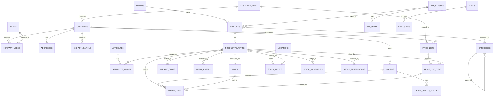

# Document 2 — Domain Model & ERD

**Project:** Wholesale / B2B Trade Platform
**Reference system:** londontopchoice.co.uk (WordPress + WooCommerce)
**Target stack:** Laravel (PHP 8.3+) · Vue 3 · MySQL 8.0 (InnoDB) · Redis
**Status:** Draft for sign-off — implementation blocked until approved
**Owner:** Rayan

---

## 1. Scope of this document

This document defines the persistent data model only. It fixes:

- every entity, its attributes, types and relationships
- all primary keys, foreign keys, unique constraints and check constraints
- all secondary and composite indexes, **with the query each one exists to serve**
- the invariants the application layer must enforce where MySQL cannot
- concurrency and locking strategy for stock and pricing
- growth and partitioning strategy for high-volume tables

It does **not** define API shapes, UI behaviour or business workflows. Those live in Documents 3–6.

### 1.1 What is in Phase 1 scope

Identity and trade accounts · Catalogue (products, variants, attributes, categories, brands) · Pack structure · Pricing engine · Tax · Inventory (authoritative ledger) · Cart · Orders and immutable line snapshots.

### 1.2 What is deliberately deferred but anticipated in the schema

RMA, quotes/RFQ, purchase orders and container tracking, credit accounts, shipments and picking, dropship. These are sketched in §13 so that Phase 1 keys and enums do not need breaking changes later.

---

## 2. Design principles

These are non-negotiable and every table below follows them.

| # | Principle | Rationale |
|---|---|---|
| P1 | **Money is stored as integer minor units** (`BIGINT`, pence) in columns suffixed `_minor` | Break tables, percentage restocking fees and landed-cost allocation all compound rounding error. Integer arithmetic is exact and comparison-safe. |
| P2 | **Rates are stored as integer basis points** (`2000` = 20.00%) in columns suffixed `_bp` | Same reason. No float VAT. |
| P3 | **Every quantity is stored in base units** ("eaches") in columns suffixed `_base` | A pack is a unit of *transaction*, never a unit of *storage*. Adding a pack tier later changes nothing downstream. |
| P4 | **The variant is the atomic commercial object.** Price, stock, barcode, pack and cost all hang off `product_variants`, never off `products` | This is what makes "support both" work — see §5.1. |
| P5 | **Stock is ledger-first.** `stock_movements` is append-only and authoritative; `stock_levels` is a rebuildable projection | Stock is fully authoritative in this system, so it must be auditable and reconstructible. |
| P6 | **Order lines snapshot everything.** Price, pack size, name, SKU, VAT rate and landed cost are copied at placement and never re-resolved | A five-year-old invoice must reprint identically after any catalogue or price change. |
| P7 | **Nothing is hard-deleted from the commercial core.** `deleted_at` soft delete, with the uniqueness pattern in §3.5 | Referential history for orders and ledger entries. |
| P8 | **No business logic in triggers.** All derivation is either a generated column or explicit application code inside a transaction | Debuggability and testability. |
| P9 | **`utf8mb4` / `utf8mb4_0900_ai_ci` everywhere**, except identifier columns noted in §3.2 | Accent-insensitive search behaviour, full emoji safety in descriptions. |
| P10 | **Surrogate `BIGINT UNSIGNED AUTO_INCREMENT` PKs for all joins**; public-facing references (order numbers, RMA numbers) are separate human-readable columns | Narrow PKs keep every secondary index small, since InnoDB appends the PK to every secondary index leaf. |

---

## 3. MySQL 8 conventions and constraints

This section exists because several of the design choices below are workarounds for things MySQL cannot do that PostgreSQL can. They are called out explicitly so nobody "fixes" them later.

### 3.1 Engine and table defaults

```sql
ENGINE=InnoDB
ROW_FORMAT=DYNAMIC
DEFAULT CHARSET=utf8mb4
COLLATE=utf8mb4_0900_ai_ci
```

`ROW_FORMAT=DYNAMIC` gives the 3072-byte index key prefix limit. Indexed `VARCHAR` columns are still capped at 191 characters by convention to keep index pages dense.

### 3.2 Type conventions

| Concept | Type | Notes |
|---|---|---|
| PK / FK | `BIGINT UNSIGNED` | |
| Money | `BIGINT` (signed) | Signed because credit notes and adjustments go negative |
| Rate / percentage | `SMALLINT UNSIGNED` basis points | `2000` = 20% |
| Quantity (absolute) | `BIGINT UNSIGNED` | |
| Quantity (delta) | `BIGINT` signed | Ledger movements |
| Weight | `INT UNSIGNED` grams | |
| Dimension | `INT UNSIGNED` millimetres | |
| SKU / code | `VARCHAR(64) COLLATE utf8mb4_0900_ai_ci` | Normalised to uppercase on write, so `ltc001` and `LTC001` collide as intended |
| Barcode | `VARCHAR(14)` | EAN-13 / GTIN-14, stored as string — leading zeros are significant |
| Country | `CHAR(2)` | ISO 3166-1 alpha-2 |
| Currency | `CHAR(3)` | ISO 4217 |
| Slug | `VARCHAR(191)` | |
| Timestamps | `DATETIME(3)` | UTC. `DATETIME` not `TIMESTAMP` — no 2038 limit, no implicit timezone conversion |
| Enum-like status | `ENUM(...)` | Chosen over lookup tables for hot-path status columns: 1 byte, no join. Documented trade-off: adding a value requires DDL. |

### 3.3 No partial indexes

MySQL has no `WHERE` clause on indexes. Where PostgreSQL would use `CREATE INDEX ... WHERE deleted_at IS NULL`, we use a **stored generated column** that is `NULL` for excluded rows, and index that. This works because MySQL treats `NULL`s as distinct in unique indexes and skips them in index scans.

### 3.4 No exclusion constraints

MySQL cannot prevent overlapping validity date ranges on price lists declaratively. This is enforced in the application (see invariant **I-7**) plus a nightly integrity check job. Do not assume the database guards it.

### 3.5 Soft-delete uniqueness pattern

The naive approach is broken. `UNIQUE (sku, deleted_at)` does **not** work in MySQL, because two live rows both have `deleted_at = NULL`, and `NULL`s are distinct — so duplicates are silently allowed.

**Single-column uniqueness** — generated column that nulls out on delete:

```sql
sku            VARCHAR(64)  NOT NULL,
deleted_at     DATETIME(3)  NULL,
sku_active     VARCHAR(64)  GENERATED ALWAYS AS
                 (IF(deleted_at IS NULL, sku, NULL)) STORED,
UNIQUE KEY uq_variants_sku_active (sku_active)
```

**Composite uniqueness** — generated column concatenating the tuple:

```sql
pack_key_active VARCHAR(96) GENERATED ALWAYS AS
  (IF(deleted_at IS NULL,
      CONCAT(variant_id, ':', units_per_pack),
      NULL)) STORED,
UNIQUE KEY uq_packs_variant_units_active (pack_key_active)
```

This pattern is used consistently. It costs one narrow stored column per constrained table and is worth it.

### 3.6 Composite index ordering rules

Applied throughout §11. In order of priority:

1. **Equality predicates first**, left to right, most selective first among equals
2. **Range or inequality predicate last** — MySQL stops using further index columns after the first range condition
3. **`ORDER BY` columns immediately after the equality prefix**, in matching direction, to get a sorted read instead of a filesort
4. **Payload columns appended last** to make the index covering where the query is hot and the payload is narrow
5. Descending indexes (`col DESC`) are used where needed — genuinely supported from MySQL 8.0, unlike 5.7 where the keyword was parsed and ignored

### 3.7 Naming

| Object | Pattern | Example |
|---|---|---|
| Table | plural snake_case | `price_list_items` |
| PK | `id` | |
| FK column | `<singular>_id` | `variant_id` |
| FK constraint | `fk_<table>_<column>` | `fk_packs_variant` |
| Unique key | `uq_<table>_<cols>` | `uq_orders_number` |
| Index | `ix_<table>_<cols>` | `ix_orders_company_placed` |
| Check | `ck_<table>_<rule>` | `ck_packs_units_positive` |

---

## 4. Domain map



---

## 5. Catalogue

### 5.1 How "support both" works

This is the key structural decision. There is **no** separate table or code path for simple versus variable products.

- `products` is the marketing/SEO object: name, description, category, brand.
- `product_variants` is the commercial object: SKU, barcode, stock, price, packs.
- A **simple** product (`products.type = 'simple'`) has **exactly one** variant, flagged `is_default = 1`, with **zero** rows in `variant_attribute_values`.
- A **variable** product (`products.type = 'variable'`) has **two or more** variants, each with one row in `variant_attribute_values` per variant-defining attribute.

Consequences, all of them desirable:

- Every query in the system — pricing, stock, order pad, order lines — reads variants and never branches on product type.
- LTC's flat catalogue imports as 920 simple products with one variant each.
- Converting a simple product into a variable one later is a data migration on `products.type` plus new variant rows. **No schema change and no reprice.** This is the retrofit pain we are avoiding.
- The cost is one extra join on the product page. Cheap, and indexed for it.

### 5.2 `brands`

```sql
CREATE TABLE brands (
  id          BIGINT UNSIGNED NOT NULL AUTO_INCREMENT,
  name        VARCHAR(160)    NOT NULL,
  slug        VARCHAR(191)    NOT NULL,
  logo_id     BIGINT UNSIGNED NULL,
  is_active   TINYINT(1)      NOT NULL DEFAULT 1,
  deleted_at  DATETIME(3)     NULL,
  created_at  DATETIME(3)     NOT NULL DEFAULT CURRENT_TIMESTAMP(3),
  updated_at  DATETIME(3)     NOT NULL DEFAULT CURRENT_TIMESTAMP(3)
                              ON UPDATE CURRENT_TIMESTAMP(3),
  slug_active VARCHAR(191)    GENERATED ALWAYS AS
                                (IF(deleted_at IS NULL, slug, NULL)) STORED,
  PRIMARY KEY (id),
  UNIQUE KEY uq_brands_slug_active (slug_active),
  KEY ix_brands_active_name (is_active, name)
) ENGINE=InnoDB;
```

### 5.3 `categories`

Adjacency list plus a **materialised path** column. Rationale: nested sets make writes expensive and merchandising teams reorder categories constantly; a closure table is a second table to keep consistent. The path column gives single-index subtree reads, which is the only hot query.

```sql
CREATE TABLE categories (
  id             BIGINT UNSIGNED NOT NULL AUTO_INCREMENT,
  parent_id      BIGINT UNSIGNED NULL,
  name           VARCHAR(160)    NOT NULL,
  slug           VARCHAR(191)    NOT NULL,
  path           VARCHAR(255)    NOT NULL COMMENT 'e.g. /1/14/57/ — maintained by app on move',
  depth          TINYINT UNSIGNED NOT NULL DEFAULT 0,
  position       SMALLINT UNSIGNED NOT NULL DEFAULT 0,
  icon_id        BIGINT UNSIGNED NULL,
  is_visible     TINYINT(1)      NOT NULL DEFAULT 1,
  deleted_at     DATETIME(3)     NULL,
  created_at     DATETIME(3)     NOT NULL DEFAULT CURRENT_TIMESTAMP(3),
  updated_at     DATETIME(3)     NOT NULL DEFAULT CURRENT_TIMESTAMP(3)
                                 ON UPDATE CURRENT_TIMESTAMP(3),
  slug_active    VARCHAR(191)    GENERATED ALWAYS AS
                                   (IF(deleted_at IS NULL, slug, NULL)) STORED,
  PRIMARY KEY (id),
  UNIQUE KEY uq_categories_slug_active (slug_active),
  KEY ix_categories_parent_position (parent_id, position),
  KEY ix_categories_path (path),
  CONSTRAINT fk_categories_parent
    FOREIGN KEY (parent_id) REFERENCES categories (id) ON DELETE RESTRICT
) ENGINE=InnoDB;
```

`ix_categories_path` serves `WHERE path LIKE '/1/14/%'` — a left-anchored prefix, so the index is used. Right-anchored wildcards are forbidden by convention.

> **Note on the reference system:** LTC exposes `Uncategorized` publicly and uses `BULK ORDER` as both a navigation concept and a product category, which muddles their taxonomy. Here, `is_visible` and a reserved uncategorised bucket keep that from leaking, and "bulk order" is a *view* over the catalogue, not a category.

### 5.4 `products`

```sql
CREATE TABLE products (
  id                   BIGINT UNSIGNED NOT NULL AUTO_INCREMENT,
  type                 ENUM('simple','variable') NOT NULL DEFAULT 'simple',
  status               ENUM('draft','active','coming_soon','discontinued','archived')
                         NOT NULL DEFAULT 'draft',
  name                 VARCHAR(255)    NOT NULL,
  slug                 VARCHAR(191)    NOT NULL,
  brand_id             BIGINT UNSIGNED NULL,
  primary_category_id  BIGINT UNSIGNED NULL,
  tax_class_id         BIGINT UNSIGNED NOT NULL,
  short_description    VARCHAR(500)    NULL,
  description          MEDIUMTEXT       NULL,
  origin_country       CHAR(2)         NULL COMMENT 'ISO 3166-1 — importer requirement',
  hs_code              VARCHAR(12)     NULL COMMENT 'commodity code for duty/customs',
  is_visible           TINYINT(1)      NOT NULL DEFAULT 1,
  published_at         DATETIME(3)     NULL,
  deleted_at           DATETIME(3)     NULL,
  created_at           DATETIME(3)     NOT NULL DEFAULT CURRENT_TIMESTAMP(3),
  updated_at           DATETIME(3)     NOT NULL DEFAULT CURRENT_TIMESTAMP(3)
                                       ON UPDATE CURRENT_TIMESTAMP(3),
  slug_active          VARCHAR(191)    GENERATED ALWAYS AS
                                         (IF(deleted_at IS NULL, slug, NULL)) STORED,
  completeness_score   TINYINT UNSIGNED NOT NULL DEFAULT 0
                         COMMENT 'app-maintained 0-100, drives data-quality dashboard',
  PRIMARY KEY (id),
  UNIQUE KEY uq_products_slug_active (slug_active),
  KEY ix_products_listing (status, is_visible, published_at DESC, id),
  KEY ix_products_brand_status (brand_id, status),
  KEY ix_products_primary_cat (primary_category_id, status),
  KEY ix_products_completeness (completeness_score, status),
  CONSTRAINT fk_products_brand
    FOREIGN KEY (brand_id) REFERENCES brands (id) ON DELETE SET NULL,
  CONSTRAINT fk_products_primary_cat
    FOREIGN KEY (primary_category_id) REFERENCES categories (id) ON DELETE SET NULL,
  CONSTRAINT fk_products_tax_class
    FOREIGN KEY (tax_class_id) REFERENCES tax_classes (id) ON DELETE RESTRICT
) ENGINE=InnoDB;
```

`ix_products_completeness` directly serves the data-quality dashboard that prevents the placeholder-image and empty-description problem visible across the reference catalogue.

### 5.5 `product_variants`

The single most important table in the schema.

```sql
CREATE TABLE product_variants (
  id                        BIGINT UNSIGNED NOT NULL AUTO_INCREMENT,
  product_id                BIGINT UNSIGNED NOT NULL,
  sku                       VARCHAR(64)     NOT NULL,
  supplier_ref              VARCHAR(64)     NULL,
  barcode                   VARCHAR(14)     NULL COMMENT 'EAN-13 / GTIN-14',
  is_default                TINYINT(1)      NOT NULL DEFAULT 0
                              COMMENT '1 for the sole variant of a simple product',
  status                    ENUM('active','coming_soon','discontinued','archived')
                              NOT NULL DEFAULT 'active',
  base_uom                  ENUM('each','kg','litre','metre') NOT NULL DEFAULT 'each',
  moq_base_qty              INT UNSIGNED    NOT NULL DEFAULT 1
                              COMMENT 'minimum order quantity in base units',
  order_increment_base_qty  INT UNSIGNED    NOT NULL DEFAULT 1
                              COMMENT 'must order in multiples of this',
  default_sell_pack_id      BIGINT UNSIGNED NULL,
  rrp_gross_minor           BIGINT          NULL COMMENT 'drives retailer margin calculator',
  weight_grams              INT UNSIGNED    NULL,
  length_mm                 INT UNSIGNED    NULL,
  width_mm                  INT UNSIGNED    NULL,
  height_mm                 INT UNSIGNED    NULL,
  position                  SMALLINT UNSIGNED NOT NULL DEFAULT 0,
  deleted_at                DATETIME(3)     NULL,
  created_at                DATETIME(3)     NOT NULL DEFAULT CURRENT_TIMESTAMP(3),
  updated_at                DATETIME(3)     NOT NULL DEFAULT CURRENT_TIMESTAMP(3)
                                            ON UPDATE CURRENT_TIMESTAMP(3),
  sku_active                VARCHAR(64)     GENERATED ALWAYS AS
                                              (IF(deleted_at IS NULL, sku, NULL)) STORED,
  barcode_active            VARCHAR(14)     GENERATED ALWAYS AS
                                              (IF(deleted_at IS NULL, barcode, NULL)) STORED,
  PRIMARY KEY (id),
  UNIQUE KEY uq_variants_sku_active (sku_active),
  UNIQUE KEY uq_variants_barcode_active (barcode_active),
  KEY ix_variants_product_position (product_id, position, id),
  KEY ix_variants_status (status, id),
  KEY ix_variants_supplier_ref (supplier_ref),
  CONSTRAINT fk_variants_product
    FOREIGN KEY (product_id) REFERENCES products (id) ON DELETE RESTRICT,
  CONSTRAINT ck_variants_moq_positive
    CHECK (moq_base_qty >= 1 AND order_increment_base_qty >= 1)
) ENGINE=InnoDB;
```

Notes:

- `uq_variants_barcode_active` relies on `NULL` distinctness: many variants may legitimately have no barcode, and each `NULL` is unique, so they coexist. Populated barcodes collide correctly.
- `default_sell_pack_id` has **no** FK declared at creation time — it is a circular reference with `packs.variant_id`. The FK is added in a later migration, after both tables exist, with `ON DELETE SET NULL`. Documented so nobody removes it as an oversight.
- `moq_base_qty` and `order_increment_base_qty` live here, not on packs, because they constrain the *total* ordered quantity regardless of which pack the buyer selected.

### 5.6 Attributes

```sql
CREATE TABLE attributes (
  id                  BIGINT UNSIGNED NOT NULL AUTO_INCREMENT,
  code                VARCHAR(64)     NOT NULL,
  name                VARCHAR(160)    NOT NULL,
  type                ENUM('select','text','number','boolean') NOT NULL DEFAULT 'select',
  is_variant_defining TINYINT(1)      NOT NULL DEFAULT 0,
  is_filterable       TINYINT(1)      NOT NULL DEFAULT 0,
  position            SMALLINT UNSIGNED NOT NULL DEFAULT 0,
  PRIMARY KEY (id),
  UNIQUE KEY uq_attributes_code (code),
  KEY ix_attributes_filterable (is_filterable, position)
) ENGINE=InnoDB;

CREATE TABLE attribute_values (
  id           BIGINT UNSIGNED NOT NULL AUTO_INCREMENT,
  attribute_id BIGINT UNSIGNED NOT NULL,
  value        VARCHAR(160)    NOT NULL,
  slug         VARCHAR(191)    NOT NULL,
  position     SMALLINT UNSIGNED NOT NULL DEFAULT 0,
  PRIMARY KEY (id),
  UNIQUE KEY uq_attrvalues_attr_slug (attribute_id, slug),
  CONSTRAINT fk_attrvalues_attribute
    FOREIGN KEY (attribute_id) REFERENCES attributes (id) ON DELETE CASCADE
) ENGINE=InnoDB;

CREATE TABLE variant_attribute_values (
  variant_id         BIGINT UNSIGNED NOT NULL,
  attribute_id       BIGINT UNSIGNED NOT NULL,
  attribute_value_id BIGINT UNSIGNED NOT NULL,
  PRIMARY KEY (variant_id, attribute_id),
  KEY ix_vav_facet (attribute_value_id, variant_id),
  CONSTRAINT fk_vav_variant
    FOREIGN KEY (variant_id) REFERENCES product_variants (id) ON DELETE CASCADE,
  CONSTRAINT fk_vav_attribute
    FOREIGN KEY (attribute_id) REFERENCES attributes (id) ON DELETE RESTRICT,
  CONSTRAINT fk_vav_value
    FOREIGN KEY (attribute_value_id) REFERENCES attribute_values (id) ON DELETE RESTRICT
) ENGINE=InnoDB;
```

The PK `(variant_id, attribute_id)` enforces "one value per attribute per variant" for free. `ix_vav_facet` is deliberately reversed to serve facet filtering ("all variants that are blue"), which reads from value to variant.

### 5.7 `product_categories`

```sql
CREATE TABLE product_categories (
  product_id  BIGINT UNSIGNED NOT NULL,
  category_id BIGINT UNSIGNED NOT NULL,
  position    SMALLINT UNSIGNED NOT NULL DEFAULT 0,
  PRIMARY KEY (product_id, category_id),
  KEY ix_prodcat_category_position (category_id, position, product_id),
  CONSTRAINT fk_prodcat_product
    FOREIGN KEY (product_id) REFERENCES products (id) ON DELETE CASCADE,
  CONSTRAINT fk_prodcat_category
    FOREIGN KEY (category_id) REFERENCES categories (id) ON DELETE CASCADE
) ENGINE=InnoDB;
```

`ix_prodcat_category_position` is covering for the category listing query: equality on `category_id`, sorted by `position`, returning `product_id` — no table touch.

### 5.8 `media_assets` and `variant_media`

```sql
CREATE TABLE media_assets (
  id            BIGINT UNSIGNED NOT NULL AUTO_INCREMENT,
  disk          VARCHAR(32)     NOT NULL DEFAULT 's3',
  path          VARCHAR(512)    NOT NULL,
  mime          VARCHAR(96)     NOT NULL,
  bytes         BIGINT UNSIGNED NOT NULL,
  width_px      INT UNSIGNED    NULL,
  height_px     INT UNSIGNED    NULL,
  checksum      CHAR(64)        NOT NULL COMMENT 'sha256 — dedupes re-uploads',
  alt_text      VARCHAR(255)    NULL,
  source_filename VARCHAR(255)  NULL COMMENT 'used for SKU auto-matching on bulk import',
  created_at    DATETIME(3)     NOT NULL DEFAULT CURRENT_TIMESTAMP(3),
  PRIMARY KEY (id),
  UNIQUE KEY uq_media_checksum (checksum),
  KEY ix_media_source_filename (source_filename)
) ENGINE=InnoDB;

CREATE TABLE variant_media (
  variant_id BIGINT UNSIGNED NOT NULL,
  media_id   BIGINT UNSIGNED NOT NULL,
  role       ENUM('primary','gallery','pack_shot','lifestyle','spec') NOT NULL DEFAULT 'gallery',
  position   SMALLINT UNSIGNED NOT NULL DEFAULT 0,
  PRIMARY KEY (variant_id, media_id),
  KEY ix_variantmedia_order (variant_id, role, position),
  CONSTRAINT fk_variantmedia_variant
    FOREIGN KEY (variant_id) REFERENCES product_variants (id) ON DELETE CASCADE,
  CONSTRAINT fk_variantmedia_media
    FOREIGN KEY (media_id) REFERENCES media_assets (id) ON DELETE CASCADE
) ENGINE=InnoDB;
```

`ix_media_source_filename` is what makes bulk image import by filename work. The reference system's images are already named by SKU (`LTC01372.png`), so the importer can match a dropped folder of images to variants automatically — which is how their placeholder-image problem gets solved in one job rather than 900 manual uploads.

---

## 6. Pack structure

The table that makes wholesale work, and the one that is genuinely painful to retrofit.

```sql
CREATE TABLE packs (
  id                 BIGINT UNSIGNED NOT NULL AUTO_INCREMENT,
  variant_id         BIGINT UNSIGNED NOT NULL,
  level              ENUM('each','inner','outer','pallet') NOT NULL,
  label              VARCHAR(64)     NOT NULL COMMENT 'e.g. "Case of 12"',
  units_per_pack     INT UNSIGNED    NOT NULL,
  barcode            VARCHAR(14)     NULL COMMENT 'case barcode, scanned in warehouse',
  gross_weight_grams INT UNSIGNED    NULL,
  length_mm          INT UNSIGNED    NULL,
  width_mm           INT UNSIGNED    NULL,
  height_mm          INT UNSIGNED    NULL,
  packs_per_layer    SMALLINT UNSIGNED NULL,
  layers_per_pallet  SMALLINT UNSIGNED NULL,
  is_sellable        TINYINT(1)      NOT NULL DEFAULT 1,
  position           SMALLINT UNSIGNED NOT NULL DEFAULT 0,
  deleted_at         DATETIME(3)     NULL,
  created_at         DATETIME(3)     NOT NULL DEFAULT CURRENT_TIMESTAMP(3),
  updated_at         DATETIME(3)     NOT NULL DEFAULT CURRENT_TIMESTAMP(3)
                                     ON UPDATE CURRENT_TIMESTAMP(3),
  pack_key_active    VARCHAR(96)     GENERATED ALWAYS AS
                                       (IF(deleted_at IS NULL,
                                           CONCAT(variant_id, ':', units_per_pack),
                                           NULL)) STORED,
  barcode_active     VARCHAR(14)     GENERATED ALWAYS AS
                                       (IF(deleted_at IS NULL, barcode, NULL)) STORED,
  PRIMARY KEY (id),
  UNIQUE KEY uq_packs_variant_units_active (pack_key_active),
  UNIQUE KEY uq_packs_barcode_active (barcode_active),
  KEY ix_packs_variant_sellable (variant_id, is_sellable, position),
  CONSTRAINT fk_packs_variant
    FOREIGN KEY (variant_id) REFERENCES product_variants (id) ON DELETE RESTRICT,
  CONSTRAINT ck_packs_units_positive CHECK (units_per_pack >= 1)
) ENGINE=InnoDB;
```

### 6.1 The pack contract

1. **Every variant has at least one pack.** Even a single-unit item gets an `each` pack with `units_per_pack = 1`. This removes every `IF pack IS NULL` branch from the codebase. The importer creates it automatically.
2. **`base_qty = pack_qty × units_per_pack`**, computed once at cart-line creation and stored. Stock, pricing, reporting and picking all read `base_qty`.
3. **`pack_id` is recorded on the transaction**, so the delivery note can say "3 × Case of 12" while the ledger deducts 36.
4. **Packs are soft-deleted, never repurposed.** Changing `units_per_pack` on a live pack would silently corrupt the meaning of historical lines that reference it. Instead: soft-delete and create a new pack. Enforced by invariant **I-4**.

### 6.2 Why this cannot be bolted on later

If quantities were stored as "whatever the customer typed", then introducing case quantities later requires: backfilling a pack for every variant, re-interpreting every historical order line, re-deriving every stock movement, and re-banding every price break. Each of those is a data-loss risk. Storing base units from row one costs nothing now.

---

## 7. Tax

```sql
CREATE TABLE tax_classes (
  id   BIGINT UNSIGNED NOT NULL AUTO_INCREMENT,
  code VARCHAR(32)     NOT NULL COMMENT 'standard | zero | reduced',
  name VARCHAR(96)     NOT NULL,
  PRIMARY KEY (id),
  UNIQUE KEY uq_taxclasses_code (code)
) ENGINE=InnoDB;

CREATE TABLE tax_rates (
  id           BIGINT UNSIGNED NOT NULL AUTO_INCREMENT,
  tax_class_id BIGINT UNSIGNED NOT NULL,
  country      CHAR(2)         NOT NULL DEFAULT 'GB',
  rate_bp      SMALLINT UNSIGNED NOT NULL COMMENT '2000 = 20.00%',
  valid_from   DATE            NOT NULL,
  valid_to     DATE            NULL,
  PRIMARY KEY (id),
  KEY ix_taxrates_lookup (tax_class_id, country, valid_from DESC),
  CONSTRAINT fk_taxrates_class
    FOREIGN KEY (tax_class_id) REFERENCES tax_classes (id) ON DELETE RESTRICT
) ENGINE=InnoDB;
```

VAT rate is **snapshotted onto the order line** at placement (`vat_rate_bp`). A rate change must never alter an issued invoice. The reference system shows net prices with no ex-VAT labelling anywhere on product cards; here the display mode is a user preference (§8.4) and the stored value is always net.

---

## 8. Pricing engine

### 8.1 `customer_tiers`

```sql
CREATE TABLE customer_tiers (
  id        BIGINT UNSIGNED NOT NULL AUTO_INCREMENT,
  code      VARCHAR(32)     NOT NULL COMMENT 'retail | trade_1 | trade_2 | trade_3',
  name      VARCHAR(96)     NOT NULL,
  priority  SMALLINT UNSIGNED NOT NULL DEFAULT 100,
  is_default TINYINT(1)     NOT NULL DEFAULT 0,
  PRIMARY KEY (id),
  UNIQUE KEY uq_tiers_code (code)
) ENGINE=InnoDB;
```

### 8.2 `price_lists`

One table covers tier pricing, customer-specific pricing, contract pricing and promotions, discriminated by `scope`.

```sql
CREATE TABLE price_lists (
  id          BIGINT UNSIGNED NOT NULL AUTO_INCREMENT,
  code        VARCHAR(48)     NOT NULL,
  name        VARCHAR(160)    NOT NULL,
  scope       ENUM('base','tier','company','contract','promotion') NOT NULL,
  tier_id     BIGINT UNSIGNED NULL,
  company_id  BIGINT UNSIGNED NULL,
  currency    CHAR(3)         NOT NULL DEFAULT 'GBP',
  precedence  SMALLINT UNSIGNED NOT NULL
                COMMENT 'lower wins; base=900, tier=700, promotion=500, company=300, contract=100',
  valid_from  DATETIME(3)     NULL,
  valid_to    DATETIME(3)     NULL,
  is_active   TINYINT(1)      NOT NULL DEFAULT 1,
  created_at  DATETIME(3)     NOT NULL DEFAULT CURRENT_TIMESTAMP(3),
  updated_at  DATETIME(3)     NOT NULL DEFAULT CURRENT_TIMESTAMP(3)
                              ON UPDATE CURRENT_TIMESTAMP(3),
  PRIMARY KEY (id),
  UNIQUE KEY uq_pricelists_code (code),
  KEY ix_pricelists_tier_active (tier_id, is_active, valid_from, valid_to),
  KEY ix_pricelists_company_active (company_id, is_active, valid_from, valid_to),
  KEY ix_pricelists_scope_precedence (scope, precedence),
  CONSTRAINT fk_pricelists_tier
    FOREIGN KEY (tier_id) REFERENCES customer_tiers (id) ON DELETE CASCADE,
  CONSTRAINT fk_pricelists_company
    FOREIGN KEY (company_id) REFERENCES companies (id) ON DELETE CASCADE,
  CONSTRAINT ck_pricelists_scope_target CHECK (
    (scope = 'tier'     AND tier_id IS NOT NULL AND company_id IS NULL) OR
    (scope IN ('company','contract') AND company_id IS NOT NULL) OR
    (scope IN ('base','promotion')   AND tier_id IS NULL AND company_id IS NULL)
  )
) ENGINE=InnoDB;
```

The `ck_pricelists_scope_target` check is real enforcement — MySQL 8 honours `CHECK` constraints (unlike 5.7, which parsed and discarded them).

### 8.3 `price_list_items` — the break table

```sql
CREATE TABLE price_list_items (
  id              BIGINT UNSIGNED NOT NULL AUTO_INCREMENT,
  price_list_id   BIGINT UNSIGNED NOT NULL,
  variant_id      BIGINT UNSIGNED NOT NULL,
  min_base_qty    INT UNSIGNED    NOT NULL DEFAULT 1
                    COMMENT 'lower bound of the break band, in base units',
  unit_net_minor  BIGINT          NOT NULL COMMENT 'price per BASE unit, ex-VAT, pence',
  created_at      DATETIME(3)     NOT NULL DEFAULT CURRENT_TIMESTAMP(3),
  updated_at      DATETIME(3)     NOT NULL DEFAULT CURRENT_TIMESTAMP(3)
                                  ON UPDATE CURRENT_TIMESTAMP(3),
  PRIMARY KEY (id),
  UNIQUE KEY uq_pli_list_variant_qty (price_list_id, variant_id, min_base_qty),
  KEY ix_pli_resolve (variant_id, price_list_id, min_base_qty, unit_net_minor),
  CONSTRAINT fk_pli_list
    FOREIGN KEY (price_list_id) REFERENCES price_lists (id) ON DELETE CASCADE,
  CONSTRAINT fk_pli_variant
    FOREIGN KEY (variant_id) REFERENCES product_variants (id) ON DELETE CASCADE,
  CONSTRAINT ck_pli_price_nonneg CHECK (unit_net_minor >= 0),
  CONSTRAINT ck_pli_qty_positive  CHECK (min_base_qty >= 1)
) ENGINE=InnoDB;
```

**Key design point:** a quantity break table is not a separate structure. `1–11 / 12–47 / 48+` is simply three rows with `min_base_qty` of `1`, `12` and `48`. The upper bound is implicit — the next band's lower bound minus one. This means adding, removing or re-banding breaks is pure data, never DDL.

**`ix_pli_resolve` is the hottest index in the system.** Column order is deliberate:

- `variant_id` — equality, high cardinality, and the order pad resolves a page of variants at once via `IN (...)`
- `price_list_id` — equality, narrows to the lists applicable to this customer
- `min_base_qty` — range (`<= ?`), so it must come last among predicates
- `unit_net_minor` — payload, appended to make the index **covering**: the resolver never touches the clustered index

`price_lists.currency` is denormalised per list rather than per item, because a list is single-currency by definition.

### 8.4 Resolution algorithm

Given a `variant_id` set, a `company_id`, a `tier_id` and a quantity per variant:

1. Collect applicable `price_list_id`s: contract → company → active promotions → tier → base, filtered by `is_active` and the validity window against `NOW()`.
2. **One query** fetches every band for every variant across those lists, using `ix_pli_resolve`.
3. In application memory, per variant: group by list, order lists by `precedence` ascending, take the first list that has any band, then within it take the band with the greatest `min_base_qty <= qty`.
4. Cache the result in Redis keyed `price:{company_id}:{variant_id}:{qty_band}` with a short TTL, invalidated on any `price_list_items` or `price_lists` write.

The order pad renders 50–100 rows per page, so this must be one query and one cache read — never N+1. That constraint is why step 2 fetches all bands rather than asking the database to pick.

### 8.5 `variant_costs` — landed cost and margin

```sql
CREATE TABLE variant_costs (
  id                 BIGINT UNSIGNED NOT NULL AUTO_INCREMENT,
  variant_id         BIGINT UNSIGNED NOT NULL,
  effective_from     DATE            NOT NULL,
  fob_unit_minor     BIGINT          NOT NULL DEFAULT 0,
  freight_unit_minor BIGINT          NOT NULL DEFAULT 0,
  duty_unit_minor    BIGINT          NOT NULL DEFAULT 0,
  other_unit_minor   BIGINT          NOT NULL DEFAULT 0,
  fx_rate_bp         INT UNSIGNED    NULL COMMENT 'rate applied at purchase, for audit',
  landed_unit_minor  BIGINT          GENERATED ALWAYS AS
                                       (fob_unit_minor + freight_unit_minor
                                        + duty_unit_minor + other_unit_minor) STORED,
  note               VARCHAR(255)    NULL,
  created_at         DATETIME(3)     NOT NULL DEFAULT CURRENT_TIMESTAMP(3),
  PRIMARY KEY (id),
  UNIQUE KEY uq_variantcosts_variant_from (variant_id, effective_from),
  KEY ix_variantcosts_lookup (variant_id, effective_from DESC, landed_unit_minor),
  CONSTRAINT fk_variantcosts_variant
    FOREIGN KEY (variant_id) REFERENCES product_variants (id) ON DELETE CASCADE
) ENGINE=InnoDB;
```

`landed_unit_minor` is a stored generated column, so margin reports read it directly and it can be indexed. `ix_variantcosts_lookup` is covering for "cost effective on date X" — descending on `effective_from` so the first index entry found is the answer.

---

## 9. Inventory — authoritative stock

Stock is fully authoritative here, so the model prioritises auditability and correctness under concurrency over raw write speed.

### 9.1 `locations`

```sql
CREATE TABLE locations (
  id          BIGINT UNSIGNED NOT NULL AUTO_INCREMENT,
  code        VARCHAR(32)     NOT NULL,
  name        VARCHAR(160)    NOT NULL,
  type        ENUM('warehouse','collection','van','virtual','quarantine')
                NOT NULL DEFAULT 'warehouse',
  is_default  TINYINT(1)      NOT NULL DEFAULT 0,
  is_sellable TINYINT(1)      NOT NULL DEFAULT 1
                COMMENT 'quarantine/damaged stock excluded from availability',
  address_id  BIGINT UNSIGNED NULL,
  PRIMARY KEY (id),
  UNIQUE KEY uq_locations_code (code),
  KEY ix_locations_sellable (is_sellable, id)
) ENGINE=InnoDB;
```

Included from day one even though launch is single-site, per the earlier decision. Retrofitting `location_id` into stock queries later means touching every availability check.

### 9.2 `stock_levels` — the projection

```sql
CREATE TABLE stock_levels (
  variant_id         BIGINT UNSIGNED NOT NULL,
  location_id        BIGINT UNSIGNED NOT NULL,
  on_hand_base       BIGINT          NOT NULL DEFAULT 0,
  reserved_base      BIGINT          NOT NULL DEFAULT 0,
  incoming_base      BIGINT          NOT NULL DEFAULT 0
                       COMMENT 'on open purchase orders — informational',
  available_base     BIGINT          GENERATED ALWAYS AS
                                       (on_hand_base - reserved_base) STORED,
  reorder_point_base INT UNSIGNED    NULL,
  reorder_qty_base   INT UNSIGNED    NULL,
  last_movement_at   DATETIME(3)     NULL,
  updated_at         DATETIME(3)     NOT NULL DEFAULT CURRENT_TIMESTAMP(3)
                                     ON UPDATE CURRENT_TIMESTAMP(3),
  PRIMARY KEY (variant_id, location_id),
  KEY ix_levels_location_available (location_id, available_base),
  KEY ix_levels_reorder (location_id, reorder_point_base, available_base),
  KEY ix_levels_dead_stock (location_id, last_movement_at, on_hand_base),
  CONSTRAINT fk_levels_variant
    FOREIGN KEY (variant_id) REFERENCES product_variants (id) ON DELETE CASCADE,
  CONSTRAINT fk_levels_location
    FOREIGN KEY (location_id) REFERENCES locations (id) ON DELETE RESTRICT,
  CONSTRAINT ck_levels_nonneg CHECK (on_hand_base >= 0 AND reserved_base >= 0)
) ENGINE=InnoDB;
```

- **PK is `(variant_id, location_id)`** — no surrogate. This makes the clustered index itself the lookup path for the single most frequent read in the application ("is this in stock"), and guarantees one row per pair.
- `available_base` is a stored generated column, so it is indexable. `ix_levels_location_available` serves availability filters and low-stock sorting without computing anything.
- `ix_levels_dead_stock` serves the dead-stock report: stock sitting with no movement since date X.
- The `ck_levels_nonneg` check means overselling fails loudly at the database boundary rather than producing negative stock. Corrections go through adjustment movements, not negative balances.

### 9.3 `stock_movements` — the ledger

Append-only. Never updated, never deleted.

```sql
CREATE TABLE stock_movements (
  id                 BIGINT UNSIGNED NOT NULL AUTO_INCREMENT,
  variant_id         BIGINT UNSIGNED NOT NULL,
  location_id        BIGINT UNSIGNED NOT NULL,
  delta_base         BIGINT          NOT NULL COMMENT 'signed: +receipt, -despatch',
  balance_after_base BIGINT          NOT NULL COMMENT 'running balance for audit/reconciliation',
  type               ENUM('receipt','despatch','adjustment','return_in','return_out',
                          'transfer_in','transfer_out','stocktake','write_off','initial')
                       NOT NULL,
  reason_code        VARCHAR(32)     NULL COMMENT 'damaged | miscount | expired | theft',
  reference_type     VARCHAR(64)     NULL COMMENT 'morph: Order | PurchaseOrder | Rma | Stocktake',
  reference_id       BIGINT UNSIGNED NULL,
  user_id            BIGINT UNSIGNED NULL,
  note               VARCHAR(255)    NULL,
  created_at         DATETIME(3)     NOT NULL DEFAULT CURRENT_TIMESTAMP(3),
  PRIMARY KEY (id, created_at),
  KEY ix_moves_variant_created (variant_id, created_at, id),
  KEY ix_moves_reference (reference_type, reference_id),
  KEY ix_moves_location_created (location_id, created_at),
  KEY ix_moves_type_created (type, created_at)
) ENGINE=InnoDB
PARTITION BY RANGE COLUMNS (created_at) (
  PARTITION p2026q1 VALUES LESS THAN ('2026-04-01'),
  PARTITION p2026q2 VALUES LESS THAN ('2026-07-01'),
  PARTITION p2026q3 VALUES LESS THAN ('2026-10-01'),
  PARTITION p2026q4 VALUES LESS THAN ('2027-01-01'),
  PARTITION pmax    VALUES LESS THAN (MAXVALUE)
);
```

**Explicit trade-offs to note:**

- **No foreign keys.** MySQL does not permit foreign keys on partitioned tables. Referential integrity for `variant_id` and `location_id` is enforced in the application. This is a conscious cost paid for partitioning; if you would rather keep the FKs, drop the partitioning and revisit when the table passes ~50M rows.
- **PK is `(id, created_at)`.** MySQL requires every unique key to contain every column of the partitioning expression. `id` alone is still unique in practice via `AUTO_INCREMENT`, but the declared PK must carry `created_at`.
- `balance_after_base` denormalises the running total so reconciliation ("does the ledger sum to the projection?") is a single-row read per variant rather than a full aggregation. It is written inside the same transaction as the level update.
- `ix_moves_variant_created` serves the per-variant stock history screen, ordered by time, and is the index used by the projection rebuild job.
- Partition pruning means "movements this quarter" reads one partition. New partitions are added by a scheduled job a quarter ahead.

### 9.4 `stock_reservations`

```sql
CREATE TABLE stock_reservations (
  id           BIGINT UNSIGNED NOT NULL AUTO_INCREMENT,
  variant_id   BIGINT UNSIGNED NOT NULL,
  location_id  BIGINT UNSIGNED NOT NULL,
  base_qty     BIGINT UNSIGNED NOT NULL,
  holder_type  ENUM('cart','order','quote') NOT NULL,
  holder_id    BIGINT UNSIGNED NOT NULL,
  expires_at   DATETIME(3)     NULL COMMENT 'cart holds expire; order holds do not',
  released_at  DATETIME(3)     NULL,
  created_at   DATETIME(3)     NOT NULL DEFAULT CURRENT_TIMESTAMP(3),
  PRIMARY KEY (id),
  KEY ix_reservations_holder (holder_type, holder_id),
  KEY ix_reservations_active (variant_id, location_id, released_at, base_qty),
  KEY ix_reservations_expiry (expires_at, released_at),
  CONSTRAINT fk_reservations_variant
    FOREIGN KEY (variant_id) REFERENCES product_variants (id) ON DELETE CASCADE,
  CONSTRAINT fk_reservations_location
    FOREIGN KEY (location_id) REFERENCES locations (id) ON DELETE RESTRICT,
  CONSTRAINT ck_reservations_qty_positive CHECK (base_qty >= 1)
) ENGINE=InnoDB;
```

`ix_reservations_expiry` drives the sweeper job that releases abandoned cart holds. `ix_reservations_active` is covering for the "how much is currently held" reconciliation query.

### 9.5 `back_in_stock_subscriptions`

```sql
CREATE TABLE back_in_stock_subscriptions (
  id           BIGINT UNSIGNED NOT NULL AUTO_INCREMENT,
  variant_id   BIGINT UNSIGNED NOT NULL,
  user_id      BIGINT UNSIGNED NULL,
  email        VARCHAR(255)    NOT NULL,
  notified_at  DATETIME(3)     NULL,
  created_at   DATETIME(3)     NOT NULL DEFAULT CURRENT_TIMESTAMP(3),
  sub_key_active VARCHAR(320)  GENERATED ALWAYS AS
                                 (IF(notified_at IS NULL,
                                     CONCAT(variant_id, ':', email), NULL)) STORED,
  PRIMARY KEY (id),
  UNIQUE KEY uq_bis_pending (sub_key_active),
  KEY ix_bis_variant_pending (variant_id, notified_at),
  CONSTRAINT fk_bis_variant
    FOREIGN KEY (variant_id) REFERENCES product_variants (id) ON DELETE CASCADE
) ENGINE=InnoDB;
```

The generated-column unique key prevents duplicate pending signups while allowing the same person to re-subscribe after being notified — the soft-delete pattern from §3.5 applied to a different lifecycle.

---

## 10. Identity, trade accounts, cart and orders

### 10.1 Identity tables (summary)

| Table | Key columns | Notable indexes |
|---|---|---|
| `users` | `email` (unique active), `password`, `name`, `phone`, `locale`, `price_display` ENUM('net','gross'), `two_factor_secret`, `last_login_at` | `uq_users_email_active`, `ix_users_last_login` |
| `companies` | `name`, `trading_name`, `tier_id`, `vat_number`, `company_number`, `status` ENUM('pending','approved','suspended','rejected'), `credit_limit_minor`, `payment_terms_days`, `account_code` | `uq_companies_account_code`, `ix_companies_tier_status`, `ix_companies_status_created` |
| `company_users` | `company_id`, `user_id`, `role` ENUM('owner','buyer','approver','viewer'), `spend_limit_minor` | PK `(company_id, user_id)`, `ix_companyusers_user` |
| `addresses` | `addressable_type`/`_id` morph, `type` ENUM('billing','delivery'), lines, `postcode`, `country`, `is_default` | `ix_addresses_owner`, `ix_addresses_postcode` |
| `b2b_applications` | `company_id`, `submitted_by`, `status`, `documents` JSON, `reviewed_by`, `reviewed_at`, `rejection_reason` | `ix_b2bapps_status_submitted` |
| `roles`, `permissions`, pivots | Spatie-compatible | standard |

`companies.tier_id` is what connects a trade account to its price list. `users.price_display` is what gives the ex-VAT/inc-VAT toggle a home.

### 10.2 `carts` and `cart_lines`

```sql
CREATE TABLE carts (
  id          BIGINT UNSIGNED NOT NULL AUTO_INCREMENT,
  token       CHAR(26)        NOT NULL COMMENT 'ULID, for guest cart cookie',
  user_id     BIGINT UNSIGNED NULL,
  company_id  BIGINT UNSIGNED NULL,
  tier_id     BIGINT UNSIGNED NULL,
  currency    CHAR(3)         NOT NULL DEFAULT 'GBP',
  location_id BIGINT UNSIGNED NOT NULL,
  expires_at  DATETIME(3)     NOT NULL,
  created_at  DATETIME(3)     NOT NULL DEFAULT CURRENT_TIMESTAMP(3),
  updated_at  DATETIME(3)     NOT NULL DEFAULT CURRENT_TIMESTAMP(3)
                              ON UPDATE CURRENT_TIMESTAMP(3),
  PRIMARY KEY (id),
  UNIQUE KEY uq_carts_token (token),
  KEY ix_carts_user (user_id, updated_at),
  KEY ix_carts_expiry (expires_at)
) ENGINE=InnoDB;

CREATE TABLE cart_lines (
  id                     BIGINT UNSIGNED NOT NULL AUTO_INCREMENT,
  cart_id                BIGINT UNSIGNED NOT NULL,
  variant_id             BIGINT UNSIGNED NOT NULL,
  pack_id                BIGINT UNSIGNED NOT NULL,
  pack_qty               INT UNSIGNED    NOT NULL,
  base_qty               BIGINT UNSIGNED NOT NULL
                           COMMENT 'pack_qty * packs.units_per_pack, written by app',
  unit_net_minor         BIGINT          NOT NULL,
  price_list_item_id     BIGINT UNSIGNED NULL,
  price_resolved_at      DATETIME(3)     NOT NULL,
  created_at             DATETIME(3)     NOT NULL DEFAULT CURRENT_TIMESTAMP(3),
  updated_at             DATETIME(3)     NOT NULL DEFAULT CURRENT_TIMESTAMP(3)
                                         ON UPDATE CURRENT_TIMESTAMP(3),
  PRIMARY KEY (id),
  UNIQUE KEY uq_cartlines_cart_variant_pack (cart_id, variant_id, pack_id),
  KEY ix_cartlines_cart (cart_id, id),
  CONSTRAINT fk_cartlines_cart
    FOREIGN KEY (cart_id) REFERENCES carts (id) ON DELETE CASCADE,
  CONSTRAINT fk_cartlines_variant
    FOREIGN KEY (variant_id) REFERENCES product_variants (id) ON DELETE RESTRICT,
  CONSTRAINT fk_cartlines_pack
    FOREIGN KEY (pack_id) REFERENCES packs (id) ON DELETE RESTRICT,
  CONSTRAINT ck_cartlines_qty_positive CHECK (pack_qty >= 1 AND base_qty >= 1)
) ENGINE=InnoDB;
```

`uq_cartlines_cart_variant_pack` includes `pack_id`, so a buyer can legitimately hold both "2 × each" and "1 × case of 12" of the same SKU as separate lines. Cart prices are *indicative* — `price_resolved_at` lets the checkout re-resolve and warn if a price has moved since the line was added.

### 10.3 `orders`

```sql
CREATE TABLE orders (
  id                    BIGINT UNSIGNED NOT NULL AUTO_INCREMENT,
  order_number          VARCHAR(20)     NOT NULL COMMENT 'human-facing, e.g. SO-2026-014823',
  company_id            BIGINT UNSIGNED NULL,
  user_id               BIGINT UNSIGNED NULL,
  placed_by_user_id     BIGINT UNSIGNED NULL COMMENT 'set when a rep orders on behalf',
  tier_id               BIGINT UNSIGNED NULL,
  channel               ENUM('web','order_pad','phone','rep','api','dropship') NOT NULL DEFAULT 'web',
  status                ENUM('pending','confirmed','part_shipped','shipped',
                             'completed','cancelled','on_hold') NOT NULL DEFAULT 'pending',
  payment_status        ENUM('unpaid','awaiting_bacs','part_paid','paid','refunded','on_account')
                          NOT NULL DEFAULT 'unpaid',
  fulfilment_status     ENUM('unfulfilled','picking','packed','part_shipped','shipped','collected')
                          NOT NULL DEFAULT 'unfulfilled',
  currency              CHAR(3)         NOT NULL DEFAULT 'GBP',
  billing_address_id    BIGINT UNSIGNED NULL,
  delivery_address_id   BIGINT UNSIGNED NULL,
  delivery_method       ENUM('parcel','pallet','collection','dropship') NULL,
  subtotal_net_minor    BIGINT          NOT NULL DEFAULT 0,
  discount_net_minor    BIGINT          NOT NULL DEFAULT 0,
  shipping_net_minor    BIGINT          NOT NULL DEFAULT 0,
  vat_total_minor       BIGINT          NOT NULL DEFAULT 0,
  grand_total_gross_minor BIGINT        NOT NULL DEFAULT 0,
  landed_cost_total_minor BIGINT        NULL COMMENT 'snapshot, drives margin reporting',
  customer_reference    VARCHAR(64)     NULL COMMENT 'buyer PO number',
  placed_at             DATETIME(3)     NULL,
  cancelled_at          DATETIME(3)     NULL,
  created_at            DATETIME(3)     NOT NULL DEFAULT CURRENT_TIMESTAMP(3),
  updated_at            DATETIME(3)     NOT NULL DEFAULT CURRENT_TIMESTAMP(3)
                                        ON UPDATE CURRENT_TIMESTAMP(3),
  PRIMARY KEY (id),
  UNIQUE KEY uq_orders_number (order_number),
  KEY ix_orders_company_placed (company_id, placed_at DESC, id),
  KEY ix_orders_status_placed (status, placed_at DESC),
  KEY ix_orders_fulfilment (fulfilment_status, placed_at),
  KEY ix_orders_payment_status (payment_status, placed_at),
  KEY ix_orders_placed_at (placed_at),
  KEY ix_orders_customer_ref (customer_reference),
  CONSTRAINT fk_orders_company
    FOREIGN KEY (company_id) REFERENCES companies (id) ON DELETE RESTRICT,
  CONSTRAINT ck_orders_totals_nonneg CHECK (
    subtotal_net_minor >= 0 AND shipping_net_minor >= 0 AND vat_total_minor >= 0
  )
) ENGINE=InnoDB;
```

`ix_orders_company_placed` is descending on `placed_at` — the customer's "my orders" screen reads newest first, and a descending index makes that an ordered index scan with no sort.

### 10.4 `order_lines` — the immutable snapshot

```sql
CREATE TABLE order_lines (
  id                       BIGINT UNSIGNED NOT NULL AUTO_INCREMENT,
  order_id                 BIGINT UNSIGNED NOT NULL,
  line_no                  SMALLINT UNSIGNED NOT NULL,
  variant_id               BIGINT UNSIGNED NOT NULL COMMENT 'reference only, never re-read for display',

  -- snapshots: the invoice must reprint identically forever
  sku_snapshot             VARCHAR(64)     NOT NULL,
  name_snapshot            VARCHAR(255)    NOT NULL,
  pack_id                  BIGINT UNSIGNED NOT NULL,
  pack_label_snapshot      VARCHAR(64)     NOT NULL,
  units_per_pack_snapshot  INT UNSIGNED    NOT NULL,

  pack_qty                 INT UNSIGNED    NOT NULL,
  base_qty                 BIGINT UNSIGNED NOT NULL,
  unit_net_minor           BIGINT          NOT NULL COMMENT 'per base unit',
  line_net_minor           BIGINT          NOT NULL,
  discount_net_minor       BIGINT          NOT NULL DEFAULT 0,
  vat_rate_bp              SMALLINT UNSIGNED NOT NULL,
  line_vat_minor           BIGINT          NOT NULL,
  price_list_item_id       BIGINT UNSIGNED NULL COMMENT 'audit: which band was applied',
  landed_unit_minor_snapshot BIGINT        NULL COMMENT 'margin at time of sale',

  qty_shipped_base         BIGINT UNSIGNED NOT NULL DEFAULT 0,
  qty_returned_base        BIGINT UNSIGNED NOT NULL DEFAULT 0,
  created_at               DATETIME(3)     NOT NULL DEFAULT CURRENT_TIMESTAMP(3),
  PRIMARY KEY (id),
  UNIQUE KEY uq_orderlines_order_lineno (order_id, line_no),
  KEY ix_orderlines_order (order_id, id),
  KEY ix_orderlines_variant_order (variant_id, order_id),
  KEY ix_orderlines_sku (sku_snapshot),
  CONSTRAINT fk_orderlines_order
    FOREIGN KEY (order_id) REFERENCES orders (id) ON DELETE RESTRICT,
  CONSTRAINT fk_orderlines_variant
    FOREIGN KEY (variant_id) REFERENCES product_variants (id) ON DELETE RESTRICT,
  CONSTRAINT ck_orderlines_qty CHECK (
    pack_qty >= 1 AND base_qty >= 1
    AND qty_returned_base <= base_qty
    AND qty_shipped_base <= base_qty
  )
) ENGINE=InnoDB;
```

`ix_orderlines_variant_order` serves "who bought this product" and the reorder/best-seller reports. `ix_orderlines_sku` exists because warehouse and support staff search by the SKU *as printed on the paperwork*, which may differ from the variant's current SKU.

### 10.5 `order_status_history`

```sql
CREATE TABLE order_status_history (
  id          BIGINT UNSIGNED NOT NULL AUTO_INCREMENT,
  order_id    BIGINT UNSIGNED NOT NULL,
  field       ENUM('status','payment_status','fulfilment_status') NOT NULL,
  from_value  VARCHAR(32)     NULL,
  to_value    VARCHAR(32)     NOT NULL,
  user_id     BIGINT UNSIGNED NULL,
  note        VARCHAR(500)    NULL,
  created_at  DATETIME(3)     NOT NULL DEFAULT CURRENT_TIMESTAMP(3),
  PRIMARY KEY (id),
  KEY ix_orderhistory_order_created (order_id, created_at),
  CONSTRAINT fk_orderhistory_order
    FOREIGN KEY (order_id) REFERENCES orders (id) ON DELETE CASCADE
) ENGINE=InnoDB;
```

---

## 11. Query catalogue and index justification

Every index above exists for a query below. If a query is added later that needs a new index, it gets appended here first.

| # | Query | Frequency | Index used | Notes |
|---|---|---|---|---|
| Q1 | Order pad page: active variants filtered by category, paged | Very high | `ix_prodcat_category_position` → `ix_variants_product_position` | Covering on the pivot; no table access to resolve product IDs |
| Q2 | Resolve prices for 100 variants × customer | Very high | `ix_pli_resolve` | Covering. One query per page, never per row |
| Q3 | Availability for 100 variants | Very high | PK `(variant_id, location_id)` | Clustered index lookup, `IN (...)` on the leading column |
| Q4 | SKU or barcode exact match (scanner, search box) | High | `uq_variants_sku_active` / `uq_variants_barcode_active` | Unique index, single row |
| Q5 | Facet filter: variants with attribute value X | High | `ix_vav_facet` | Reversed column order specifically for this direction |
| Q6 | Customer order history, newest first | High | `ix_orders_company_placed` | Descending index, no filesort |
| Q7 | Reorder from previous order | Medium | `ix_orderlines_order` | Covering-ish; PK-clustered read |
| Q8 | Checkout availability check with lock | Medium | PK `(variant_id, location_id)` + `FOR UPDATE` | See §12 |
| Q9 | Low stock / reorder report | Low (scheduled) | `ix_levels_reorder` | Runs off the projection, never the ledger |
| Q10 | Dead stock report | Low (scheduled) | `ix_levels_dead_stock` | |
| Q11 | Stock history for one variant | Low | `ix_moves_variant_created` | Partition-pruned when date-bounded |
| Q12 | Ledger reconciliation vs projection | Low (nightly) | `ix_moves_variant_created` + `balance_after_base` | Latest movement per variant vs `on_hand_base` |
| Q13 | Margin by period | Low | `ix_orders_placed_at` → `ix_orderlines_order` | Uses line snapshots, not live costs |
| Q14 | Data completeness dashboard | Low | `ix_products_completeness` | |
| Q15 | Products due to publish | Low (cron) | `ix_products_listing` | |
| Q16 | Expired cart reservations sweep | Every minute | `ix_reservations_expiry` | |

### 11.1 Indexes deliberately **not** created

- **No index on `products.name`.** Free-text search goes to Meilisearch/Typesense via Laravel Scout, not `LIKE '%term%'`, which cannot use a B-tree. A MySQL `FULLTEXT` index is the fallback if the search service is descoped.
- **No index on low-cardinality booleans alone.** `is_visible` and `is_active` only ever appear as the leading column of a composite index, never on their own — a two-value index is worse than a table scan.
- **No index on `order_lines.pack_id`.** Never queried by pack.
- **No covering index for the product detail page.** It reads few rows by PK; a wide covering index would cost more in write amplification than it saves.

---

## 12. Concurrency and locking

### 12.1 Stock allocation (the critical path)

Overselling is the failure mode that matters most in an authoritative-stock system. Order placement runs in a single transaction:

```sql
START TRANSACTION;

-- 1. Lock the level rows, in ascending variant_id order to prevent deadlock
SELECT variant_id, on_hand_base, reserved_base, available_base
FROM stock_levels
WHERE location_id = ? AND variant_id IN (?, ?, ?)
ORDER BY variant_id
FOR UPDATE;

-- 2. Application validates available_base >= base_qty for every line.
--    Any shortfall aborts the whole transaction.

-- 3. Insert reservations, increment reserved_base, append movements.
--    balance_after_base is computed from the locked value.

COMMIT;
```

Rules:

- **Always lock in ascending `variant_id` order.** Unordered multi-row locking across concurrent orders is the classic deadlock source; consistent ordering eliminates it.
- **Never hold the lock across an external call.** Payment authorisation happens *before* the transaction opens, or the order is created `pending` and stock committed on payment confirmation. A Stripe round-trip inside `FOR UPDATE` will exhaust the connection pool.
- **`ck_levels_nonneg` is the backstop.** If application logic is ever wrong, the insert fails rather than writing negative stock.
- Transaction isolation stays at the MySQL default `REPEATABLE READ`. `FOR UPDATE` gives the needed serialisation on the specific rows without the gap-lock cost of `SERIALIZABLE`.

### 12.2 Price changes during checkout

Cart lines hold `price_resolved_at`. At checkout the resolver runs again; if any `unit_net_minor` differs, the buyer is shown a diff and must confirm. Prices are never silently changed underneath a buyer, and never silently held either.

### 12.3 Optimistic locking for admin edits

`products`, `product_variants`, `price_list_items` and `packs` carry `updated_at`. Admin forms submit the value they loaded; a mismatch returns a conflict rather than overwriting a colleague's edit.

---

## 13. Deferred tables — reserved names and shapes

Sketched now so Phase 1 enums and keys do not need breaking changes. Not built in Phase 1.

| Table | Purpose | Phase |
|---|---|---|
| `quotes`, `quote_lines` | RFQ workflow; `quote_lines` mirrors `order_lines` snapshot shape | 2 |
| `rmas`, `rma_lines` | Returns; restocking fee rule columns, `non_refundable` flag read from variant | 2 |
| `credit_notes`, `credit_note_lines` | Refunds against invoices | 2 |
| `account_transactions` | Credit account ledger: invoices, payments, credits, running balance | 2 |
| `saved_lists`, `saved_list_lines` | Order templates and reorder lists | 2 |
| `purchase_orders`, `purchase_order_lines` | Supplier POs | 3 |
| `containers`, `container_lines` | Import container tracking and landed-cost allocation | 3 |
| `shipments`, `shipment_lines` | Despatch and courier tracking | 3 |
| `pick_lists`, `pick_list_lines` | Warehouse picking | 3 |
| `suppliers` | Supplier master | 3 |
| `delivery_zones`, `delivery_rates` | Postcode-based carriage, NI/Highlands surcharges | 2 |

Two Phase-1 enums are pre-extended so the deferred work needs no `ALTER`:

- `stock_movements.type` already includes `return_in`, `return_out`, `transfer_in`, `transfer_out`
- `orders.channel` already includes `rep`, `api`, `dropship`
- `stock_reservations.holder_type` already includes `quote`

---

## 14. Invariants the application must enforce

MySQL cannot express these. Each one gets a unit test and, where the cost is justified, a nightly integrity check job that reports violations.

| ID | Invariant | Enforcement |
|---|---|---|
| I-1 | A `simple` product has exactly one variant, with `is_default = 1` | Model observer + nightly check |
| I-2 | A `variable` product has ≥2 variants, each with a complete set of variant-defining attribute values | Observer + nightly check |
| I-3 | A simple product's variant has zero rows in `variant_attribute_values` | Observer |
| I-4 | `packs.units_per_pack` is immutable once any order line references the pack | Guarded in the repository layer; attempt raises |
| I-5 | Every variant has ≥1 `is_sellable` pack | Observer on variant create; importer default |
| I-6 | `base_qty = pack_qty × units_per_pack` on every cart and order line | Computed in one factory method; asserted in tests |
| I-7 | No two price lists of the same scope and target have overlapping validity windows | Service-layer check on save + nightly check |
| I-8 | A price list has no gap at `min_base_qty = 1` for any variant it prices | Validation on import |
| I-9 | `SUM(stock_movements.delta_base) = stock_levels.on_hand_base` per variant/location | Nightly reconciliation job; discrepancy alerts |
| I-10 | `SUM(active stock_reservations.base_qty) = stock_levels.reserved_base` | Nightly reconciliation |
| I-11 | Order totals equal the sum of their lines plus shipping | Recomputed and asserted on every mutation |
| I-12 | `order_lines` are never updated after the order leaves `pending`, except `qty_shipped_base` / `qty_returned_base` | Model guard |
| I-13 | SKUs and barcodes are uppercased and trimmed before write | Mutator |
| I-14 | `categories.path` and `depth` are consistent with `parent_id` | Recalculated on move; nightly check |

---

## 15. Migration and seed plan (summary)

Ordered so foreign keys resolve. Full detail in Document 8.

1. `tax_classes`, `tax_rates`, `locations`, `customer_tiers`, `attributes`, `attribute_values`
2. `users`, `roles`, `permissions`, `companies`, `company_users`, `addresses`, `b2b_applications`
3. `brands`, `categories`, `products`, `product_variants` *(without `default_sell_pack_id` FK)*
4. `packs`, then a follow-up migration adding `fk_variants_default_pack`
5. `product_categories`, `variant_attribute_values`, `media_assets`, `variant_media`
6. `price_lists`, `price_list_items`, `variant_costs`
7. `stock_levels`, `stock_movements`, `stock_reservations`, `back_in_stock_subscriptions`
8. `carts`, `cart_lines`, `orders`, `order_lines`, `order_status_history`

Reference-data import from the existing LTC catalogue: 920 SKUs land as simple products, one variant each, one `each` pack each, one `base` price list, and `initial` type stock movements — so the ledger has a valid origin entry rather than a bare opening balance.

---

## 16. Open questions before sign-off

1. **Pack-level pricing.** Break tables currently price per base unit. Do you ever need a price that applies *only* to a specific pack (a case priced below 12× the each price for reasons other than volume)? If yes, `price_list_items` gains a nullable `pack_id` and the unique key extends. Cheap now, awkward later.
2. **Ledger partitioning vs foreign keys.** §9.3 trades FKs for partitioning. Confirm which you prefer — partitioning can be added later, but only with a table rebuild.
3. **Order number format and sequencing.** Gapless sequences need a dedicated counter table with row locking; `AUTO_INCREMENT`-derived numbers will have gaps on rollback. Accountants sometimes require gapless.
4. **Multi-currency.** `currency` columns exist throughout but no FX table. In or out of scope?
5. **Attribute values on simple products.** Non-variant-defining specs (material, colour for a flat SKU) — store in `variant_attribute_values` anyway, or a separate `product_specifications` table? Affects I-3.
6. **Soft delete on `orders`.** Currently absent by design: orders are cancelled, never deleted. Confirm.

---

*End of Document 2. On approval, Document 3 (Pricing Engine Spec) and Document 4 (Inventory & Stock Ledger Spec) expand §8 and §9 into full behavioural specifications with worked examples.*
