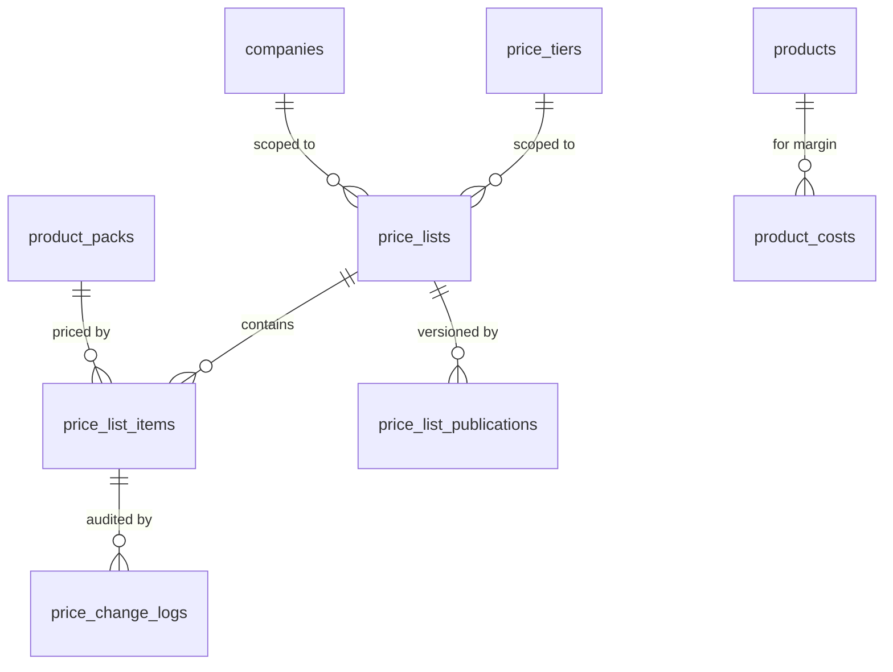

# 04 — Pricing Engine

The pricing engine is the single biggest functional gap in the reference system, which has one flat price per SKU and no volume breaks at all. It is also the component most likely to be got wrong in a way that is expensive to fix, because order history depends on it.

## 1. Design principles

1. **One resolution path.** Every price shown anywhere — product page, order pad, cart, quote, invoice — comes from `PriceResolver`. There is no second code path and no "list price" column on `products`.
2. **Prices are data, not schema.** Adding a tier, a customer agreement, or a promotion is a row, never a migration.
3. **Resolution is deterministic and explainable.** Given the same inputs it always returns the same price, and it returns *why*.
4. **Resolution is snapshotted.** The result is copied onto the order line and never re-derived.
5. **Bulk resolution is a first-class operation.** The order pad needs 100 prices in one query, not 100 queries.

## 2. Entity relationships



## 3. `price_lists`

| Column | Type | Notes |
|---|---|---|
| `id` | BIGINT UNSIGNED PK | |
| `public_id` | CHAR(26) | unique |
| `code` | VARCHAR(32) | unique, e.g. `BASE`, `T2-2026`, `ACME-CONTRACT` |
| `name` | VARCHAR(150) | |
| `type` | VARCHAR(24) | `base`, `tier`, `customer`, `promotion` |
| `price_tier_id` | BIGINT UNSIGNED | nullable FK — required when `type='tier'` |
| `company_id` | BIGINT UNSIGNED | nullable FK — required when `type='customer'` |
| `currency_code` | CHAR(3) | default `GBP` |
| `priority` | SMALLINT UNSIGNED | resolution weight, higher wins |
| `valid_from` | DATETIME | nullable |
| `valid_to` | DATETIME | nullable |
| `status` | VARCHAR(24) | `draft`, `active`, `paused`, `archived` |
| `is_exclusive` | TINYINT(1) | if true, suppresses all lower-priority lists for matched packs |
| `notes` | TEXT | nullable |
| `created_by_id`, `published_by_id` | BIGINT UNSIGNED | nullable FK |
| `published_at` | TIMESTAMP | nullable |
| `created_at`, `updated_at`, `deleted_at` | | |

**Indexes**

```sql
UNIQUE KEY uq_price_lists_code (code)
UNIQUE KEY uq_price_lists_public_id (public_id)
KEY ix_pl_resolution (status, type, valid_from, valid_to)
KEY ix_pl_tier (price_tier_id, status)
KEY ix_pl_company (company_id, status)
KEY ix_pl_priority (priority DESC, id)
```

`ix_pl_resolution` is the index behind candidate-list selection. In practice this table has tens, not thousands, of rows and is fully cached in Redis — the indexes exist for cold-cache correctness and admin screens, not for hot-path performance.

**Default priorities** (leave gaps so new levels can slot in):

| Type | Priority | Meaning |
|---|---|---|
| `base` | 100 | The fallback list. Must exist and must cover every orderable pack. |
| `tier` | 200–400 | `RETAIL`=200, `T1`=300, `T2`=350, `T3`=400 |
| `promotion` | 500 | Date-windowed campaign pricing |
| `customer` | 800 | Negotiated contract price for one company |

## 4. `price_list_items` — quantity breaks

A quantity break is **a row**, not a column. This is the key modelling decision: it means an unlimited number of breaks per pack with no schema change, and it makes the resolution query a simple `MAX(min_quantity)` problem.

| Column | Type | Notes |
|---|---|---|
| `id` | BIGINT UNSIGNED PK | |
| `price_list_id` | BIGINT UNSIGNED | FK cascade |
| `product_pack_id` | BIGINT UNSIGNED | FK restrict |
| `min_quantity` | INT UNSIGNED | in **packs**; the lowest break is always `1` |
| `unit_price` | DECIMAL(12,4) | net, per **pack** |
| `unit_price_per_base` | DECIMAL(12,4) | generated stored: `unit_price / pack.base_quantity` — see note |
| `is_price_locked` | TINYINT(1) | rep cannot discount below this |
| `valid_from`, `valid_to` | DATETIME | nullable — line-level override of list window |
| `created_at`, `updated_at` | | |

**Indexes**

```sql
UNIQUE KEY uq_pli_list_pack_qty (price_list_id, product_pack_id, min_quantity)
KEY ix_pli_pack_list_qty (product_pack_id, price_list_id, min_quantity)
KEY ix_pli_list_pack (price_list_id, product_pack_id, min_quantity, unit_price)
KEY ix_pli_validity (valid_from, valid_to)
```

**Index rationale:**

- `uq_pli_list_pack_qty` enforces the business rule *one price per break per pack per list* at the database level. Duplicate breaks are the most common data-entry error in wholesale pricing and they produce non-deterministic prices. The database refuses them.
- `ix_pli_pack_list_qty` is the **single-product lookup** path: "for pack 4821, across these candidate lists, at quantity 24". Leading with `product_pack_id` because that is the equality predicate when rendering a product page.
- `ix_pli_list_pack (…, unit_price)` is the **bulk order-pad** path, and it is deliberately **covering**: the resolution query needs only `price_list_id`, `product_pack_id`, `min_quantity`, `unit_price`, all of which are in the index. MySQL answers the entire bulk price query without a single table row read. At 100 rows × 4 candidate lists that is the difference between one index range scan and 400 random row lookups.

**On `unit_price_per_base` as a generated column:** it cannot be a true MySQL generated column, because `base_quantity` lives on another table and generated columns cannot reference other tables. Two options:

- **(A, recommended)** Denormalise `base_quantity` onto `price_list_items` as `pack_base_quantity`, copied at write time, then make `unit_price_per_base` a `GENERATED ALWAYS AS (unit_price / pack_base_quantity) STORED` column. Pack composition changes are rare and already require a pricing review; a job repairs affected rows.
- **(B)** Compute per-base price in the application layer only.

Option A is preferred because "sort the order pad by cheapest per-unit" and the margin report both need it in SQL. Add:

```sql
KEY ix_pli_per_base (product_pack_id, unit_price_per_base)
```

**Break table example** — outer pack of a £0.98 grater:

| min_quantity (outers) | unit_price (per outer) | per base unit |
|---|---|---|
| 1 | 23.5200 | 0.9800 |
| 5 | 22.5600 | 0.9400 |
| 20 | 21.1200 | 0.8800 |
| 50 | 19.6800 | 0.8200 |

A buyer ordering 22 outers resolves to the `min_quantity = 20` row: £21.12 per outer, £464.64 net.

## 5. Resolution algorithm

**Inputs** (`PriceContext` DTO — note it contains no `Order`, per the module boundary rule):

```
company_id | null        (null = anonymous/retail)
price_tier_id            (resolved from company, or the default tier)
product_pack_id
quantity                 (in packs)
as_at                    (DateTimeImmutable, defaults to now)
currency_code
```

**Steps:**

1. **Build the candidate list set.** All `price_lists` where `status = 'active'`, the validity window contains `as_at`, `currency_code` matches, and the scope matches: `type='base'`, OR (`type='tier'` AND `price_tier_id` matches), OR (`type='promotion'`), OR (`type='customer'` AND `company_id` matches). Cached in Redis under `pricelists:{company_id}` for 1 hour.
2. **If any matched list has `is_exclusive = 1`,** discard all lists of lower priority.
3. **Find candidate items:** rows in `price_list_items` for this `product_pack_id`, in a candidate list, with `min_quantity <= quantity`, and a line-level validity window (if set) containing `as_at`.
4. **Rank and take the first:** order by `price_list.priority DESC`, then `price_list_item.min_quantity DESC`, then `price_list_items.id ASC` (final tiebreak for determinism).
5. **If nothing found, throw.** A missing price is a data error, not a zero price and not a free product. The order pad renders "POA — contact us" and the product cannot be added to a basket.
6. **Return a `ResolvedPrice`** carrying: `unit_price`, `price_list_id`, `price_list_item_id`, `min_quantity_applied`, `resolution_reason` (`base`|`tier`|`promotion`|`customer_contract`), `next_break_quantity` and `next_break_price` (for the "buy 3 more, save 4%" upsell), `vat_rate`, `unit_price_per_base`.

**Explicitly: the lowest price does not win.** Priority wins. A negotiated customer contract price applies even if it is higher than a running promotion — that is what "contract" means. If you want promotions to beat contracts, set the promotion's priority above 800; the rule is configuration, not code.

## 6. Single-price query

```sql
SELECT  pli.id            AS price_list_item_id,
        pli.price_list_id,
        pli.min_quantity,
        pli.unit_price,
        pli.unit_price_per_base,
        pl.type            AS resolution_reason
FROM    price_list_items pli
JOIN    price_lists pl ON pl.id = pli.price_list_id
WHERE   pli.product_pack_id = :pack_id
  AND   pli.price_list_id IN (:candidate_ids)
  AND   pli.min_quantity  <= :quantity
  AND  (pli.valid_from IS NULL OR pli.valid_from <= :as_at)
  AND  (pli.valid_to   IS NULL OR pli.valid_to   >= :as_at)
ORDER BY pl.priority DESC, pli.min_quantity DESC, pli.id ASC
LIMIT 1;
```

Uses `ix_pli_pack_list_qty` for the range, then a small sort over at most a handful of rows.

## 7. Bulk resolution query — the order pad

This is the hot path. 100 packs, one customer, one quantity assumption (usually `1`, re-resolved client-side as quantities change).

```sql
SELECT *
FROM (
    SELECT  pli.product_pack_id,
            pli.unit_price,
            pli.unit_price_per_base,
            pli.min_quantity,
            pli.price_list_id,
            pl.type AS resolution_reason,
            ROW_NUMBER() OVER (
                PARTITION BY pli.product_pack_id
                ORDER BY pl.priority DESC, pli.min_quantity DESC, pli.id ASC
            ) AS rn
    FROM    price_list_items pli
    JOIN    price_lists      pl ON pl.id = pli.price_list_id
    WHERE   pli.product_pack_id IN (:pack_ids)          -- 100 ids
      AND   pli.price_list_id   IN (:candidate_ids)     -- 3–5 ids
      AND   pli.min_quantity    <= :quantity
      AND  (pli.valid_from IS NULL OR pli.valid_from <= :as_at)
      AND  (pli.valid_to   IS NULL OR pli.valid_to   >= :as_at)
) ranked
WHERE ranked.rn = 1;
```

One query, one index range scan per candidate list, covered by `ix_pli_list_pack`. `ROW_NUMBER()` requires MySQL 8 — this is a hard version floor for the project.

**Second query in the same request** fetches the full break table for those packs (so the UI can show "5+ £22.56, 20+ £21.12" without a round trip per row). Same index, no `min_quantity` predicate.

## 8. Caching & invalidation

| Key | Contents | TTL | Invalidated by |
|---|---|---|---|
| `pricelists:{company_id}` | ordered candidate list ids + priorities | 1 h | price list publish/pause, company tier change |
| `price:{company_id}:{pack_id}` | full resolved break table for that pack | 1 h | any write to a `price_list_item` for that pack |
| `price:tier:{tier_id}:{pack_id}` | same, for anonymous/tier-only context | 1 h | as above |

Invalidation uses cache **tags**: every cached entry is tagged `pack:{pack_id}` and `pricelist:{list_id}`. Publishing a list flushes its tag, which is O(1) regardless of how many packs it covers.

**Publish workflow (`price_list_publications`):** a price list is edited in `draft`, validated (every orderable pack covered? any break gaps? any price below floor cost?), then published atomically — status flip plus cache tag flush inside a transaction, with a `price_list_publications` row recording who, when, and how many items changed. Never edit an `active` list in place.

```
price_list_publications: id, price_list_id FK, published_by_id FK,
  published_at, items_added, items_changed, items_removed,
  validation_report JSON, rollback_of_id nullable FK
```

## 9. `price_change_logs`

| Column | Type |
|---|---|
| `id` | BIGINT UNSIGNED PK |
| `price_list_item_id` | BIGINT UNSIGNED FK (nullable — item may be deleted) |
| `price_list_id` | BIGINT UNSIGNED FK |
| `product_pack_id` | BIGINT UNSIGNED FK |
| `min_quantity` | INT UNSIGNED |
| `old_unit_price` | DECIMAL(12,4) nullable |
| `new_unit_price` | DECIMAL(12,4) nullable |
| `changed_by_id` | BIGINT UNSIGNED FK |
| `publication_id` | BIGINT UNSIGNED nullable FK |
| `created_at` | TIMESTAMP |

```sql
KEY ix_pcl_pack_created (product_pack_id, created_at DESC)
KEY ix_pcl_list_created (price_list_id, created_at DESC)
KEY ix_pcl_user (changed_by_id, created_at DESC)
```

Append-only. Never updated, never deleted. Answers "why did this customer's price change last Tuesday" without a forensic exercise.

## 10. Margin calculation

```
margin_amount      = unit_price_per_base − landed_unit_cost
margin_percent     = margin_amount / unit_price_per_base × 100
markup_percent     = margin_amount / landed_unit_cost × 100
```

`landed_unit_cost` comes from the `product_costs` row with the greatest `effective_from <= as_at`.

**Retailer-facing margin calculator** (a genuine competitive feature for a trade site):

```
customer_margin_percent = (rrp − unit_price_per_base) / rrp × 100
```

Displayed as "RRP £2.99 — your margin 67%". Requires `products.rrp` to be populated, which is why it is in the publish gate's optional-but-tracked set in `product_data_quality`.

**Floor-price validation on publish:** warn if `unit_price_per_base < landed_unit_cost × 1.05`; block if `< landed_unit_cost`. Overridable by `pricing_manager` with a recorded reason.

## 11. Rep discounting

A `sales_rep` building a quote may discount within bounds:

- Never below `landed_unit_cost × (1 + min_margin_percent)`, configured per tier.
- Never on an item where `is_price_locked = 1`.
- Discounts beyond the rep's authority route to `sales_manager` approval.
- The quote line stores `list_unit_price`, `discounted_unit_price`, `discount_reason`, `approved_by_id`.

## 12. Test matrix (must all be covered before implementation is accepted)

| Case | Expected |
|---|---|
| Anonymous user, base list only | base price at break 1 |
| T2 customer, tier list covers pack | tier price, `reason=tier` |
| T2 customer, tier list does **not** cover pack | falls back to base |
| Quantity exactly on a break boundary | the higher break applies |
| Quantity one below a break | previous break applies |
| Active promotion + tier price | promotion wins (priority 500 > 400) |
| Customer contract + active promotion | contract wins (800 > 500) |
| `is_exclusive` customer list | base and tier suppressed entirely |
| Promotion expired mid-session | re-resolution at checkout returns tier price; user is shown the change |
| No price anywhere | throws; pack not addable; renders POA |
| Two lists, equal priority, equal break | deterministic by `id ASC` |
| Price changes between cart add and checkout | checkout re-resolves, flags the delta, requires re-confirm |
| Pack `base_quantity` changed after an order | historical order line unchanged (snapshot) |
| Rep discount below floor | rejected |
| VAT rate change between order and invoice | invoice uses the order-date snapshot |
