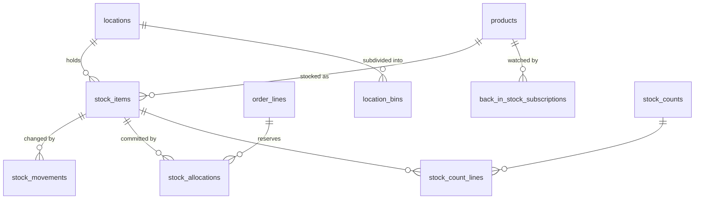

# 05 — Inventory (Authoritative)

Stock is fully authoritative in this system. There is no external source of truth, no sync, no reconciliation against a third party. That is a simplification in integration terms and a tightening in correctness terms: if the ledger is wrong, nothing else can correct it.

## 1. Entity relationships



## 2. `locations`

| Column | Type | Notes |
|---|---|---|
| `id` | BIGINT UNSIGNED PK | |
| `code` | VARCHAR(16) | unique — `DUN1`, `LDN1` |
| `name` | VARCHAR(120) | |
| `type` | VARCHAR(24) | `warehouse`, `transit`, `quarantine`, `virtual` |
| `address_id` | BIGINT UNSIGNED | nullable FK |
| `is_sellable` | TINYINT(1) | quarantine and transit are not sellable |
| `is_collection_point` | TINYINT(1) | warehouse collection |
| `priority` | SMALLINT UNSIGNED | allocation order |
| `status` | VARCHAR(24) | `active`, `inactive` |

`UNIQUE (code)`, `KEY ix_locations_sellable (is_sellable, priority)`.

Even with one physical warehouse, model locations from day one: `quarantine` (damaged/returned goods pending inspection) and `transit` (in-bound containers) are needed immediately, and retrofitting a `location_id` into `stock_items` and `stock_movements` later is exactly the kind of migration you want to avoid.

**`location_bins`** (optional, phase 3): `id`, `location_id` FK, `code`, `aisle`, `rack`, `level`, `is_pickable`. `UNIQUE (location_id, code)`.

## 3. `stock_items` — the current balance

One row per product per location. Quantities are always in **base units** (ADR-005).

| Column | Type | Notes |
|---|---|---|
| `id` | BIGINT UNSIGNED PK | |
| `product_id` | BIGINT UNSIGNED | FK restrict |
| `location_id` | BIGINT UNSIGNED | FK restrict |
| `on_hand` | INT NOT NULL DEFAULT 0 | signed — negatives are a data error but must be *visible*, not impossible |
| `allocated` | INT UNSIGNED NOT NULL DEFAULT 0 | committed to unfulfilled order lines |
| `available` | INT GENERATED ALWAYS AS (`on_hand` - `allocated`) STORED | ADR-008 |
| `incoming` | INT UNSIGNED NOT NULL DEFAULT 0 | on open purchase orders, for buyer visibility only |
| `reorder_point` | INT UNSIGNED | nullable — triggers low-stock alert |
| `reorder_quantity` | INT UNSIGNED | nullable |
| `bin_code` | VARCHAR(24) | nullable, denormalised primary pick location |
| `last_movement_at` | TIMESTAMP | nullable |
| `last_counted_at` | TIMESTAMP | nullable |
| `version` | INT UNSIGNED NOT NULL DEFAULT 0 | optimistic-lock counter |
| `created_at`, `updated_at` | | |

**Indexes**

```sql
UNIQUE KEY uq_stock_product_location (product_id, location_id)
KEY ix_stock_location_available (location_id, available)
KEY ix_stock_available (available, product_id)
KEY ix_stock_reorder (location_id, reorder_point, available)
KEY ix_stock_product (product_id, available)
```

**Index rationale:**

- `uq_stock_product_location` is both the uniqueness guarantee and the primary lookup path. It also gives allocation its `FOR UPDATE` target row with a single index dive.
- `ix_stock_available (available, product_id)` is the catalogue "in stock only" filter. Because `available` is a *stored* generated column, this is a normal B-tree range scan (`available > 0`). This is the whole justification for ADR-008 — with a virtual column or an application-side calculation, this filter degrades to a full scan of every stock row.
- `ix_stock_reorder` supports the purchasing dashboard: `WHERE location_id = ? AND reorder_point IS NOT NULL AND available <= reorder_point`. The equality-then-range column order is deliberate.
- `ix_stock_product (product_id, available)` covers the aggregate "total available across locations for this product", which is what the product page shows.

**Why `on_hand` is signed:** a negative balance means something went wrong — a dispatch was recorded twice, or goods were sold that were never received. Making the column `UNSIGNED` would cause the write to fail or silently clamp, hiding the error at the point where it is cheapest to detect. A signed column plus a monitoring alert on `on_hand < 0` surfaces it instead. `allocated` *is* unsigned, because a negative allocation has no meaning and always indicates a logic bug worth failing on.

**CHECK constraint:**

```sql
CONSTRAINT ck_stock_allocated_nonneg CHECK (allocated >= 0)
```

Note that `allocated <= on_hand` is deliberately **not** a constraint — backorders legitimately allocate against stock that has not arrived, where the product permits it.

## 4. `stock_movements` — the ledger

Append-only. Never updated. Never deleted. A correction is a new compensating movement, not an edit.

| Column | Type | Notes |
|---|---|---|
| `id` | BIGINT UNSIGNED PK | |
| `public_id` | CHAR(26) | unique |
| `stock_item_id` | BIGINT UNSIGNED | FK restrict |
| `product_id` | BIGINT UNSIGNED | FK — denormalised for reporting without a join |
| `location_id` | BIGINT UNSIGNED | FK — denormalised |
| `type` | VARCHAR(32) | see table below |
| `reason_code` | VARCHAR(32) | nullable — `damaged`, `expired`, `miscount`, `theft`, `sample` |
| `quantity_delta` | INT NOT NULL | **signed**, in base units; never zero |
| `balance_after` | INT NOT NULL | `on_hand` immediately after this movement |
| `unit_cost` | DECIMAL(12,4) | nullable — landed cost at movement time, for COGS |
| `reference_type` | VARCHAR(48) | nullable — `order_line`, `purchase_order_line`, `return_line`, `stock_count_line`, `transfer` |
| `reference_id` | BIGINT UNSIGNED | nullable |
| `idempotency_key` | CHAR(64) | nullable, **unique** |
| `performed_by_id` | BIGINT UNSIGNED | nullable FK → `users` |
| `notes` | VARCHAR(255) | nullable |
| `occurred_at` | TIMESTAMP(3) | business time |
| `created_at` | TIMESTAMP(3) | record time |

**Movement types**

| Type | Sign | Trigger |
|---|---|---|
| `goods_in` | + | Purchase order receipt |
| `dispatch` | − | Shipment confirmed |
| `return_in` | + | RMA goods received and passed inspection |
| `adjustment_up` / `adjustment_down` | ± | Manual, reason code required |
| `stocktake_variance` | ± | Stock count reconciliation |
| `write_off` | − | Damage, expiry, theft |
| `transfer_out` / `transfer_in` | ± | Between locations, always as a pair |
| `opening_balance` | + | Migration / go-live only |

**Indexes**

```sql
UNIQUE KEY uq_movements_public_id (public_id)
UNIQUE KEY uq_movements_idempotency (idempotency_key)
KEY ix_mov_item_occurred (stock_item_id, occurred_at DESC, id DESC)
KEY ix_mov_product_occurred (product_id, occurred_at DESC)
KEY ix_mov_reference (reference_type, reference_id)
KEY ix_mov_type_occurred (type, occurred_at)
KEY ix_mov_location_occurred (location_id, occurred_at)
KEY ix_mov_occurred (occurred_at)
KEY ix_mov_user (performed_by_id, occurred_at DESC)
```

**Index rationale:**

- `ix_mov_item_occurred (stock_item_id, occurred_at DESC, id DESC)` is *the* index. The stock card view ("show me every movement for this product at this location, newest first") is the most-used warehouse screen. Adding `id DESC` as the final column makes the sort fully deterministic when two movements share a millisecond, and gives stable keyset pagination.
- `ix_mov_reference (reference_type, reference_id)` answers "what stock did this order consume" — used by returns, credit notes and dispute handling. Not unique: one order line can produce a dispatch and later a return.
- `uq_movements_idempotency` is the defence against double-posting. Every movement written from a queued job, a webhook, or a scanner carries a key derived from its source (`dispatch:shipment_line:9931`). A retry inserts a duplicate key and fails harmlessly instead of taking stock twice. **This single constraint prevents the most damaging class of inventory bug.**
- `ix_mov_occurred` alone supports the partition-pruning-friendly date-range reports and the archival job.

**Partitioning.** At an estimated 5,000–20,000 movements/day, this table reaches tens of millions of rows within a few years. Partition by `RANGE (TO_DAYS(occurred_at))` in monthly partitions from go-live.

MySQL requires every unique key to include the partitioning column. That conflicts with `uq_movements_idempotency` and `uq_movements_public_id`. Resolution — pick one:

- **(A, recommended for phase 1)** Do not partition. Instead archive movements older than 24 months to `stock_movements_archive` via a monthly job. Simpler, keeps both unique constraints, and 20M rows with the indexes above performs fine.
- **(B)** Partition, and move idempotency enforcement to a separate `stock_movement_idempotency` table (`idempotency_key` PK, `stock_movement_id`), written in the same transaction.

Decide before go-live; it is recorded as an open question in doc 08.

**Invariants, asserted nightly by `stock:reconcile`:**

```sql
-- must return zero rows
SELECT si.id, si.on_hand, COALESCE(SUM(sm.quantity_delta), 0) AS ledger_sum
FROM   stock_items si
LEFT JOIN stock_movements sm ON sm.stock_item_id = si.id
GROUP BY si.id, si.on_hand
HAVING si.on_hand <> ledger_sum;

-- must return zero rows
SELECT si.id FROM stock_items si
WHERE si.allocated <> (
    SELECT COALESCE(SUM(sa.quantity), 0)
    FROM stock_allocations sa
    WHERE sa.stock_item_id = si.id AND sa.status = 'active'
);
```

Any drift raises a Sentry alert at error level. These two queries are the reason the whole ledger design exists.

## 5. `stock_allocations`

Explicit reservation records. Without these, `allocated` is an opaque number nobody can explain.

| Column | Type | Notes |
|---|---|---|
| `id` | BIGINT UNSIGNED PK | |
| `stock_item_id` | BIGINT UNSIGNED | FK |
| `order_line_id` | BIGINT UNSIGNED | FK |
| `quantity` | INT UNSIGNED | base units |
| `status` | VARCHAR(24) | `active`, `fulfilled`, `released` |
| `allocated_at` | TIMESTAMP | |
| `released_at` | TIMESTAMP | nullable |
| `expires_at` | TIMESTAMP | nullable — soft reservations for unpaid BACS orders |

**Indexes**

```sql
KEY ix_alloc_item_status (stock_item_id, status)
KEY ix_alloc_order_line (order_line_id, status)
KEY ix_alloc_expiry (status, expires_at)
UNIQUE KEY uq_alloc_line_item (order_line_id, stock_item_id, status)
```

`ix_alloc_expiry` drives the job that releases stock from BACS orders unpaid after N days — the reference system takes phone orders on BACS with no reservation mechanism at all, which means either overselling or manual holds.

## 6. Allocation: the concurrency-critical path

```php
DB::transaction(function () use ($orderLine, $baseQty) {

    // 1. Fail fast under contention rather than queueing on a row lock.
    $lock = Cache::lock("stock:{$productId}:{$locationId}", 5);
    if (! $lock->get()) {
        throw new StockContentionException();
    }

    try {
        // 2. Pessimistic row lock — the authoritative gate.
        $item = StockItem::where('product_id', $productId)
            ->where('location_id', $locationId)
            ->lockForUpdate()
            ->firstOrFail();

        // 3. Re-check availability INSIDE the lock. Never trust a value read before it.
        if ($item->available < $baseQty && ! $product->allow_backorder) {
            throw new InsufficientStockException($item->available);
        }

        // 4. Allocation record + counter, same transaction.
        StockAllocation::create([...]);
        $item->increment('allocated', $baseQty);
        $item->increment('version');

    } finally {
        $lock->release();
    }
});
```

**Rules:**

1. Availability is **always** re-read inside the lock. A check performed before acquiring the lock is advisory only — that is the classic oversell bug.
2. Allocation adjusts `allocated`, never `on_hand`. Physical stock has not moved.
3. Dispatch is the only thing that decrements `on_hand`, and it writes a `dispatch` movement and transitions the allocation to `fulfilled` in one transaction.
4. Lock ordering: when a multi-line order allocates several products, lock `stock_items` in ascending `id` order. Without a deterministic order, two concurrent multi-line orders deadlock.
5. Transactions holding stock locks contain **no** HTTP calls, no mail, no PDF generation. Those are dispatched after commit.

## 7. Stocktake

**`stock_counts`**: `id`, `public_id`, `location_id` FK, `type` (`full`, `partial`, `cycle`), `status` (`draft`, `counting`, `review`, `committed`, `cancelled`), `scheduled_for`, `started_at`, `committed_at`, `counted_by_id`, `committed_by_id`, `notes`.

**`stock_count_lines`**: `id`, `stock_count_id` FK, `stock_item_id` FK, `product_id`, `expected_quantity` (snapshot at count start), `counted_quantity` nullable, `variance` generated stored (`counted − expected`), `variance_value` DECIMAL(14,4) nullable, `recount_required`, `counted_at`, `counted_by_id`.

```sql
UNIQUE KEY uq_scl_count_item (stock_count_id, stock_item_id)
KEY ix_scl_variance (stock_count_id, variance)
KEY ix_scl_pending (stock_count_id, counted_at)
```

Committing a count writes one `stocktake_variance` movement per non-zero-variance line, all in one transaction, each with an idempotency key of `stocktake:{count_line_id}`.

## 8. `back_in_stock_subscriptions`

The reference system shows "Out of stock" and captures nothing. This is free demand data.

| Column | Type |
|---|---|
| `id` | BIGINT UNSIGNED PK |
| `product_id` | BIGINT UNSIGNED FK |
| `product_pack_id` | BIGINT UNSIGNED nullable FK |
| `user_id` | BIGINT UNSIGNED nullable FK |
| `email` | VARCHAR(255) |
| `quantity_wanted` | INT UNSIGNED nullable |
| `notified_at` | TIMESTAMP nullable |
| `created_at` | TIMESTAMP |

```sql
UNIQUE KEY uq_bis_product_email (product_id, email, notified_at)
KEY ix_bis_pending (product_id, notified_at)
KEY ix_bis_created (created_at)
```

`ix_bis_pending` lets the goods-in handler find waiting subscribers with one index scan when `available` crosses zero. Aggregate `quantity_wanted` by product is a purchasing report in its own right.

## 9. Incoming stock & purchase orders (phase 3, modelled now)

`incoming` on `stock_items` is maintained from open purchase order lines. The tables:

- **`purchase_orders`**: `id`, `public_id`, `po_number` unique, `supplier_id` FK, `status` (`draft`, `sent`, `confirmed`, `in_transit`, `partially_received`, `received`, `cancelled`), `currency_code`, `fx_rate`, `expected_at`, `container_reference`, `freight_total`, `duty_total`, `ordered_by_id`, timestamps.
- **`purchase_order_lines`**: `id`, `purchase_order_id` FK, `product_id` FK, `product_pack_id` FK, `pack_quantity`, `base_quantity`, `unit_cost`, `received_base_quantity`, `landed_unit_cost_calculated`.
- **`goods_receipts`** / **`goods_receipt_lines`**: the receiving event, which writes `goods_in` movements and creates the `product_costs` row that apportions freight and duty across the container.

```sql
-- purchase_order_lines
KEY ix_pol_po (purchase_order_id)
KEY ix_pol_product_status (product_id, purchase_order_id)
-- purchase_orders
KEY ix_po_supplier_status (supplier_id, status)
KEY ix_po_status_expected (status, expected_at)
```

`ix_po_status_expected` powers the "what's arriving this month" view, which is what makes `incoming` trustworthy to the sales team.

## 10. Reporting stock positions

| Report | Query shape | Index used |
|---|---|---|
| Dead stock (no dispatch in 180 days, available > 0) | anti-join `stock_movements` on `type='dispatch'` and `occurred_at` | `ix_mov_type_occurred` |
| Stock cover days | `available / avg_daily_dispatch` from a nightly rollup table | rollup |
| Shrinkage by reason | `SUM(quantity_delta)` grouped by `reason_code` over a window | `ix_mov_type_occurred` |
| Stock valuation | `SUM(on_hand × landed_unit_cost)` | `ix_stock_product` + `ix_costs_product_from_desc` |

**Do not run these against `stock_movements` live at scale.** A nightly `stock_daily_snapshots` table (`date`, `product_id`, `location_id`, `on_hand`, `allocated`, `dispatched_qty`, `received_qty`, `valuation`) with `UNIQUE (date, product_id, location_id)` and `KEY (product_id, date)` makes all trend reporting an indexed scan of a small table instead of an aggregate over the ledger.
